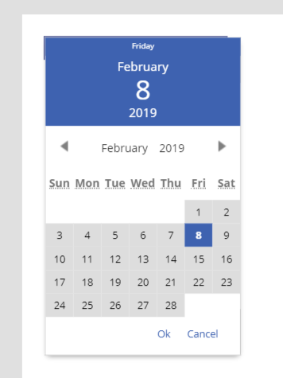

As noted earlier, one of the built-in themes may not match your
organizations desired look and feel for the app. You can customize your
app by changing various properties of the app controls. By adjusting a
few of the Control properties, like Fill, Hover, and Border you can
completely change how the control looks. If you decide to customize
your controls, it's recommended that you do this thorough testing to ensure that you
don't run into any complications when users interact with the app.

For example, consider the Button control. The following are
some of the properties of a Button control that you could customize to better
fit your companies theme.

Typical properties
-----------------

These properties are in effect when the user is not interacting with the
control.

- BorderColor - The color of a control\'s border.

- BorderStyle - Determines whether a control\'s border is solid, dashed, dotted,
 or none.

- Color - The color of text in a control.

- Fill - The background color of a control

Disabled properties
-------------------

These properties are in effect when the control is disabled. A control
can be disabled if the **Disabled** property is set to **Disabled**.

- DisabledColor - The color of text in a control if its **DisplayMode**
 property is set to **Disabled**.

- DisabledFill - The background color of a control if its **DisplayMode**
 property is set to **Disabled**.

Hover properties
----------------

These properties are in effect when the user hovers over the control
with a mouse.

- HoverColor - The color of the text in a control when the user keeps
 the mouse pointer on it.

- HoverFill - The background color of a control when the user keeps
 the mouse pointer on it.

These are just some of the properties that you could modify. For more details about the properties that you can
customize, see [Color and Border Properties in Power Apps](/powerapps/maker/canvas-apps/controls/properties-color-border/?azure-portal=true).

Note that each control is independent. This means that if
you alter the **HoverColor** property of one button control on your screen
or in your app, the other buttons in the app will remain unchanged. You
must edit the properties of each control that you want to appear in a
different manner.

Some color settings are only controlled by the theme
----------------------------------------------------

There are certain aspects of controls that cannot be altered and are
specific to the theme that you select. For example, here's an example of the **Date picker** control.

1. In Power Apps Studio, add the **Date picker** control.

2. Put the app in preview mode and select the control so that it opens.

3. The color at the top of the **Date picker** control is specific to
 the theme, meaning there isn't a control property you can change to
 set the color manually. To change the color of that background you
 would have to select a different theme.

As you design your app, be sure to incorporate the use of icons. In
the next section, you'll learn how to add an icon to a Canvas app to change the look and feel of the app. 
