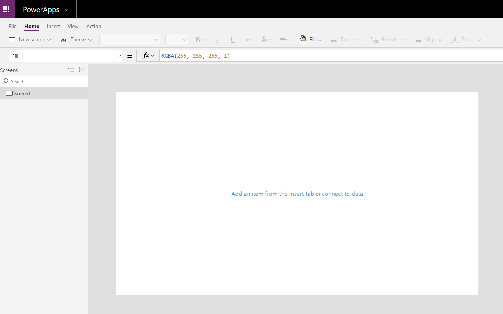

It is important to design your app for the primary device that it will be used on. There are two form factors to choose from, the Phone form factor and the Tablet form factor. The main difference between these is the Screen size. The screen size affects the amount of space available to build the app.

The Phone form factor has a significantly smaller area to build your app, but if most of your users will be accessing the app from a mobile phone then this is the best form factor for you. When building for mobile, select controls that will be easy to use on a mobile device, ensure that the text is large enough to be easily seen, and design the app in a single column vertical format.

The Tablet form factor has a much larger area for designing your app and is the best option if your users will be accessing the app from a tablet or PC. Because you have more screen size to work with, you will have more flexibility in designing this app. Regardless of the form factor that you choose; the functionality available in the Power Apps Studio will be the same.

Take a moment and create two blank Canvas apps. For one of the apps use the Phone form factor and for the other app use the Tablet form factor. You will immediately notice the difference in the amount of space available on the screen to design your app.

**Phone form factor**

**Tablet form factor**

Depending on the form factor that you choose, you have the ability to alter the screen size. To view the current screen size and orientation, for either form factor, see following steps.

1.  In Power Apps Studio, in the upper-left corner, select **File**.

2.  On the left, select **App settings**.

When you are in the tablet app, you will notice multiple options to
select from for the screen size. Be sure to select the appropriate size
for the majority of your app users.

-   16:9 (Default)

-   3:2 (Surface Pro 3)

-   16:10 (Widescreen)

-   4:3 (iPad)

-   Custom

The Phone form factor does not include screen size options.

Lock aspect ratio and lock orientation
--------------------------------------

Other options that you might want to consider regarding the screen size and
orientation include the lock aspect ratio and lock orientation settings.

If you lock the aspect ratio, the app will retain the appropriate aspect
ratio for a phone. If the app is running on another kind of device, the
app will display incorrectly and may show unwanted results. If you
unlock the aspect ratio, the app will adjust to the aspect ratio of the
device on which it's running.

If you lock the app's orientation, the app will retain the orientation
that you specify. If the app is running on a device for which the screen
is in a different orientation, the app will display incorrectly and may
show unwanted results. If you unlock the app's orientation, it will
adjust to the screen orientation of the device on which it's running.

You can also modify the app's orientation by enabling **Enable app
embedding user experience** in **Advanced settings**. This feature
aligns the app when it's embedded and changes the background
color of the hosting canvas to white. 
