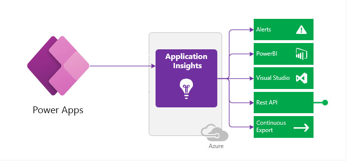

You built an app, published and shared it with people in your organization. Do you know how people are using it and if it is performing well? If you had configured your app to send telemetry to Application Insights, you could just check how it is doing in the Azure portal. For example, you could answer the following questions:

-   How many users are using your app?

-   What screens do they use most?

-   How long are they on a screen?

-   Which screens are slow?

-   Any question that you could log and use custom telemetry to answer.

Application Insights is a feature of Azure Monitor that you can use to monitor application performance. Custom apps including canvas Power Apps can easily be configured to send telemetry to Application Insights. Once the telemetry is in Application Insights the data can be viewed or accessed using multiple options.

> [!div class="mx-imgBorder"]
> 

From the Azure portal, you can access pre-built visualizations of the telemetry captured from users running your app.

> [!div class="mx-imgBorder"]
> 

For more custom analysis of the data, you can compose custom queries of the data or use Power BI to create custom visualizations of your data.

Power Apps canvas apps automatically sends basic screen telemetry to Application Insights if you configure the Instrumentation key on the app object. The telemetry is only captured when your published app is run so any use from within Power Apps Studio when you build the app won't impact your usage telemetry.

In addition to the basic telemetry the Power Apps runtime sends, you can also log custom events using the Power Fx Trace() function. By strategically instrumenting your app with Trace() function calls, you can include app context information that can be used to analyze app-specific challenges. The following is an example of using Trace() to record the user and active screen information when the app OnStart property runs.

> [!div class="mx-imgBorder"]
> 

Configuring your Power Apps canvas app to send telemetry to send data is a simple process we will cover in the next topic. Sending of telemetry adds minimal overhead to an app and should be considered for any app with multiple users. Without actual telemetry, you are left with user perception of how your app is doing. While user perception is an important part of how you should improve your application, actual telemetry takes out the user emotion and focuses on empirical data. In the rest of this module, we will look at how to configure and use the telemetry that you capture in Application Insights to improve your application.