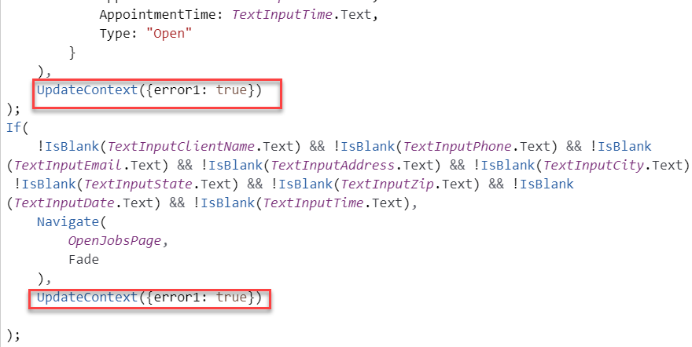
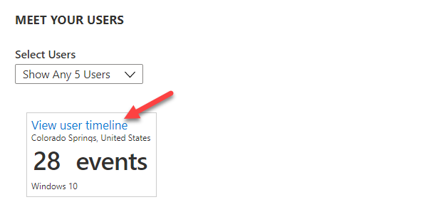
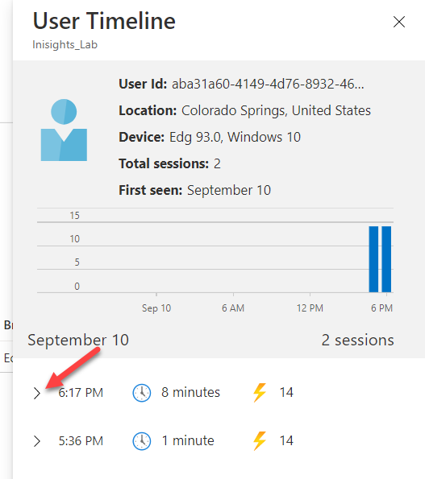
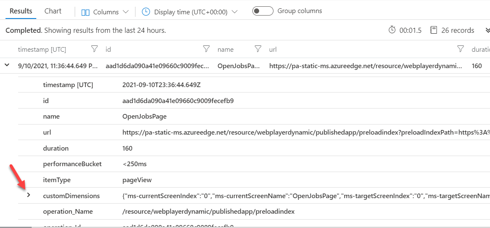
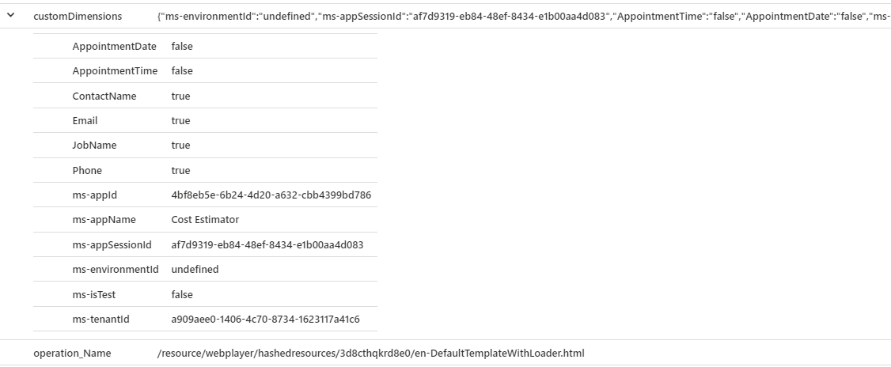

You are asked to collect telemetry data from the Cost Estimator application. You have decided to use Application Insights to collect and analyze the telemetry data.

## Requirements

- Add trace that will track viewed jobs.

- Add trace that will track jobs form validation errors.

## What you will learn

- How to create app insights application.

- How to connect canvas application to Application Insights.

- How to add traces to your application.

- How to query trace logs.

## Prerequisite

- You will need an environment with Microsoft Dataverse installed.

- You will need Microsoft Azure subscription [Azure - Sign up](https://signup.azure.com/signup?offer=ms-azr-0044p&appId=102&ref=portal&redirectURL=https:%2F%2Fazure.microsoft.com%2Fen-us%2Fget-started%2Fwelcome-to-azure%2F&l=en-us&correlationId=a18965c7a16f4722a855a8e7953047f3).

## Exercise 1: Import solution 

In this exercise, you will import a solution into your environment. This solution contains a working canvas application. You will modify it later to add tracing to certain user actions and then analyze the results.

### Task 1: Import solution

In this task, you will import a solution into your environment.

1.  Navigate to [Power Apps maker portal](https://make.powerapps.com/?azure-portal=true) and select the environment you would like to use for this lab.

1.  Select **Solutions** and select **Import**.

	> [!div class="mx-imgBorder"]
	> [](../media/import-button.png#lightbox)

1.  Select **Browse**.

1.  Browse to the lab resources folder, select the ContosoCostEstimator_1_0_0_1.zip solution, and select **Open**.

1.  Select **Next**.

1.  Select **Import** and wait for the solution importing to complete.

## Exercise 2: Configure app

In this exercise, you configure the app for app insights. If you have an active Azure subscription associated to your lab user, follow the steps here. If you do not have an active Azure subscription, you will be prompted to add that while following these steps. The free Azure that is offered will be enough to allow you to complete this lab.

### Task 1: Create app insights app

In this task, you will create an app insights app in Microsoft Azure. Creating app insights requires Microsoft Azure subscription, you can [Sign up](https://signup.azure.com/signup?offer=ms-azr-0044p&appId=102&ref=portal&redirectURL=https:%2F%2Fazure.microsoft.com%2Fen-us%2Fget-started%2Fwelcome-to-azure%2F&l=en-us&correlationId=a18965c7a16f4722a855a8e7953047f3).

1.  Navigate to [Microsoft Azure portal](https://portal.azure.com/?azure-portal=true) and select **Create a resource**.

	> [!div class="mx-imgBorder"]
	> [](../media/create-resource.png#lightbox)

1.  Search for application insights and select **Application Insights**.

1.  Select **Create**.

1.  Select your Subscription and select **Create new** Resource group.

1.  Enter **fl_insights** for **Name** and select **OK**. Replace fl with your initials.

	> [!div class="mx-imgBorder"]
	> [](../media/resource-group.png#lightbox)

1.  Enter **Insights_Lab** for Name, select your **Region**, and select **Review + create**.

1.  Select **Create** and wait for the resource to be created.

1.  Select **Go to resource**.

1.  Copy the **Instrumentation Key**.

	> [!div class="mx-imgBorder"]
	> [](../media/instrumentation-key.png#lightbox)

1. Navigate to [Power Apps maker portal](https://make.powerapps.com/?azure-portal=true) and select the environment you are using for this lab.

1. Select **Solutions** and select to open the **Contoso Cost estimator** solution you imported.

1. Select to open the **Cost Estimator** application.

1. The application should open in app studio.

1. Select **App**, go to the **Properties** pane and paste the instrumentation key you copied in the **Instrumentation Key** field.

	> [!div class="mx-imgBorder"]
	> [](../media/properties-instrumentation-key.png#lightbox)

1. Select **File** and **Save**.

1. Select **Publish**.

1. Select **Publish this version** and wait for the publishing to complete.

1. Select the back button.

1. Select **Play**.

1. Make sure the app loads the data.

	> [!div class="mx-imgBorder"]
	> [](../media/cost-estimator.png#lightbox)

1. Close the preview.

1. Do not navigate away from this page.

## Exercise 3: Edit and add trace

In this exercise, you will add trace to the application by modifying formulas that are already part of the working Power App.

### Task 1: Add trace

In this task, you will trace to the application.

1.  Expand the **OpenJobsPage**.

1.  Expand the **JobsListGallery** and select **Icon2**.

	> [!div class="mx-imgBorder"]
	> [](../media/icon-control.png#lightbox)

1.  Append the OnSelect value of Icon2 with the formula below. This trace will track which jobs are getting viewed.

	`;Trace("Job Viewed",TraceSeverity.Information,{JobId:ThisItem.JobId, JobName:ThisItem.JobName})`

	> [!div class="mx-imgBorder"]
	> [](../media/edit-formula.png#lightbox)

1.  Select the **NewJobPage** from the **Tree view**.

1.  Select the **Save job** button.

	> [!div class="mx-imgBorder"]
	> [](../media/save-job.png#lightbox)

1.  Go to the formula bar, select **OnSelect** and expand the formula bar.

	> [!div class="mx-imgBorder"]
	> [](../media/expand-formula.png#lightbox)

1.  Select **Format text**.

	> [!div class="mx-imgBorder"]
	> [](../media/format-text.png#lightbox)

1.  Scroll down and locate **UpdateContext**. There should be two of them.

	> [!div class="mx-imgBorder"]
	> [](../media/update-context.png#lightbox)

1.  Add the formula below after the first **UpdateContext**.

	```powerappsfl
	;
	Trace(
	        "Validation Failed",
	        TraceSeverity.Warning,
	        {
	            JobName: IsBlank(TextInputClientName.Text),
	            ContactName: IsBlank(TextInput1_15.Text),
	            Phone: IsBlank(TextInputPhone.Text),
	            Email: IsBlank(TextInputEmail.Text),
	            AppointmentDate: IsBlank(TextInputDate.Text),
	            AppointmentTime: IsBlank(TextInputTime.Text)
	        }
	    )
	```

	> [!div class="mx-imgBorder"]
	> [](../media/formula-edit.png#lightbox)

1. Go to the second **UpdateContext** and add the same formula.

	> [!div class="mx-imgBorder"]
	> [

1. Select **File** and **Save**.

1. Select **Publish**.

1. Select **Publish this version** and wait for the publishing to complete.

1. Close the app studio browser window or tab.

## Exercise 4: Run published app 

In this exercise, you will run the published application. Doing this will trigger the tracing you just added and will give you data to analyze in the steps that follow.

### Task 1: Run application

In this task, you will run the application you published.

1.  Navigate to [Power Apps maker portal](https://make.powerapps.com/?azure-portal=true) and make sure you are in the correct environment.

1.  Select **Apps** and select to launch the **Cost Estimator** application.

1.  Select to open a Job.

	> [!div class="mx-imgBorder"]
	> [](../media/row.png#lightbox)

1.  Select the back button.

1.  Open another job and select the back button again.

1.  Open few more jobs.

1.  Select **+** add job button.

1.  Select Save job without providing data. This will give you data to analyze where the user did not follow the expected data entry path.

	> [!div class="mx-imgBorder"]
	> [](../media/cost-estimator-form.png#lightbox)

1.  Provide **Client name** and select **Save job**.

1. Provide **Email** and select **Save job**.

1. Provide **Address** and select **Save job**.

1. Provide **City** and **State** and select **Save jobs**.

1. Provide **Zip code** and **Phone** and select **Save job**.

	> [!div class="mx-imgBorder"]
	> [](../media/cost-estimator-form-2.png#lightbox)

1. The job should be saved.

1. Create another job, but this time provide contact name and leave some of the required fields empty.

## Exercise 5: View app insights 

In this exercise, you will view app insights

### Task 1: View app insights

1.  Navigate to [Microsoft Azure portal](https://portal.azure.com/?azure-portal=true) and make sure you are in the correct environment.

1.  Select to open the **Insights_Lab** Application Insights you created.

	> [!div class="mx-imgBorder"]
	> [](../media/insights-lab.png#lightbox)

1.  Scroll down to the **Usage** section and select **Users**.

	> [!div class="mx-imgBorder"]
	> [](../media/users.png#lightbox)

1.  You should see at least one user. If you don't see at least one user, edit the app again and make you provided the correct Instrumentation Key then publish again.

	> [!div class="mx-imgBorder"]
	> [](../media/user-count.png#lightbox)

1.  From the chart, scroll down and select **View more insights** at the bottom of the chart.

	> [!div class="mx-imgBorder"]
	> [](../media/view-more-insights.png#lightbox)

1.  You should see at least **5** events. If you don't at least 5 events, go back and do Exercise 4 again and wait 5 minutes.

1.  Scroll down and select **View user timeline**.

	> [!div class="mx-imgBorder"]
	> [](../media/user-timeline.png#lightbox)

1.  You should see information about the use location and events. Select to expand the session.

	> [!div class="mx-imgBorder"]
	> [](../media/expand-session.png#lightbox)

1.  You should see the events.

	> [!div class="mx-imgBorder"]
	> [](../media/session-events.png#lightbox)

1. Go to the **Monitoring** section and select **Logs**.

	> [!div class="mx-imgBorder"]
	> [](../media/logs.png#lightbox)

1. Close the **Queries** popup.

1. Do not navigate away from this page.

## Exercise 6: Query log

In this exercise, you will query the logs.

### Task 1: Query log

1.  Type **pageViews** and select **Run**.

	> [!div class="mx-imgBorder"]
	> [](../media/run-query.png#lightbox)

1.  Go to the **Results**.

1.  You should see the traces. Scroll Up/Down and Left/Right to see what was traced.

1.  Expand one of the results and select to expand the **customDimensions**.

	> [!div class="mx-imgBorder"]
	> [](../media/expand-custom-dimensions.png#lightbox)

1.  Change the Query to **traces** and select **Run** again.

	> [!div class="mx-imgBorder"]
	> [](../media/run-query-2.png#lightbox)

1.  Expand one of the results and select to expand the **customDimensions**.

1.  Filter for validation logs. Replace the query with the query below and select **Run**.

	```powerappsfl
	traces
	| where message =="Validation Failed"
	```

	> [!div class="mx-imgBorder"]
	> [](../media/query-traces.png#lightbox)

1.  Expand one of the results and select to expand the **customDimensions**.

	> [!div class="mx-imgBorder"]
	> [](../media/query-results.png#lightbox)

1.  Query for jobs without contact name. Paste the query below and select **Run**.

	> [!div class="mx-imgBorder"]
	> [](../media/query-traces-run.png#lightbox)

1. You should get traces with no contact name.