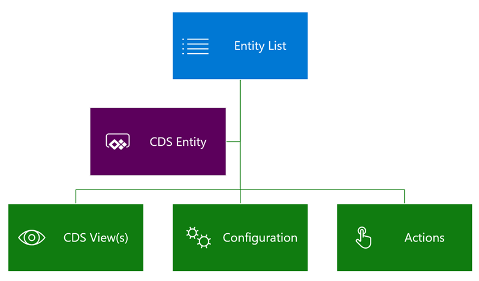

You can add entity lists to webpages by using Microsoft Power Apps portals Studio, where you can configure some of the main properties. Additional configuration options are available by using the Portal Management app.

## Configure the entity list

Portals Studio provides a basic interface for creating and configuring entity lists; however not everything can be configured in portals Studio. Makers can customize all entity list features and properties by using the Portal Management app. To access entity lists in the Portal Management app, use the following procedure:

1. Go to the [Power Apps maker portal](https://make.powerapps.com/?azure-portal=true).
1. In the upper-right corner, use the environment selector to select the target environment.
1. From the **Apps** list, locate and open the Portal Management app. (The app type is Model-driven.)
1. In the left navigation, select **Entity Lists**.
1. Open the list that was previously created in portals Studio.

> [!div class="mx-imgBorder"]
> 

An entity list can be as simple or as complicated as your business requirements specify. To begin, the only required properties for the entity list, other than the name and the website, are the target **Entity Name** and one or more **Views**.

Entity lists are highly configurable and have several settings that define the list behavior. Lists can also include actions for the user to interact with the items on the list.

> [!div class="mx-imgBorder"]
> 

The following sections describe some of the most common features and settings.

> [!NOTE]
> Most of the options that add interactive elements, such as buttons, support customization of the elements in multiple languages. For example, if multiple views are enabled, the name for each of the views in the view selector can be customized for each of the enabled portal languages.

### Views

Selected views define the Microsoft Dataverse entity fields, list layout, and the default sort order.

- **Multiple views** - If more than one view is specified, a drop-down list renders to allow the user to switch between the views.

- **Sorting and pagination** - Sorting is enabled on any of the displayed columns and the page size is configurable.

> [!div class="mx-imgBorder"]
> 

> [!NOTE]
> Entity lists include the **Web Page for Details View** and **Web Page for Create** general properties. These properties are for backward compatibility only. The functionality is included as part of the View Actions and Item Actions grid configuration.

### Configuration

You can configure entity list data by using filtering and searching or by selecting various display options.

#### Filtering and searching

Filtering and searching functionalities help you configure the data in the following ways:

- **Search** - When Quick Search is enabled, the portal renders a text search box. It is similar to the Quick Search feature in model-driven apps. Quick Search runs across the view columns and lets users locate information within larger lists by using plain text input. Portal users can enter the asterisk wildcard character to search on partial text.

- **Portal filters** - List data can be filtered by the current portal user, the current portal user's parent account, and the current portal website. This feature enables some common scenarios by using configuration only, without the need for additional development:

  - List of product reviews that are left by the current user.
  - List of the buildings on the campus for the department (account) of the current user.
  - List of all draft pages for the current website, only when multiple portals are provisioned.

If both the current portal user and current portal user's parent account filters are enabled, the portal renders a drop-down menu, which allows the user to view their own data (My) or their parent account's data (account name is displayed).

- **Metadata filters** - This feature is also configuration-only. Records in the list can be filtered on any of the list columns, including ranges, lookups, optionsets, and custom FetchXml expressions. Portal users have access to the interactive filtering panel when the entity list is rendered.

> [!div class="mx-imgBorder"]
> 

#### Display options

Views can render as traditional grid lists, calendars, or maps. Delivering list content as an OData feed is also supported.

> [!div class="mx-imgBorder"]
> 

Alternative views might require additional configuration such as start and end date fields for a calendar, or latitude and longitude fields for a map.

> [!IMPORTANT]
> Maps and calendars require page templates that can render the view. When a starter portal is provisioned, **Rewrite** page templates like **Page** or **Full Page** support this functionality. Pages that use web templates will render the default entity list view.

### Actions

Entity lists can have actions associated with them to enable commands for each list, such as **Create** and **Download** (as a Microsoft Excel spreadsheet), or commands for each record, such as **View** or **Edit**, and to trigger workflows.

> [!div class="mx-imgBorder"]
> 

For more detailed information about entity list attributes and relationships and how to use them to configure list behavior, see [About entity lists](https://docs.microsoft.com/powerapps/maker/portals/configure/entity-lists/?azure-portal=true).

