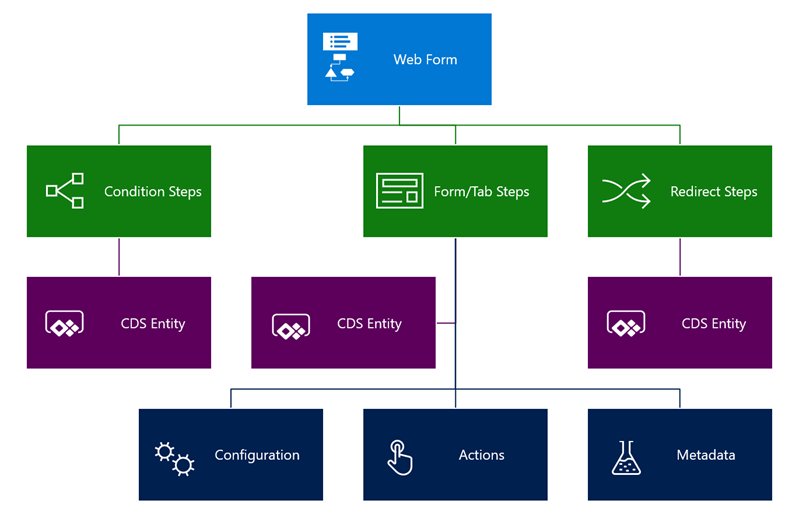

Web forms are configured in the Portal Management app, not through Power Apps portals Studio.

> [!div class="mx-imgBorder"]
> [](../media/web-form-overview.png#lightbox)

### Web form properties

Unlike an table list or table form, a web form is not linked to any particular Microsoft Dataverse table. Instead, a web form organizes web form steps and persists a history of a user's steps as web form session rows. Options on the web form control top-level preferences for the multi-step process:

- **Start step** - Controls the initialization of the form within the portal.

- **Authentication** - Associates a form session with a portal user. Authenticated web forms capture portal user information and provide the **Save** and **Resume** capabilities by using sessions.

- **Expiration** - Defines how to handle stale saved sessions and expire them.

- **Progress indicator** - Is supported where the web form includes multiple steps.

### Web form steps

Web form steps provide the flow logic of the form’s user experience, such as steps and conditional branching. They also provide details regarding the rendering of a form and additional behavior.

> [!IMPORTANT]
> If web form steps are modified, previously created history data could now be stale. Whenever steps are changed, we recommend that you delete all web form session rows to eliminate a mismatch between the sequence of steps that are logged in the history and the current sequence.

Each web form that is presented on the portal has one or more steps. These steps share some common properties:

- **Target table** - The Dataverse table that is selected for the step defines available columns and how step data is related to the previous and next steps in the sequence.

- **Next Step** - Each step contains a pointer (a lookup) to the next step, with the exception of terminal steps. Terminal steps do not have a next step and are the last step of the web form. With conditional branching, you can have multiple terminal steps.

- **Move Previous Permitted** - This property defines whether the step allows users to return to the previous step. Depending on the logic and the data that is captured, some steps are irreversible, while others (typically during the information capture sequence) allow navigation back and forth through the steps.

The following step types are available: **Load Form/Load Tab**, **Redirect**, and **Condition**.

> [!NOTE]
> The **Condition** step can't be selected as the start step for a web form.

#### Load Form and Load Tab steps

The **Load Form** and **Load Tab** step types allow the step to act as an table form within the overall web form process. These steps load a model-driven form with a similar set of available options as an table form. For more details about configuring individual **Load Form** and **Load Tab** steps, see [Define a load form and load tab step type](https://docs.microsoft.com/powerapps/maker/portals/configure/load-form-step/?azure-portal=true).

Similar to the table form configuration, the related web form metadata rows contain additional behavior modification logic to change or override the functionality of form columns when they are rendered on the portal. You can use the web form metadata to redefine the behavior of individual columns, sections, tabs, subgrids, notes, and timelines.

#### Redirect step

The **Redirect** step type allows for a redirect of the user's browser session to another page in the portal or to an external URL. This step is useful for seamlessly directing the process flow. Configuration is similar to the table form's **On Success** settings. For more information, see [Add a redirect step type](https://docs.microsoft.com/powerapps/maker/portals/configure/add-redirect-step/?azure-portal=true).

#### Condition step

The **Condition** step type evaluates an expression. If the expression evaluates to true, then the next step is displayed. If the expression evaluates to false, and if the **Next Step If Condition Fails** is specified, that step is displayed. Combining the **Condition** and **Redirect** steps allows the creation of data-driven process flows.

> [!IMPORTANT]
> Design-time validation does not exist for expressions. If a specified logical expression is invalid, for example, if it refers to a non-existent table column, the step fails to run and a generic portal error message is displayed to the user. Keep expressions simple and make sure that the syntax and column references are correct.

For more information about configuring **Condition** steps and expression syntax, see [Add a conditional step type](https://docs.microsoft.com/powerapps/maker/portals/configure/add-conditional-step/?azure-portal=true).

## Add a web form to your portal

A web form defines required behavior but does not contain information regarding how and where on the website to render the form. The web form contains relationships to web pages and a start step to control the initialization of the form within the portal.

> [!NOTE]
> A web form can't be selected as an action target; it can only be displayed on a web page.

The web form is not listed as a component in portals Studio, but a maker can add the following Liquid tag to the page source code to display a pre-configured form in the Portal Management app.

```twig

```

> [!div class="mx-imgBorder"]
> [](../media/web-form-portal-studio.png#lightbox)

You can also select a web form as the value for a **Web Form** lookup on a webpage. The page template that is associated with the webpage uses that form definition to render the form.

> [!VIDEO https://www.microsoft.com/videoplayer/embed/RE4AoG8]