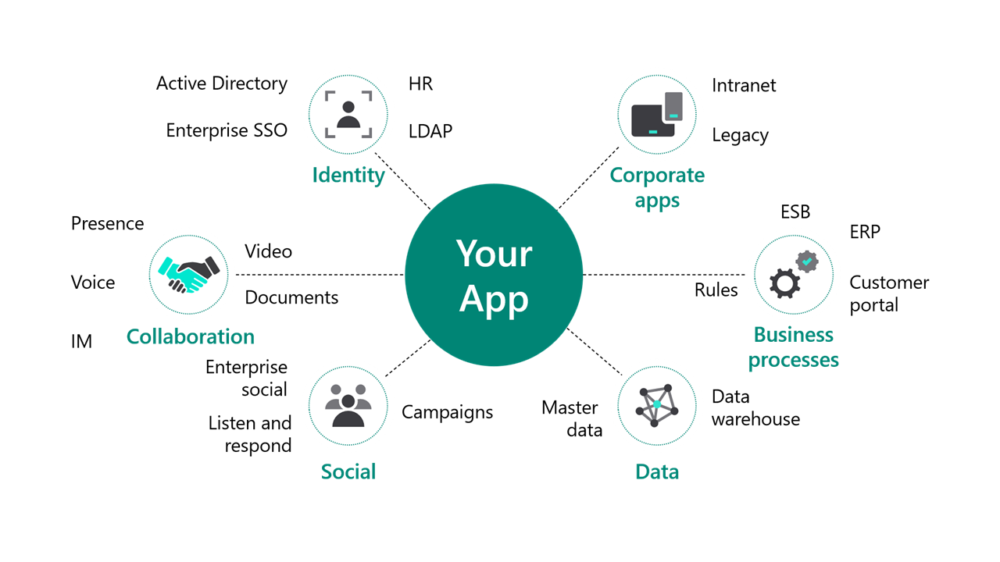

The solution architect leads the identification of integrations both in and out of the Power Platform. The solution architect will guide how implementations are designed as part of the overall architecture.

In this module, you will learn the different ways to integrate with the Power Platform and the solution architect's role in integration. You will learn about:

    - What is integration and why do we need it
    - Power Platform features that enable integration.
    - Leveraging the capabilities of Azure.

The business app you are building is often just a part of an overall bigger picture. While in the user's perspective the app is connecting to various other enterprise systems, the app could just be a participant in a much larger enterprise process flow that spans multiple enterprise systems.

## What is integration

Integration is the connecting one or more parts or components of systems to create a more unified experience or to ensure a more consistent outcome of a process. Integration results in a system that acts as one, not as individual parts executing on their own agenda.

Integration is often thought of as stitching together pieces to create a greater whole. Integration allows for things like data integrity, better user adoption, higher ROI etc.

Different components can be connected or disconnected and integration is the process of determining how best to get them to work together in a coordinated way.

## Why do we need integration

Here are six common variables involved in determining the necessity of integration. Each variable defines an inherent problem, which allows for rectification through integration.

- Usability: From the user's perspective, a common problem in enterprises is the variety of different systems they need to interact with to perform a job. Through integration, the tasks a particular user needs to perform can be provided in a single, seamless, user interface. Training costs and time to perform a task can be decreased. This can also lead to greater consistency and customer satisfaction.

- Volume: Where data volumes are large, or are changing regularly, it can be problematic to duplicate. Through integration, rather than by copying or migration, the data can be accessed from a common place.

- Real-time: It is important to have access to up-to-date information about customers. Because customer data can be managed by different teams or as part of a regulated process, it may not be possible to use the same system to support both business needs. Integration can make it possible to access up-to-date data in real-time, ensuring accuracy every time.

- Cost: Some functionality is cheaper to access externally rather than reproduce. One example is address lookup. Integration to an external provider can be cheaper than replicating the capability from the raw postal service source data within the system.

- Duplication: Consistency of data is critical. One example is allocation of service resources to tasks. Duplication may end up in double-booking, resulting in an inability to deliver the service required. Although this capability may be required across multiple business areas, it is not uncommon for a single system to manage the allocation and offer that consistent service to other systems, an ability that integration can provide.

- Reuse: Reimplementing common functionality is expensive, particularly when ongoing maintenance and regression testing of enhancements are considered. An approach where common functionality is reused, rather than being reimplemented, can often be cheaper and lead to greater consistency. Integration can provide this vital undertaking.

## Types of integration

There are three types of integration:

- Data Integration: Combining data from different sources and presenting the user a unified view.
- Application Integration: A higher-level integration connecting at the application layer.
- Process Integration: Combining multiple disparate systems, each of those systems is part of an overall business function.

## How can the solution architect help?

The solution architect:

- Identifies where integration is required.
- Leads the design effort on how integrations are implemented and ensuring that integrations fit within the overall architecture.
- Leads the evaluation efforts of third-party integration tools.
- Ensures that the integration doesn’t make the solution too fragile.
- Considers integrations as part of overall disaster recovery plan.

The solution architect event evaluating integrations should always consider "The cost of doing nothing". To figure out whether it is worth integrating data, applications, or processes, the solution architect must first understand the cost of not solving the problem. As a part of defining the business value that you hope to achieve from integrating with your Power Platform solution, you should get a better understanding of what it is costing the organization to solve the problem in the current manner or what it would cost to perform manually. In other words, measure the cost of doing nothing. A key question to ask is how often does this happen. You may have seen situations where an integration has taken six months to develop, only for it to be synchronize a small number of customer details a day.
