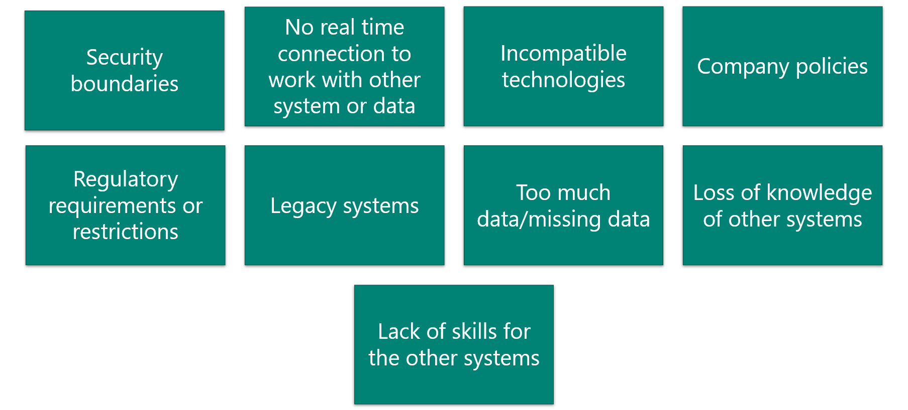
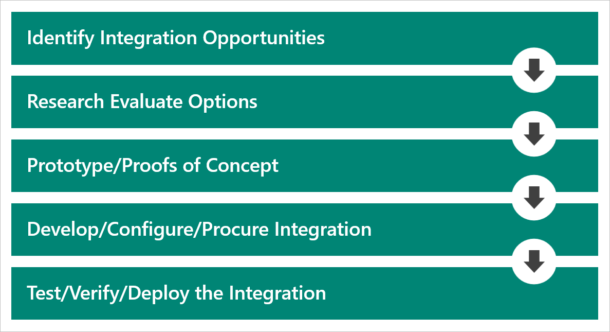

Integrations can be expensive and complex, but just as real are the perceived challenges.

## Common challenges

Below are some common integration challenges that a solution architect may face:

The solution architect must ensure that integrations are not brittle; tightly coupled systems are hard to change.

## Influencers

These are some items that will influence how you design integrations:

- Volume of data being moved or accessed.
- Quality of data.
- Latency to access or work with other system.
- Security requirements.
- Reliability requirements.
- Impact of duplication of data or functionality.
- Fit with existing Power Platform capability.
- Cost, time, and resources.
- Internal politics.

## Causes of failure

Consider the projects you have had experience of and seen issues with integrations. What caused the integrations to fail?

The following factors will destine integrations to fail:

- Underestimating the complexity of integrating.
- Poor user experience using the integrated solution.
- Increasing cohesion of components creating a fragile system.
- Not knowing what Power Platform does or does not do well.
- Not knowing what the other system does or does not do well.
- Source data is of poor quality, or is full of duplicates and dirty data.
- Not being clear as to what the system of record is.
- Having multiple parties involved and not coordinating the building of the integrations.
- The other parties building integrations not knowing the Power Platform.

## Designing for resilience

The solution architect needs to ensure that integrations are designed to be resilient:

- Expect transient errors with your integrations.
- Include escalating retry logic with the circuit breaker pattern to eventually fail.
- Use queuing or other loosely coupled techniques to increase resiliency.
- Include in your designs how to handle common expected failures.

## Integration design process

Every situation is unique you will encounter a wide variety of integration scenarios on projects. While it is useful to be introduced to a technology and how to integrate, it is more important that you develop skills to evaluate real project needs. However, using the principals, ideas, and concepts you can navigate through complex integration challenges. The following diagram shows the steps you should follows:

The design process is a balance and there is often no right or wrong answer or solution. When considering the options for integration the solution architect needs to take into account the skills available in the team and the breadth of capabilities of the Power Platform.

In some cases, it is cheaper to hire staff than to build the integration. As technologists, we often overlook non-technical solutions that are still viable. You should also be asking is the integration needed and does it need to be real time.

> [!IMPORTANT]
> The solution architect should also consider using Power Automate Desktop flows to perform integrations at the user interface level.

## Data integration

When evaluating integrations, the solution architect should categorize each piece of data as this will guide the solution architect towards the appropriate integration solution. The following are ways to categorize data:

- Volatility: Is the data highly volatile that is, is it rapidly changing.
- Volume: How large is the volume of data?
- Time sensitive: Does the data need to be real time.
- Batch: Can the data be processed in batch or must it be processed on a transaction by transaction basis?
- Regulated: Does the data contain personal information or are there restrictions on where the data can be stored.
- Licensed: Is the data licensed and are there limitations on the data use?
