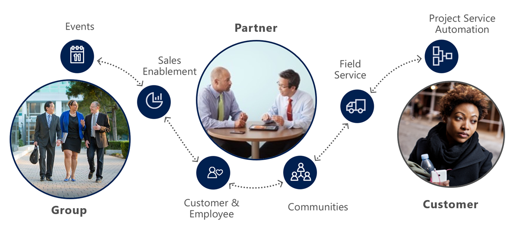

Model-Driven and Canvas Power Apps deliver business functionality to the *users*.  Power Apps portals extend the Common Data Service to internal and external *audience*s such as communities, customers, partners, and employees.

Power Apps portals come with a variety of pre-configured portal solutions targeting many diverse audiences. Starter portals have many features that add value to the Dynamics 365 first-party apps. Let's take a look at how these features help modern business to engage modern audience.

## Modern Audience

We have all had our share of the customer service support experiences, both positive and negative. Would you rather be, on hold for a long time, waiting for a customer service agent or use self-service capabilities of the company's web site, going directly to the supplier's knowledge base for the products and services? Would you rather write a letter and mail it, without any expectations of a reply, or engage in the online community forum and get the answer from other users sharing their experiences?

Portal capabilities empower the majority of online consumers who prefer to find answers on their own through self-service and community options. Using Power Apps portals you can provide them with a branded, personalized self-service experience that leverages an organized, searchable knowledge base to deliver consistent, up-to-date answers, and community experience for peer-to-peer support and direct interaction with your subject matter experts. The portals provide simple navigation, with seamless transitions between self and assisted support.

Out of the box mobile optimizations for portal and knowledge articles ensure customers can get the help they need anytime and from any device. 

Consumers are a major driver of this trend:

* The majority of global consumers now expect brands and organizations to offer a self-service portal. 
* Nearly one-third of consumers keep in touch with brands they've done business with to make sure they are getting the most out of their purchase. 
* Half of the end users are using multiple channels to stay connected including web, mobile, telephone, social and self-service; often using many channels for a single support experience.

Providing a web portal interface takes these user trends and brings any engagement, including partner, groups and employee scenarios directly accessing Common Data Services to create a modern connected experience for both external users and internal business operations.

## Modern Business

Let's take a look the same trend but from a business perspective. Your business is already using Power Apps. Consider what additional capabilities can Power Apps portals deliver. 

**Provide self-service support.** When your business is growing, would you rather employ extra staff in call centers OR add self-service capabilities to your web site where your customers can search knowledge articles, engage with other customers, find answers and create support cases when needed (that then go directly into Dynamics 365 Customer Service), all without a single interaction from your resources?

**Build sales pipeline.** When a lead fills in a contact us form on your company site would you rather receive this information as an email OR get it recorded in Dynamics 365 Sales where the record can become part of your sales pipeline *automatically*?

**Empower employees.** When an employee needs a new computer, would you rather see them sending an email to the helpdesk OR simply filling in an online form with the information being recorded in the Common Data Service with the helpdesk staff immediately accessing and processing this information?

**Engage mobile workforce.** Empower agents on any device, wherever they work. Field technicians can process and complete work orders in the field, instantly updating the Dynamics 365 Field Service.

> [!VIDEO https://youtu.be/5JRHxh48tTc]

## Power Apps portals capabilities

It is important to understand that Power Apps portals are built on top of the Common Data Service. This architecture comes with a major benefit. All the differentiating features of **model-driven Power Apps** are the features of **Power Apps portals** as well: centralized management, Common Data Model, roles and permissions, forms and views, business rules, declarative workflows and actions, plug-in architecture, integration with other services, Common Data Service extensibility, audit, and more.

Power Apps portals deliver complete content management system out of the box, with all content stored in the Common data service. That means the content can be edited not only via the portals studio, but also directly using the Portal Management App. Content can be secured using the robust Common Data Service security model.

These are the key capabilities of Power Apps portals:

|                          Capability                          |                   | Description                                                  |
| :----------------------------------------------------------: | ----------------- | :----------------------------------------------------------- |
|                  | **Content**       | Seamless, responsive, and customizable web design for any user on any device. Full tracking and context available as the Common Data Service is the backend system for all interactions. |
|                        | **Functionality** | Quickly build secure, functional websites to interact with the Common Data Service with no coding required. Track customer interactions across all channels and capture them in a custom Power Apps or Dynamics 365 instance. |
|                      | **Extensibility** | Leverage powerful Power Platform business processes natively extended through the web front-end. Integrate portals with other systems like SharePoint or Power BI. Extend portals with custom development to cater for complex scenarios |
|  | **Security**      | All data used to build portal content is protected through the Common Data Service security model. Power Apps portals extend this model to secure and tailor the content for the target audiences who are not Common Data Service users. |
