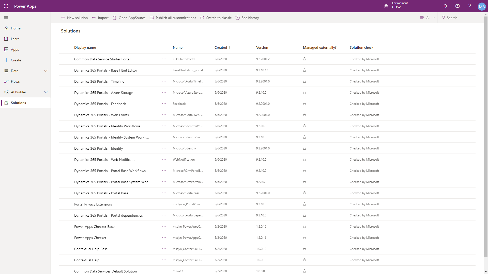

A Power Apps portal provisioned in a Power Platform environment is composed of three main components;

* Portal Solutions
* Portal Metadata
* Portal Web Application

The different components work together to surface a web site to an external user view the portal on a browser.

### Portal solutions

Installed in the Common Data Service environment is a series of managed solution components that extend the Common Data Model. The solutions define a model driven app as well a set of entities, processes, and plug-ins that are used to construct the framework of a Power Apps portal.  The entities are used to store the various portal metadata records. The Portal Management app allows administrators, configurators, and makers to configure and fine-tune various portal settings.  A number of actions, workflows, and plug-ins are deployed to automate the creation of specific portal records and assist with the management of portal users.

### Portal metadata

The configuration details of a Power Apps portal is defined by the portal metadata.  Templates, web links, content snippets, site settings, and many more items are stored as related Common Data Service records that can be created and modified to establish the look and functionality of the portal. 

One of the distinctive features of Power Apps portals is using Common Data Service as a centralized storage for the information required to run the portal website. Everything that portals require to run, including metadata and content, is stored in Common Data Service database making it easy to back up and transport portal solutions between the environments.

### Portal web application

An Azure web application is provisioned in the same tenant as the Common Data Service environment with the portal solutions and metadata.  The web application reads the various portal metadata records and surfaces the various pages on an externally facing website.  Authenticated and unauthenticated external users can interact with the externally facing portal and create, read, update, and delete information from the Common Data Service.

