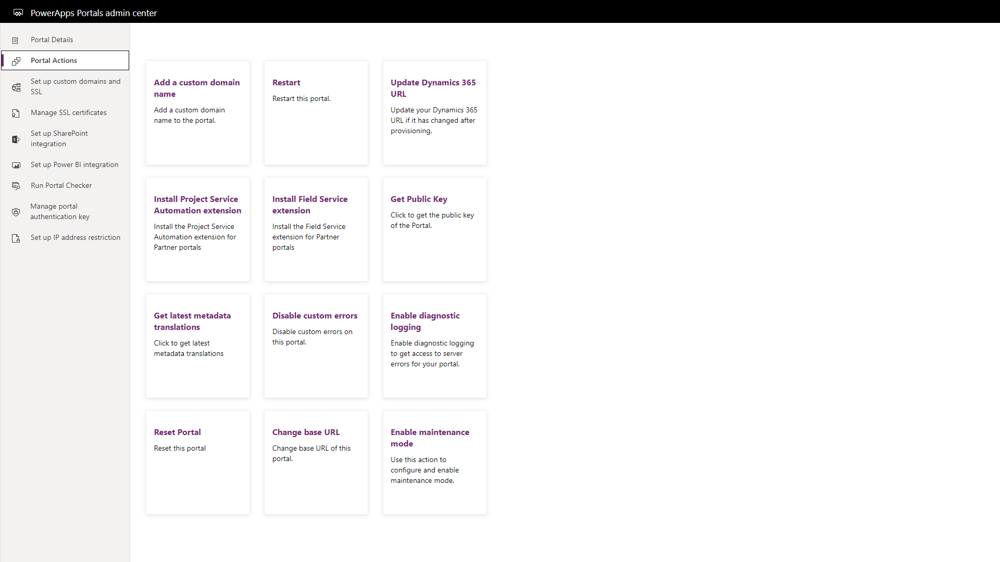

There are a number of tools available in the Power Platform to administer, configure, and fine-tune a Power Apps portal to meet specific business requirements.

## Portal Studio

The Power Apps portal Studio is a what-you-see-is-what-you-get (WYSIWYG) design tool that will allow portal makers to create web pages and content and specify specific properties of portal components.  To access the Portal Studio:

1. Navigate to https://make.powerapps.com.
2. Select the target environment using the environment selector in the top right-hand corner.
3. Select the application of type **Portal**.
4. Click **Edit** menu.

The portal studio is used for quickly defining a site structure with web page management, creating page layouts, and embedding forms and lists and theming & reviewing page templates.

## Portal management app

The Portal Management app is a model-driven Power App where makers can directly create and update portal metadata and content to configure a portal.  To access Portal Management app:

1. Navigate to https://make.powerapps.com.
2. Select the target environment using the environment selector in the top right-hand corner.
3. Click **Portal Management** model-driven app.

> [!NOTE]
> The Portal management app may be named the Dynamics 365 Portals in existing Dynamics 365 environments.

There is a number of additional configuration options currently available in Portal Management app that are not accessible in the Portal Studio.  Portal Management app can used for creating and editing content snippets, managing advanced options for entity forms and entity lists, and other advanced configuration tasks.

## Portal admin center

The Power Apps portals admin center allows administrators to configure and control specific administration functions of a portal such as configuring custom URLs, enabling diagnostic logging or to enable or install specific features.  

To access Power Apps portals admin center:

1. Navigate to https://make.powerapps.com.
2. Select the target environment using the environment selector in the top right-hand corner.
3. Select the application of type **Portal**.
4. Click **Settings** on the command bar.
5. Click **Administration** link under **Advanced options** in the flyout **Portal settings** panel.

