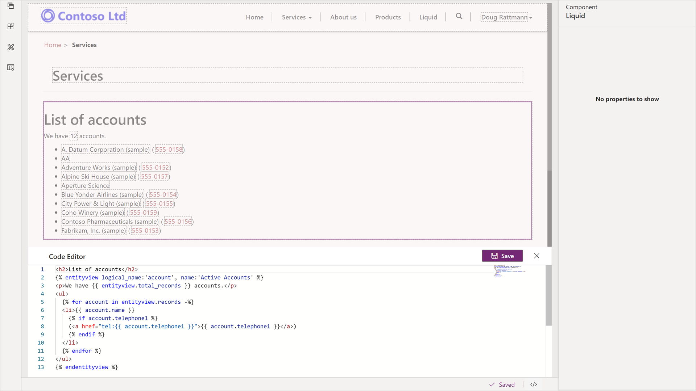

The purpose of this hands-on lab is to access Microsoft Dataverse data by using Liquid.

## Learning objectives

At the end of these exercises, you'll be able to:

- Enter Liquid code as part of the page content.
- Access Dataverse by using Liquid.
- Add conditional statements to display only available data.

### Prerequisites

For this exercise, you need to have the following parameters set up in your environment:

- A Power Apps portal that is provisioned. If you do not have a Power Apps portal available, follow the [Create Portal](https://docs.microsoft.com/powerapps/maker/portals/create-portal/?azure-portal=true) instructions to create one.
- Access to the Power Apps maker portal.

### High-level steps

In this exercise, you will display selected Dataverse records by adding some HTML and Liquid code to the webpage copy section by using the Power Apps portals Studio code editor.  

- Open your portal in Power Apps portals Studio.

- Open a Services webpage.

- Add HTML and Liquid code that lists all active accounts.

- Preview the results in portals Studio.


#### Launch portals Studio

Follow these steps to launch portals Studio:

1. Go to the [Power Apps maker portal](https://make.powerapps.com/?azure-portal=true).
1. Make sure that the correct environment is selected in the environment selector in the upper-right corner.
1. From the **Apps** list, locate your portal app (Type = Portal).
1. Select the ellipsis (**...**) and then select **Edit**. Portals Studio will launch.

#### Select webpage

To select the **Services** webpage, follow these steps:

1. From the toolbelt, select the **Pages** icon.
1. Locate the **Services** webpage and select to edit it.

#### Edit source code

To edit the source code, follow these steps:

1. Select the page copy section on the canvas.

1. Select the **Source Code Editor** (**</>**) icon.

1. Replace the existing paragraph with the following HTML and Liquid code.

   ```twig
   <h2>List of accounts</h2>
   
   <p>We have {{ entityview.total_records }} accounts.</p>
   <ul>
     
     <li>{{ account.name }}
       
       (<a href="tel:{{ account.telephone1 }}">{{ account.telephone1 }}</a>)
       
     </li>
     
   </ul>
   
   ```

1. Select **Save**.

   You should see the list of current accounts on the canvas, including hyperlinked telephone numbers where they are present.
   > [!div class="mx-imgBorder"]
   > [](../media/liquid-exercise.png#lightbox)

1. Select the **Browse website** button. The displayed webpage should only contain the text, "We have 0 accounts."

    > [!NOTE]
    > This result is expected because, at runtime, the portal will deny access to entity records unless an entity permission record exists to allow access to the data.
