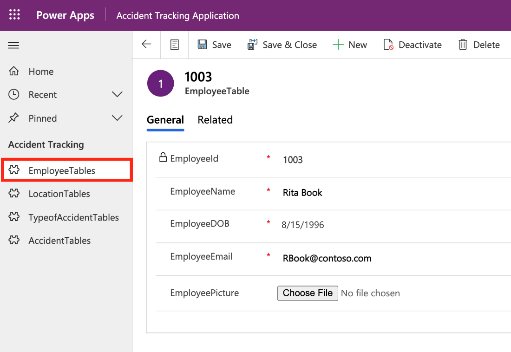
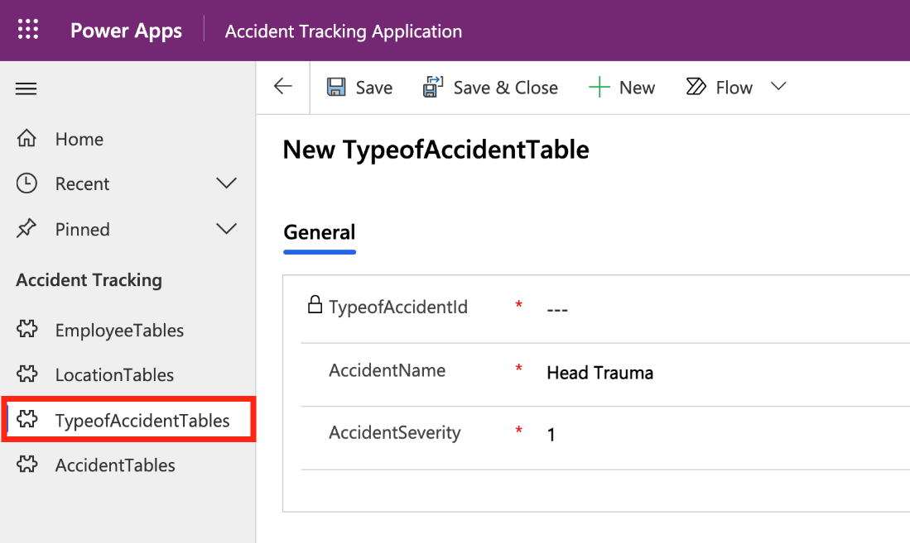

In this section, we will be reviewing the screens necessary to build out the solution. The idea is that you will have a visualization of the final solution. Just like a great artist it is important to visualize the final result in order to begin putting it together. We will break the solution into the following components:

-   **Employee form:** This will be used to add employees (metadata) to the solution. You want a place to track basic information about employees. We will create a table to store basic employee information along with a form to enter and modify employee data.

	> [!div class="mx-imgBorder"]
	> 

-   **Location form:** This will be used to track basic information about the different Contoso locations. Same concept applies, we will build a table plus a form for managers to interact with the data

	> [!div class="mx-imgBorder"]
	> 

-   **Type of Accidents form:** This will be used to track the different type of accidents that occur, also to track some information (metadata) about the accidents like a severity scale.

	> [!div class="mx-imgBorder"]
	> 

-   **Incident tracking form:** This is the main form where managers can record the information about employee accidents. This form will utilize the data from all the previous forms.

	> [!div class="mx-imgBorder"]
	> 

When building a model-driven app, it is important to break the solutions into smaller components in which tables in Dataverse are the building blocks. Model-driven apps then start from your data model, building up from the shape of your business process. In our case, we broke it down to the different tables and forms, which are needed for our accident tracking application. In the next unit, we will analyze our data model.
