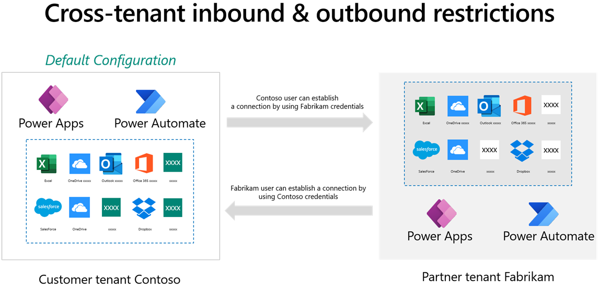
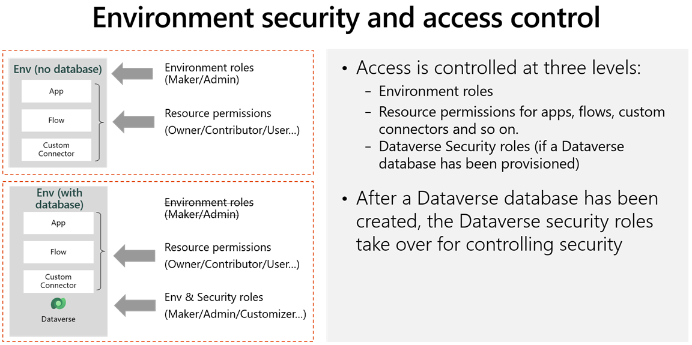

Environments are containers that administrators can use to manage apps, flows, connections, and other assets; along with permissions to allow organization users control access to the environment and its resources.

Power Apps apps and Power Automate flows do not provide users with access to any data assets that they do not already have access to. Users should only have access to data that they really require access to.

Access to environments is multi-layered. Environments are contained within an Azure Active Directory (AAD) tenant. Access to the environment is authenticated by Azure AD. Users must have a user account in Azure AD to access any environment and have a license to use the Power Platform. To access an individual environment user needs a Microsoft 365 role if there is no Dataverse database, and a Dataverse security role if there is a Dataverse database. Users also need to be given permission on resources in an environment such as apps, flows, and connectors.

An administrator can also control access to environments from other Azure AD tenants in B2B scenarios.

## Azure AD

The Power Platform uses Azure AD to authenticate users for the Power Platform.

Azure AD has several features that the Power Platform can utilize:

- Identity and Access Management (IAM): Manage access to Power Apps apps
- Authentication: Verify credentials when a user signs in to an App of users a flow.
- Single sign-on (SSO): Access apps without having to log in separately,
- Multi-Factor Authentication (MFA): Prompted a user during sign-in for other forms of identification.
- Business-to-Business (B2B): Manage your guest users and external partners, while maintaining control over your own corporate data. Guest access is supported for the Power Platform.
- Conditional Access: Manage access to your apps using signals to make decisions on allowing access.
- Device Management: Manage how your devices access your corporate data.
- Enterprise users: Manage license assignment.
- Hybrid identity: Azure AD Connect provide a single user identity for authentication and authorization, regardless of location (cloud or on-premises).
- Identity governance: Manage your organization's identity through employee, business partner, vendor, service, and app access controls.
- Identity protection (MSIP): Detect potential vulnerabilities affecting your organization's identities.
- Reports and monitoring: Insights into the security and usage patterns in your environment. The Power Platform admin center provides more detailed insights than provided by Azure AD.

There are other features of Azure AD that are not currently supported with the Power Platform such as:

- Business-to-Customer (B2C): Control how customers sign in using their preferred social, enterprise, or local account identities.
- Managed identities: An identity in Azure AD that can authenticate any Azure AD-supported authentication service. Currently not supported in the Power Platform and service principals must be used instead.
- Privileged identity management (PIM): Provides elevated administrator access in a just-in-time manner.

An organization is likely to have chosen how it implements Azure AD and a Power Platform solution is unlikely to change this fundamentally. However, the Power Platform may provide access to users who have never had IT app access before such as mobile frontline workers, business partners, and external contractors who do not have identities in Azure AD. Therefore you may need to consider Conditional access, B2B, and Guest users.

Conditional Access required an Azure AD Premium license. Conditional access policies can grant or block access to apps and data based upon:

- User
- Device
- Location

Azure AD B2B collaboration is a feature that lets you invite guest users to collaborate with your organization. You can assign licenses to guest users to run apps built with the Power Platform. Guests cannot currently create or edit Power Apps.

For more information, see [enabling guests to access Power App](https://docs.microsoft.com/powerapps/maker/canvas-apps/share-app-guests/?azure-portal=true) and [Power Apps per app](https://docs.microsoft.com/power-platform/admin/about-powerapps-perapp/?azure-portal=true).

## Cross Tenant isolation

In B2B collaboration scenarios, you securely share the apps and data in your tenant with a third party's tenant. In the default configuration, each tenant can access the other tenant's resources.

Azure AD has a feature called tenant restrictions. With tenant restrictions, organizations can specify the list of tenants that their users are permitted to access. Azure AD then only grants access to these permitted tenants. Cross-tenant isolation lets you restrict the other tenants your users can connect to. Cross-tenant isolation blocks inbound or outbound connections for canvas apps and flows.

Restricting outbound connections means a user in your tenant is blocked from connecting to a third-party tenant. Restricting outbound cross-tenant connections can be done using tenant restrictions that apply to all Azure AD cloud apps that would block outbound connections for Power Apps and Power Automate flows.

Restricting inbound connections means a user in a third-party tenant is blocked from creating a connection to your tenant.

> [!IMPORTANT]
> Restricting inbound cross-tenant connections requires a support ticket. This restriction then only applies to Power Apps and Power Automate flows.

## Securing Environments with Security Groups

By default a user with a Power Apps license can potentially access all environments in a tenant and you can see all licensed users in the user table in an environment. Azure AD Security groups can be used to limit access to environments. This has the added advantage of keeping the user table streamlined to just the  users of the environment.

A security group can be associated with an environment when the environment is created, or it can be linked to the environment. In the following screenshot, a security group for the developers has been associated with the development environment.

The following behavior is observed:

- When users are added to the security group, are added to Dataverse as users.
- When users are removed from the security group, they are disabled in Dataverse.
- When a security group is associated with an existing environment containing users, the users in the environment that are not members of the security group will be disabled.
- When no security group is associated with an environment, all users with a Power Apps license will be created as users and enabled in the environment.

> [!NOTE]
> Distribution groups and Office 365 groups cannot be associated with environments.

## Roles and Admin accounts

Managing environments and performing some administration activities requires one or more of these administrative roles:

- Global admin: A user with role has full administration access to all services in the tenant. Global admins have access to all Power Platform environments and will be added to all Dataverse environments with the System Administrator security role.
- Power Platform admin: A user with the Power Platform admin can create environments, manage all environments even if the users do not belong to the security group for the environment, manage Power Apps, manage Power Automate, and manage Data Loss Prevention policies. A Power Platform admin can also manage support tickets and monitor service health.
- Delegated admin: Delegated administration is used by Microsoft Cloud Solution Provider (CSP) partners to manage their customers through the Microsoft Partner Portal. A Delegated admin has full administration to all services in the customer's tenant.

> [!NOTE]
> The Dynamics 365 admin role is deprecated. A user with the Dynamics 365 admin role can create environments, and manage environments but only if they belong to the security group for that environment. A user with the Dynamics 365 admin role will have the System Administrator security role in those environments.

These roles are not the same as security roles in an environment. Non-administrative users can be assigned a role for an environment. The roles that are used are different depending whether the environment contains a Dataverse database or not.

The Environment Admin role is only used when there is no Dataverse database. Environment Admin for a specific environment and allow the user with the role to add and remove users with the Environment Maker role. The Environment Maker role allows a user to create apps in that environment.

When a Dataverse database is added to the environment, a user with the Environment Admin role is given the System Administrator security role in the Dataverse database and a user with the Environment Maker is given the Basic User security role.
