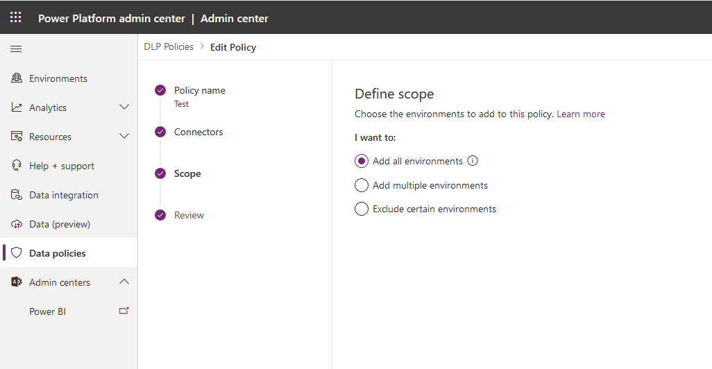

Data loss prevention (DLP) policies act as guardrails to help prevent users from unintentionally exposing organizational data and to protect information security in the tenant. DLP policies enforce rules for which connectors are enabled for each environment, and which connectors can be used together.

The purpose behind DLPs is to prevent unauthorized data access and leakage from the Power Platform. As solution architect, you need to be concerned with DLPs because:

- DLPs ensure proper data flow in an organization following organization policies.
- DLPs can prevent a developed solution from working properly if not included in your plans.
- DLPs Can break your solution after you deploy, if they are added later.

## Key facts

- Data loss prevention policies (DLP) enforce rules for which connectors can be used together.
- Connectors are classified into groups.
- A connector in one group can only be used with other connectors from that same group in an app or a flow.
- Tenant admins can define policies that apply to all environments.
- By default, no DLP policies are implemented in the tenant.

Connectors are classified as either business data only, no business data allowed, or blocked. A connector in the business data only group can only be used with other connectors from that group in the same app or flow. The names "business" and "non-business" do not have any special meaning, they are simply labels. The grouping of the connectors themselves is of significance, not the name of the group they're placed in. Connectors that are blocked cannot be used at all.

> 

> [!NOTE]
> The Common Data Service connectors cannot be blocked.

## DLP and Environments

DLP policies can be scoped at the tenant level and at the environment level.

It is possible to apply multiple DLP policies to an environment. At design and runtime, all policies that are applicable to the environment in which the app or flow resides are evaluated together to decide whether the resource is in compliance or violation of DLP policies. If multiple policies are configured for one environment, the most restrictive policy applies to the combination of connectors.

> [!NOTE]
> Environment DLP policies cannot override tenant-wide DLP policies.

The solution architect should aim to define the minimal number of policies and avoid, if possible having multiple policies applied to an environment.

The following approach is recommended:

1. Create a policy spanning all environments that block all unsupported non-Microsoft connectors and classifies all Microsoft connectors as Business Data.
2. Create a policy for the default environment (and other training environments) that further restricts which Microsoft connectors are classified as Business Data.
3. Create other policies, or exclude those environments from policies #1 and #2 above, that permit certain connectors to be used for specific environments.

## Deploying policies

The solution architect should consider the following with data loss prevention policies:

- It is best to establish a default policy early on and then grant exceptions.
- New and updated restrictions can disable existing apps and flows.
- Changes can take a few minutes to take effect.
- Policies cannot be applied at the user level only at the tenant or environment level.
- PowerShell and admin connectors can manage policies.
- Users of resources in environments can view policies that apply.

When deploying to an existing tenant, there are further considerations that a solution architect needs to liaise with other groups in IT:

- Confirm DLP policies are configured to support your deliverable.
- Know the lead time required for getting changes approved and implemented.
- Know what you can do, and what you require other groups to do.
- Use Azure AD Security Groups for controlling access to environments and resources.
