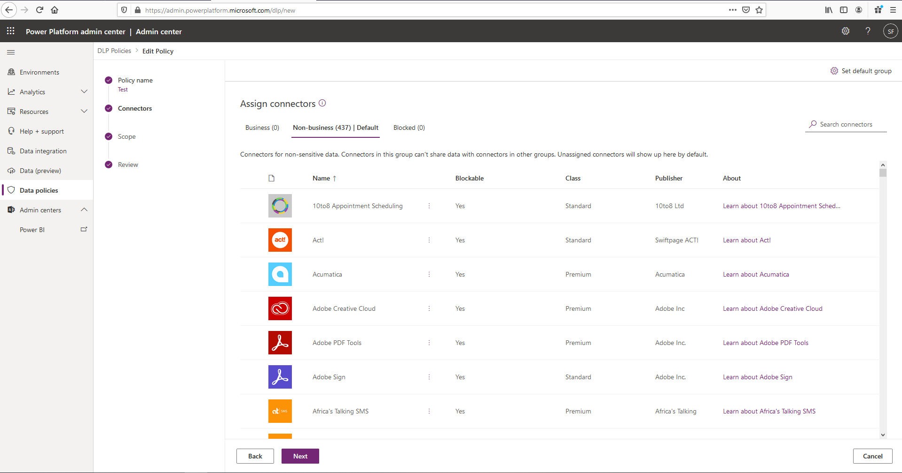
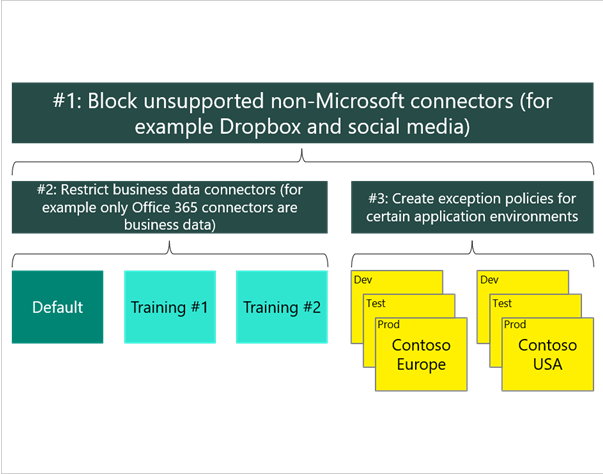

Data loss prevention (DLP) policies act as guardrails to help prevent users from unintentionally exposing organizational data and to protect information security in the tenant. DLP policies enforce rules that establish which connectors will be enabled for each environment and which connectors can be used together.

DLPs prevent unauthorized data access and leakage from Power Platform. As a solution architect, you need to be concerned with DLPs because they:

- Ensure proper data flow in an organization by following organization policies.
- Can prevent a developed solution from working properly, if they are not included in your plans.
- Can break your solution after you deploy, if they are added later.

## Key facts

Key facts about data loss prevention (DLP) policies are:

- DLPs enforce rules for which connectors can be used together.
- Connectors are classified into groups.
- A connector in one group can only be used with other connectors from that same group in an app or a flow.
- Tenant admins can define policies that apply to all environments.
- By default, no DLP policies are implemented in the tenant.

Connectors are classified as either business data only, no business data allowed, or blocked. A connector in the business data only group can only be used with other connectors from that group in the same app or flow. The names "business" and "non-business" don't have special meaning; they are simply labels. The grouping of the connectors is of significance, not the name of the group that they're placed in. Connectors that are blocked can't be used.

> 

> [!NOTE]
> Dataverse connectors can't be blocked.

## DLPs and environments

DLP policies can be scoped at the tenant level and at the environment level.

You can apply multiple DLP policies to an environment. At design and runtime, all policies that are applicable to the environment in which the app or flow resides are evaluated together to decide whether the resource is in compliance or violation of DLP policies. If multiple policies are configured for one environment, the most restrictive policy applies to the combination of connectors.

> [!NOTE]
> Environment DLP policies can't override tenant-wide DLP policies.

The solution architect should aim to define the minimal number of policies and, if possible, avoid having multiple policies applied to an environment.

The following approach is recommended when you're creating policies:

1. Create a policy that spans all environments that block all unsupported non-Microsoft connectors and classifies all Microsoft connectors as business data.
2. Create a policy for the default environment (and other training environments) that further restricts which Microsoft connectors are classified as business data.
3. Create other policies, or exclude those environments from the previous policies, that permit certain connectors to be used for specific environments.

## Deploy policies

Solution architects should consider the following factors regarding data loss prevention policies:

- It's best to establish a default policy early and then grant exceptions later.
- New and updated restrictions can disable existing apps and flows.
- Changes can take a few minutes to take effect.
- Policies can't be applied at the user level, only at the tenant or environment level.
- Microsoft PowerShell and admin connectors can manage policies.
- Users of resources in environments can view policies that apply.

When deploying to an existing tenant, solution architects need to liaise with other groups in IT to:

- Confirm that DLP policies are configured to support your deliverable.
- Know the required lead time for getting changes approved and implemented.
- Know what you can do and what you require other groups to do.
- Use Azure AD security groups for controlling access to environments and resources.
