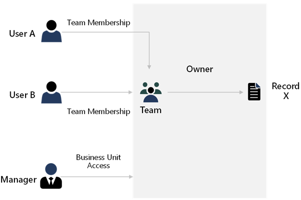

When setting up security, there are four different layers of security you can set up for an app.

- App-level security: App-level security restricts access to the app.
- Form-level security: For model-driven apps, form-level security allows you to allow only specific security groups to access specific forms. This is useful if you want to restrict how people enter or view data by their job role.
- Row-level security: The Dataverse security model controls access to rows.
- Column-level security: Column level security controls access to individual columns in a table.

Security should happen at the platform layer, not the app layer. There are numerous ways to control reading and writing data in an app. You can set columns to read-only on your model-driven form, you can use JavaScript to mask columns from the user experience, and you can hide columns fields from forms and views. None of these approaches really implement security. They do not secure the data and users can still get to the data in other ways such as with Advanced Find or Edit in Excel Online.

Additionally, all users are entitled to use the API and can use third-party and community tools to access the data. For proper security, the security features of Dataverse should be employed.

## Elevated privileges and impersonation

You should avoid giving users high levels of privileges. Plug-in .NET assemblies, Classic workflows, and Power Automate cloud flows can all run with elevated access to perform actions on behalf of the user. API code can impersonate another user if necessary.

## Automation

A solution architect should consider automating aspects of managing users and security. For instance, you can control many aspects from creating teams to sharing rows via the API.

You could  trigger plug-ins or Power Automate flows based on events that occur in the system to change a user's security for example, Elevate the backup account manager automatically or share their data so they can manage account while the primary account manager is on vacation.

## Performance

Solutions with larger number of users and/or data must be aware of impact of choices. For example:

- Too much sharing can create a lot overhead.
- Too many business units can cause slow access.
- Too many processes running on events.
- Poor plug-in design.

A poor security design can lead to poor performance. There are techniques you can use such as:

- Looking for ways to escalate security, for example sharing with a team instead of a user.
- Minimize the number of business units.
- Using access teams instead of owner teams.
- Testing with real volumes and real security scenarios to validate the design.
- Using the Analytics tools in the Power Platform Admin center to view API calls and high volume processes.

The best way to improve performance is to keep the security design as simple as possible.

### Separate and optimize usage patterns

The solution architect should optimize for different usage patterns. This means using the different security model features to provide necessary access as shown in the following diagram with different users having different ways to access the same record.

#### Different business areas can be modeled differently

Not all users work in the same way. The solution architect should reflect different working models of different parts of the business and model each area differently to get an optimum solution as shown in the following diagram.

### Model exceptions as exceptions

The solution architect should aim to model the common access patterns as efficiently as possible and use a more granular model where complex access is required. Sharing is a good example of exception processing. Sharing should be with teams whenever possible.

### Separate historical from active data

Infrequently accessed but high-volume historical data can impact current data access. The solution architect should consider partitioning data in the security model in separate tables and provide a secondary mechanism for occasional access

### Review data model to help security

Some data model adjustments can make security modeling easier. The solution architect should determine if defining new data boundaries simplifies security modeling e.g.m instead of having individual access defined to Account records, moving financial reporting info from Account to a separate Financials table allowing the Account table viewable by all, with Financials table limited to managers only.
