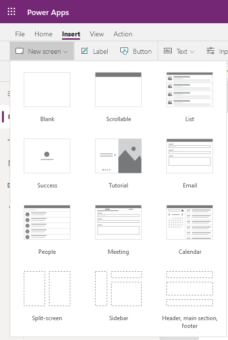
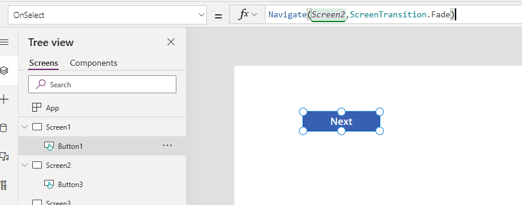
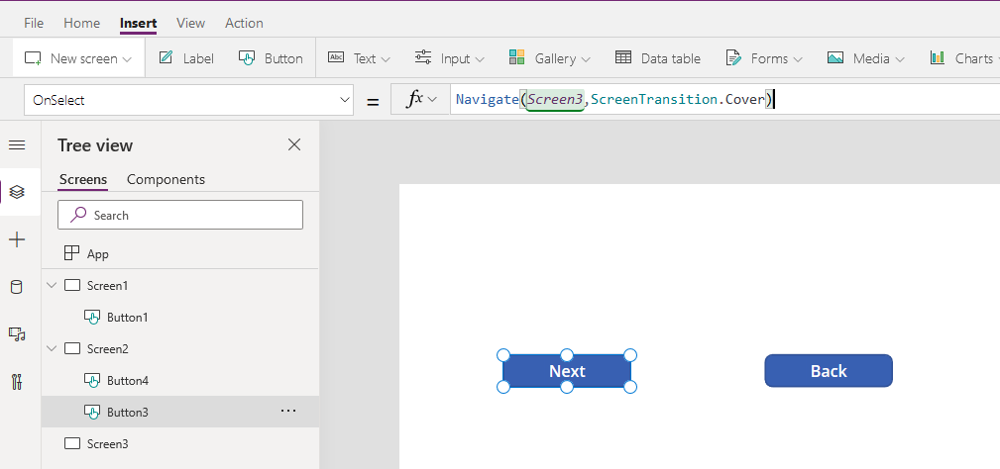
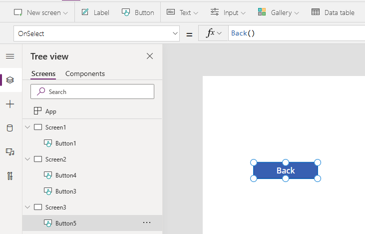

## Exercise -  Create navigation and back functions

 The purpose of this exercise is to provide a more detailed example using the **Back()** and **Navigate** functions with multiple controls in a common real-world scenario. In many of the apps that you
develop, certain screens may have multiple controls allowing users to
navigate to different screens depending on the control they select. In
the following example, you will create a three screen app to
demonstrate the **Navigate** and **Back()** functionality.

1. Go to the [Power Apps Studio](https://make.powerapps.com/?azure-portal=true). If you are using the virtual environment, skip to step 2.

1. Select the **New app** dropdown and choose **Canvas**
1. A new window will open in your browser, create a name and choose **Tablet layout**. Select **Create**.
1. In the new blank app, select the **Insert** tab, select the **New screen** dropdown, and choose *Blank*.

	

1.  This will create a new blank screen in your app. Repeat once more to have three screens total.

1. On Screen1, insert a **Button** control and change the **Text**
    property to **Next**.
1.  On Screen2, add a **Button** control and change the **Text** to **Next**.

1. Add another **Button** control and change the **Text** to **Back**.
1.  On Screen3, add a **Button** control and change the **Text**
    property to **Back**.
1.  On Screen1, set the Next button **OnSelect** property to **Navigate(Screen2,ScreenTransition.Fade)**.

	

1.  On Screen2, set the **OnSelect** property for the Next button to **Navigate(Screen3,ScreenTransition.Cover)**.
1.  Set the **OnSelect** property for the Back button to **Back().**

	

1.  On Screen3, set the **OnSelect** property for the Back button to **Back()**.

	

1.  To test this, put the app in Preview or Play mode and navigate
    through the app as a user would.

As you select each button, notice the subtle visual transitions of each
ScreenTransition. Remember, the Navigate function can include a
ScreenTransition, but it is not required. If you write your Navigate function like
this, **Navigate(Screen2)**, Power Apps would then navigate to the screen without any transition.
