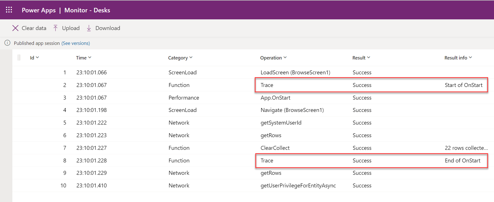

Monitor is a tool that you can launch from Power Apps Studio to help you troubleshoot problems and proactively improve the quality of your apps. Using Monitor, here are some of the key things you can identify:

- Errors using connectors

- Large amounts of data sent/received

- Slow response from connectors

- Duplicated data actions

When Monitor is activated, it captures and allows you to view a stream of events from your running app. These events include user interaction with controls and the use of data sources. Generating this log as the app starts and analyzing it can help you understand how your app is spending its load time.

> [!div class="mx-imgBorder"]
> 

The data captured includes all the necessary context information to allow you to identify problems. Similar information is also available from your browser's developer tools. However, they lack app context information like the control name and formula.

> [!div class="mx-imgBorder"]
> 

Using the event details, you can make changes in the app to correct problems identified and retest without leaving Power Apps Studio or Monitor.

In addition to the events automatically captured, you can also log custom messages using the Trace() function. The custom messages can be helpful to mark the start or the end of OnStart or OnVisible logic. In the following example, we add a Trace before and after we pre-load some data from Microsoft Dataverse.

    Trace("Start of OnStart");

    ClearCollect(colDesks,Desks);

    Trace("End of OnStart");

> [!div class="mx-imgBorder"]
> 

When Monitor is run for the app, you can now see the beginning and end of the OnStart processing by looking for the Trace messages in the event log.

> [!div class="mx-imgBorder"]
> 

When using Monitor to evaluate startup time of your app, it's important that your app is run from a cold start, and you don't manually rerun OnStart or OnVisible from within Power Apps Studio. The cold start ensures the events you capture are not influenced by data caching that can occur when you rerun the OnStart or OnVisible method logic. The cold start can be ensured by using the following steps:

- Enable debugging published app setting

- Save the app

- Publish the app

- Launch Monitor from make.powerapps.com

In the following video, we show how to activate Monitor and review the data captured during startup of your app.

&nbsp;
> [!VIDEO https://www.microsoft.com/en-us/videoplayer/embed/RWP2DX]
