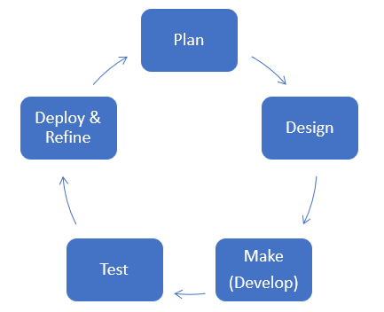

So far, we've covered how to translate a pre-existing and outdated business solution into a modern solution using the Power Platform. We also covered how to create a data model, and how to implement that data model in Dataverse. Now we can get into building the app. But first, let's think through how this app is going to look and work. You may be tempted to skip all these planning stages and jump right into building. But without taking time to methodically plan out your app, you can implement a partial solution or have to go back and change many things later on. Apps go through a development cycle, sometimes referred to as Application Lifecycle Management. The stages are listed in the visual below.

> [!div class="mx-imgBorder"]
> 

We've already been in the planning phase actually, since we've worked out the data model already. But now it's time to plan out what the app will look like and the actual mechanics. So how do you plan an app?

There are many ways to go about this. You could start from your data model and think about how you'll walk through it in the application. But the best way to start planning is from a user perspective. Ask yourself:

- Who will be using this app?

- What will they need to do?

- How will they do it?

In this case, we know that travelers will be using the app. They need to log expenses and look at previous expense reports. As far as how they'll do it, you may automatically think, "by using the app, obviously." But our goal is to walk through the mechanics of the use case, not the broad technical answers. By thinking through these questions, we have a use case scenario that can be placed in a narrative format like the below:

> Travelers will log into the app on their phone and start a report as soon as they begin accruing expenses. They'll continue to log expenses as the trip progresses. As soon as all expenses have been logged, they'll submit the expenses which will be sent to their supervisor. They need to be able to check when the expenses have been approved and sent to accounting so they can predict when they'll see their reimbursement.

You can see by this use case that travelers need not only to submit expenses, but to save them as a draft to come back to later. They need to see expense reports they've submitted in the past, but be unable to see other travelers' expenses. For this, they'll need:

- A screen where they can submit a new expense report or view previous reports, including those being drafted.

- A screen to edit expense reports, whether new or a previous draft.

- A screen to see all previous reports.

You can also see from the use case that the app needs to have the functionality to save drafts and send information to a supervisor, possibly in the form of an email.

Consider writing another use case to expand functionality beyond the traveler's needs. You could have the supervisors approve through the app or accounting check expenses in the app. The different types of users will have different requirements and possible need different screens or functionality. Now you can see how to plan out a complete app by walking through various use cases.
