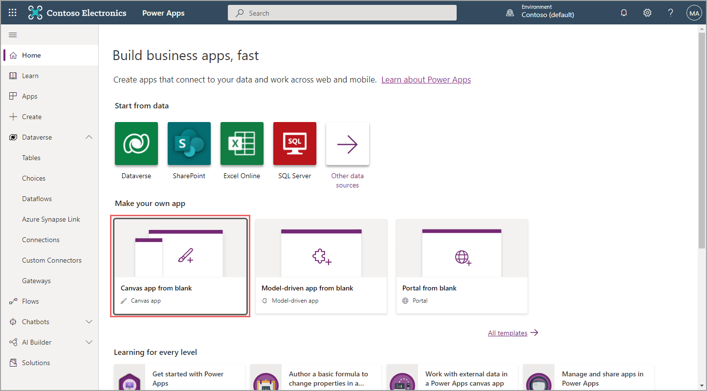

Now that you've spent time planning out your app, you're finally ready to start building!

1. In your browser, navigate to [make.powerapps.com](https://make.powerapps.com/?azure-portal=true) and select **Canvas app from blank**.

   > [!div class="mx-imgBorder"]
   > 

   A pop out will appear prompting you for additional information.

1. Name your app, for our example we're going to call it **Travel Expense Report** and select **Phone** for your format. We know it needs to be a phone layout because of our use case.

1. Select **Create**.

   > [!div class="mx-imgBorder"]
   > 

   The page that opens up is the Power Apps studio where you'll build your entire app out and where we'll spend the next three modules. Canvas apps save automatically every two minutes when you're building in the studio except for the first time. So it's a good idea to save as soon as you spin up your app. To do so, follow step below:

1. In the upper left corner, select **File**.

   > [!div class="mx-imgBorder"]
   > 

1. In the lower right corner, select **Save**.

   > [!div class="mx-imgBorder"]
   > 

   Power Apps will prompt you to share your app, but we won't worry about that until we've completed our solution.

1. Select the **Back** arrow to return to the studio.

Take a moment to familiarize yourself with the studio. The top ribbon should look familiar as it's similar in most Microsoft programs. Also, you have the Tree view on the left side where all of your screens and controls will be listed, and a properties pane to the right, which details the properties for the selected control, in this case a blank screen.

We build canvas apps by placing controls on the screen and then setting the properties for these controls. We'll learn a few of these controls and the properties they have in the next unit, where we create our first screen.
