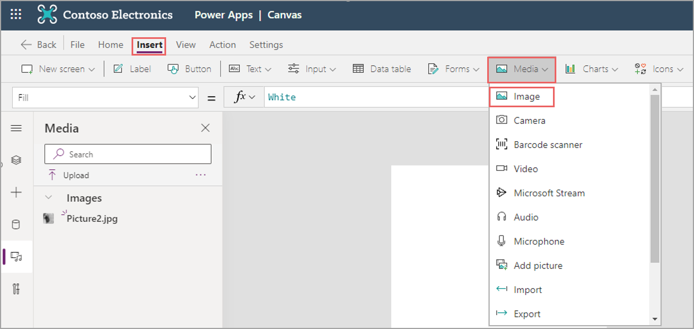
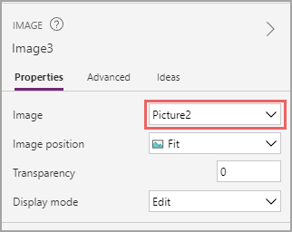
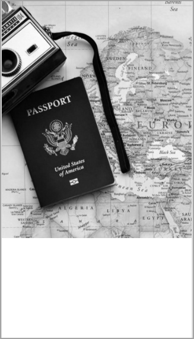
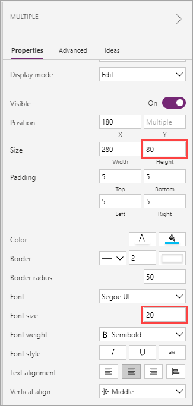

Now that you've planned, started, and saved your app, let's get started building. The first screen in your tree view (the left-hand pane) is your welcome screen. This is the first thing users will see when they open your app. So it needs to be impactful and to instruct or direct them to other places.

To start, let's add an image for visual impact. To do so, follow the steps below:

1. Select the **Media** button on the menu to the left of the tree view, and select **Upload**.

   > [!div class="mx-imgBorder"]
   > 

   You can download this image for upload into your app.

   Once your image is in your app, you may notice that nothing has changed in your screen. While you can access the image, you have yet to add a control.

1. Select the **Insert** tab and select **Media** and then select **Image**.

   > [!div class="mx-imgBorder"]
   > 

   Now you have an image control, but it's not referencing the media you've uploaded.

1. Select your uploaded image in the dropdown on your properties pane.

   > [!div class="mx-imgBorder"]
   > 

   Now you have the appropriate image on your welcome screen.

1. Drag the corners of the **Image** Control to resize the app and position it to take up about two thirds of the screen. You may notice that there's extra space above and below the picture since the image is a different size than the screen. To correct this, change your image position from **Fit** to **Fill** on the properties pane.

1. Double-click the name of the image at the top of the properties pane to rename the control to '**Img_Background_Welcome**'.

   > [!div class="mx-imgBorder"]
   > 

   Your screen should look something like this:

   > [!div class="mx-imgBorder"]
   > 

   It's important as we go to rename all of our controls to something easy to remember. A typical nomenclature follows the pattern of control_purpose_screen. To shorten this, many developers have a few letters to represent each control. You can see that the image control follows this perfectly with 'Img' representing Image, 'Background' stating the purpose of the control, and 'Welcome' stating the screen. There will be many times you reference other controls and following a predetermined nomenclature helps you recall the various controls without interrupting your formulas to double check. To this end, let's go ahead and rename our screen.

1. Get back to the tree view by selecting the appropriate **Menu** button, and then double-click the screen name to change it there to '**Scr_Welcome**'.

   > [!div class="mx-imgBorder"]
   > 

   You'll notice as you go that there are many different ways to do the same things, such as changing the name of a control. These options simply exist to make it simpler and easier to build and don't result in differences to your app.

   For the next step, we could do all the heavy lifting of design ourselves by adding other controls like shapes or changing the colors of various controls. But instead we're simply going to change the theme and let Power Apps make our app stunning with very little effort.

1. To set a new theme, go back to the home tab and select the **Theme** dropdown. You can choose what you would like, but for this design we used **Dark Blue**.

   > [!div class="mx-imgBorder"]
   > 

   The screen background should immediately change. You can see in the small theme preview that a few other things look different, too. Let's add some more controls we'll need and see how the theme affected them.

   One of our user requirements from our use case was to choose between adding a new expense report and editing a draft or viewing old expense reports. We'll need new screens for that, and to navigate we'll need buttons.

1. Select the **Insert** tab and select **Button** twice.

   > [!div class="mx-imgBorder"]
   > 

1. Drag and drop the two buttons on your screen to rearrange them how you would like. Ensure that your buttons are in the exact middle of your app, you can use the alignment options.Make sure one of your buttons is selected, visit the **Home** tab, select the **Align** dropdown, and select **Align center**. This will ensure your button is in the center of your screen. If you select both buttons at the same time, this will ensure the buttons are centered with one another and not the screen.

   > [!div class="mx-imgBorder"]
   > 

   Now that we have our buttons, let's learn about some of the properties that change the way they look. For example, we may prefer the buttons to have a more round appearance.

1. Select one of the buttons and select **Advanced** on your property pane.

1. Scroll down until you see the four radius properties, which are **RadiusTopLeft**, **RadiusTopRight**, **RadiusBottomLeft**, and **RadiusBottomRight**. Replace the **10** with **50**. Radius is the amount of curvature for every corner. You can see that your button looks much more rounded now.

   > [!div class="mx-imgBorder"]
   > 

1. Select your other button. Instead of making changes in the properties pane, you can use the property dropdown immediately below the ribbon. Use this dropdown to find **RadiusBottomLeft** and change it to **50**.

   > [!div class="mx-imgBorder"]
   > 

   Continue to do this with the remaining three radius properties in the advanced tab of the properties pane or in the property dropdown. As mentioned previously, changing these properties in different places doesn't cause any changes in your app. The buttons are the same wherever we altered the radius properties. Most developers prefer to make quick changes in the properties pane and rely on the properties dropdown for large formulas.

   Your app should look like this now:

   > [!div class="mx-imgBorder"]
   > 

1. Press one of your buttons and hold down the **Ctrl** key while selecting the other button. This should allow you to select both buttons at once.

   Not all controls have the same properties. But if controls have similar properties, you can select multiple controls and set them at once.

1. With both buttons still selected, change the Font Color to white by pressing the Color selector on your ribbon.

   > [!div class="mx-imgBorder"]
   > 

1. Double-click the first Button and type '**Create new expense report**'.

   > [!div class="mx-imgBorder"]
   > 

1. Select the other Button and change the **Text** property on the property pane to '**See all expense reports**'.

1. Select both Buttons (by holding down the control key) and set the Height to **80** and the Font Size to **20** so you can read the text on the buttons.

   > [!div class="mx-imgBorder"]
   > 

1. Rename your buttons to '**Btn_NewExpense_Welcome**' and '**Btn_AllExpense_Welcome**'. So you can recall them later if necessary.

Your app should now look like this:

   > [!div class="mx-imgBorder"]
   > 

You've now designed your welcome screen. In the next unit, we'll go over how to build in functionality.
