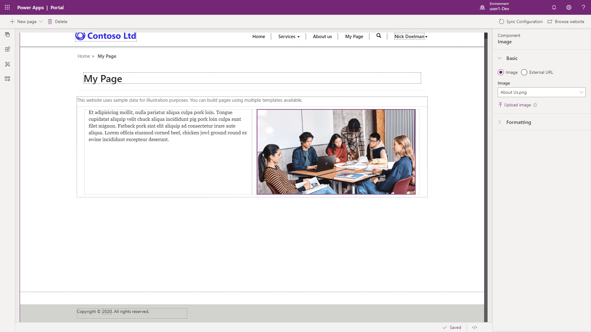
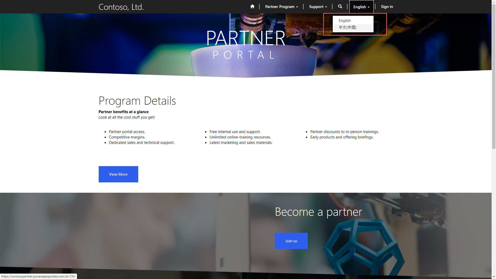
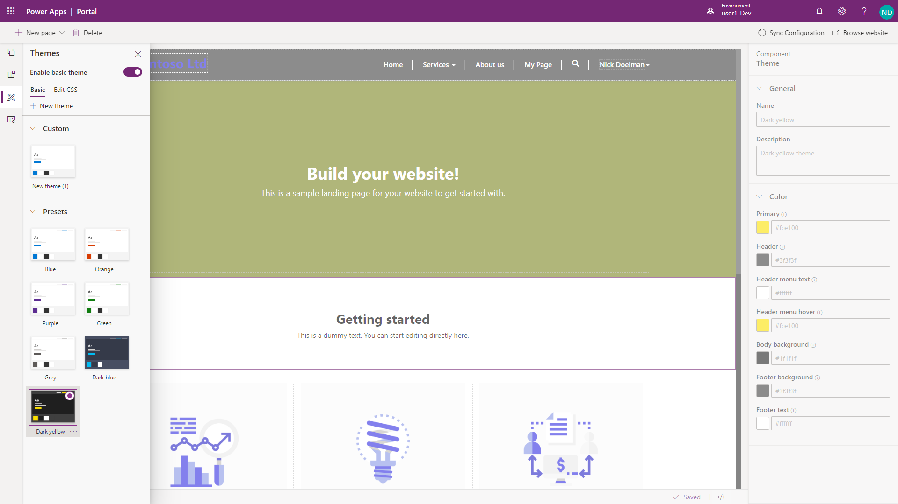
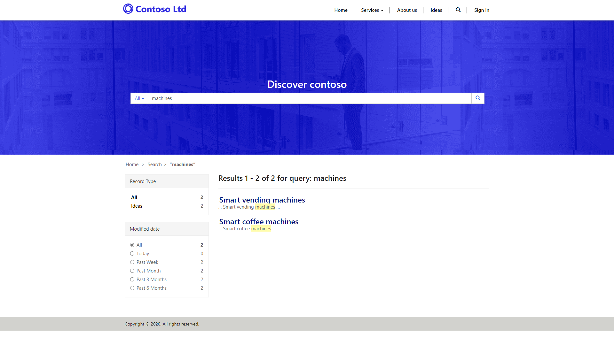
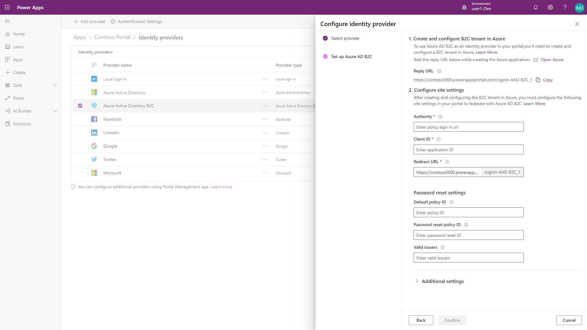
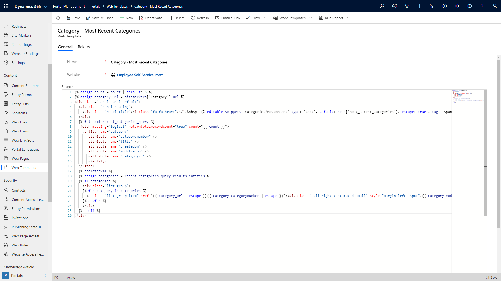

Regardless of the portal template that you choose, a Microsoft Power Apps portals application has a set of core features that allows makers to build or configure a powerful, externally facing web application on Microsoft Power Platform. 

## Content management

Webpages, static text, images, and other content can be quickly created in a portal web application by using the Power Apps portals Studio and other tools.  

> [!div class="mx-imgBorder"]
> 

## Multi-language

Portals content and navigation can be viewed in up to 43 different languages. Portal visitors will be able to switch to different languages and not lose their current page or navigation. Additional languages will need to be provisioned within Common Data Service and Dynamics 365 to use the multi-language capabilities in a portal.

> [!NOTE] 
> Content will still need to be translated and updated on the webpages and in the content snippets for the specified enabled languages. Any Common Data Service assets that are added to the portal, such as entities, forms, views, or fields, will also need to have corresponding label translations by using the Dynamics 365/Common Data Service multilingual functionality.

> [!div class="mx-imgBorder"]
> 

## Access to Common Data Service data

The main feature of Power Apps portals is the ability to show and interact with records in Common Data Service. A list of Common Data Service records can be shown on a portal page by using Entity lists or through custom web templates. Records can be created and edited individually by using Entity Forms or as part of a step-by-step process by using Web Forms. The data is protected by using a combination of web roles and entity permissions to ensure that portal visitors only have the appropriate access to Common Data Service records.

> [!VIDEO https://www.microsoft.com/videoplayer/embed/RE4yWn4]

## Themes

A portal maker has the ability to apply their unique corporate branding and styling directly to a Power Apps portal by using a dedicated CSS and Bootstrap toolkit.

> [!div class="mx-imgBorder"]
> 

## Global search

Portal makers can configure the portal to search across specified Common Data Service records so that users can quickly locate specific data on a portal results page.  Configuration of the global search is protected by entity permissions so that portal users do not inadvertently discover protected information.

> [!div class="mx-imgBorder"]
> 

## Authentication and security

Users who are browsing to a Power Apps portal application will be able to authenticate by using a built-in authentication or by using an integrated external authentication provider such as Microsoft Azure Active Directory B2C (Azure AD B2C), LinkedIn, Facebook, or other authentication providers.

An authenticated portal user can be assigned a web role with associated entity permissions and webpage access control rules to control access to specific webpages and Common Data Service records.

> [!div class="mx-imgBorder"]
> 

## Profile management

An authenticated portal user will be able to manage their own profile information on a dedicated portal entity form that will update their corresponding Dynamics 365 or Common Data Service contact record. This feature allows stakeholders to ensure that their contact information is up to date.

> [!div class="mx-imgBorder"]
> 

## Customization and extensibility

Power Apps portals provide many tools to create content, add Common Data Service data, and configure the appearance of a portal application. Portal capabilities can also be further extended by using custom web templates, Liquid markup, JavaScript, and Cascading Style Sheets (CSS). Portals can also use other Power Platform development technologies such as plug-ins, Power Automate, and workflows.

> [!div class="mx-imgBorder"]
> 
