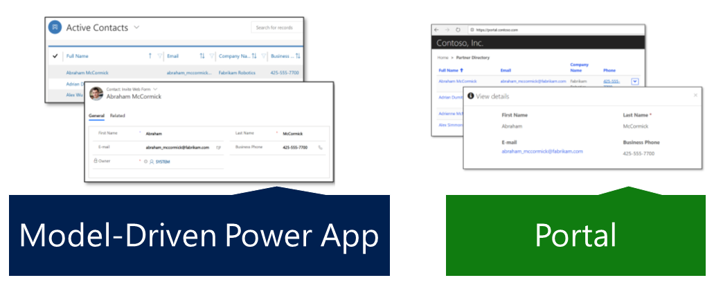

A typical use case of Power Apps portals is to extend functionality from the Dynamics 365 first-party applications to internal and external audiences. The portal templates based on Dynamics 365 apps offer built-in functionality to these audiences by adding features like case lifecycle, knowledge article access, partner opportunity management, and so on.

Power App portals also can extend applications built on the Common Data Service and surface the data and business logic and make them available on your portal to an external audience, based on user permissions. 

Consider the following scenarios:

- You extended case management features of Dynamics 365 Customer Service. Your app now handles product warranties, return management authorization (RMA), refunds, and product replacements. You can take Customer self-service portal and extend it to bring this functionality to your customers: register the warranty, make a claim, fill in an RMA form directly on the site, and so on.
- You have built an application in the Common Data Service to track charitable donations, both individual and corporate donors and fund raising campaigns.  You can build a portal to allow individuals to donate online as well as employers to view and match their employee's donations.
- You use the Common Data Service to track the progress of your certification programs from the application process to the evaluation of various skill assessments to awarding a certification level to a candidate.  A Power App portal can be configured to allow online applications, provide access to accessors to update evaluations and allow candidates to view their progress.

> [!NOTE]
> A Power Apps portal can only access Common Data Service data in the same instance where the portal is provisioned. Connecting to multiple instances and accessing data across the instances or across the tenants is not supported.

Model-driven Power Apps are one of the low-code/no-code methods to build unique line-of-business applications. (see [What are model-driven apps in Power Apps?](https://docs.microsoft.com/powerapps/maker/model-driven-apps/model-driven-app-overview/?azure-portal=true)). Part of the app creation process is to define the model and UI elements such as views and forms (see [Understand model-driven app components](https://docs.microsoft.com/powerapps/maker/model-driven-apps/model-driven-app-components/?azure-portal=true)). Power Apps portals extend these UI elements to the web by using Entity Lists, Entity Forms, and Web Forms:

- **Entity Lists** define how the list of Common Data Service records is displayed on the portal pages. They are defined by one or more model-driven app **entity views** and include functionality like filtering and sorting.
- **Entity Forms** add ability for the portal pages to interact with the records in a specific entity using model-driven app **form definition** as a layout template.
- **Web Forms** render one or more **model-driven app forms** on a portal website with support for single or multi-step navigation and conditional branching logic.

> [!div class="mx-imgBorder"]
> 
