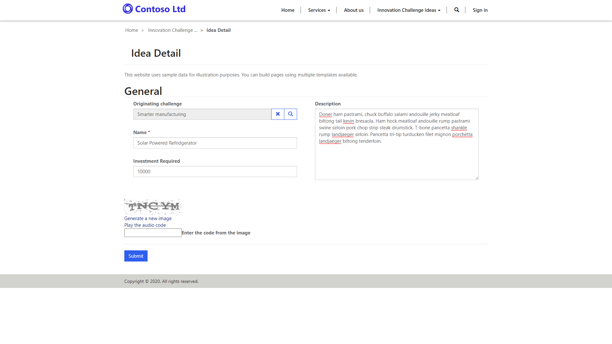
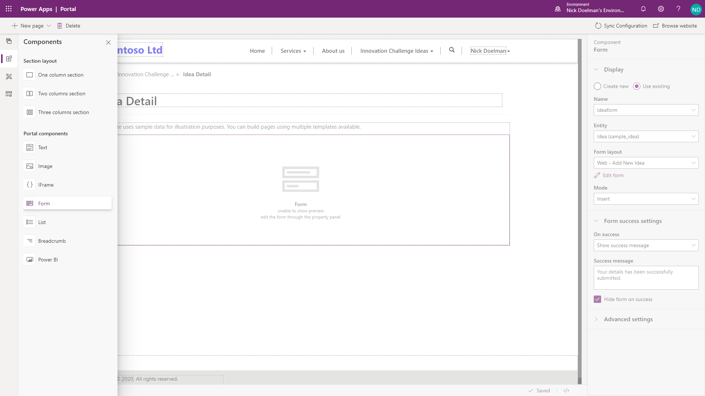
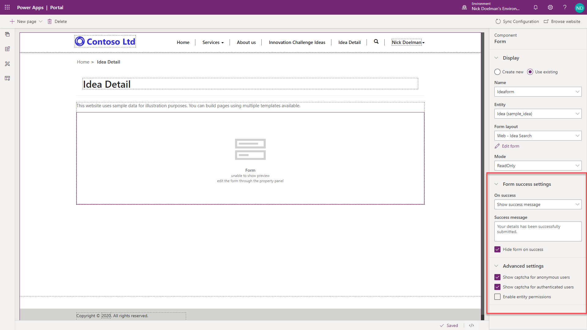

Entity Forms add the ability for portal pages to interact with records in a specific entity by using a model-driven form definition as a layout template. Similar to entity lists, entity forms are data-driven configurations that allow users to add a form to collect or display data in the portal without the need for a developer to create a custom form. Entity forms are defined by using model-driven forms and can be placed into webpages in the portal.

Entity forms can display most field types and subgrids but, currently, they can't display Power Apps Component Framework controls.

> [!div class="mx-imgBorder"]
> [](../media/3-entity-form-ss.png#lightbox)

## Common uses

The following table explains the common scenarios where entity forms can be used.

| Scenario | Description                                                  |
| -------- | ------------------------------------------------------------ |
| **Layout** | Entity forms can be configured and used in read-only mode as a layout mechanism. Think of entity forms as informational pages about employees, products, or any other Microsoft Dataverse entity. For example, you might have a custom entity in your Dataverse instance that describes open positions that are available within your organization. Instead of crafting a special template to render the page, you can create a separate model-driven form for the entity, create a new webpage by using portals Studio, and then add an **Entity Form** component to the page. Any published changes in a form layout in a model-driven app will automatically apply to the webpage. |
| **Information capture** | Forms can be used on the portal for data capture from anonymous or authenticated users. For example, a simple lead entity form might be rendered on a **Contact Us** page to record anonymous requests as leads in Dynamics 365 Sales. For authenticated users, a portal might use a survey page to collect product feedback from customers into a custom Product Feedback entity. |
| **Record management** | Typically used in authenticated scenarios, entity forms allow various combinations of Create, Retrieve, Update, and Delete (CRUD) operations on an entity to be defined within a set of related webpages. For example, customers can retrieve and read their own cases and create new ones, partners can edit their company profiles, and employees can view the list of assets that are allocated to them by the company. |
| **Web apps** | Entity forms, when used in conjunction with entity lists and subgrids, and with the functionality extended by JavaScript, allow developers to build complete web applications. |

## Create an entity form

When creating a new entity form, your first step is to decide the **Entity** and **Form Name** that you will be rendering. 

While reuse of forms that are part of a model-driven app is possible, the common practice is to design portal-specific model-driven forms (that might or might not be included in the model-driven apps). 

> [!div class="mx-imgBorder"]
> [](../media/3-create-entity-form-ss.png#lightbox)

- Portal forms are more concise with less information presented, especially when external audiences are involved.
- Portal processes are separate from the internal use of a staff-facing, model-driven app (including Dynamics 365 apps). Dedicated portal forms are easier to maintain because any changes in the model-driven apps need to be manually applied to the portal forms, giving you an opportunity to review the requirements and assess usability aspects.
- Certain limitations exist on the form and fields that are rendering, for example, PCF controls are not rendered. For more information, see [About entity forms](https://docs.microsoft.com/powerapps/maker/portals/configure/entity-forms/?azure-portal=true).
- Client-side business rules and JavaScript, which are essential parts of a model-driven form, will not run on the portal. It's easy to overlook and might result in unintended consequences. 
- Special considerations need to be given when you are rendering related records, notes, and a timeline because not all functional aspects are supported (or required) in the portals.

### Mode

The form mode can be **Read Only**, **Insert**, or **Edit**. This mode defines if the form is used to generate a layout, capture the data, or provide full editing capabilities for Dataverse records. 

> [!NOTE]
> A form that is in **Edit** mode will be rendered as **Read Only** if the user does not have write privileges for the record.

If the mode is **Insert**, no additional information is required. For **Read Only** and **Edit** modes, the form will need to "know" the entity record to display and update. The **Record Source Type** setting defines how this information is passed to the form:

- **Query String** - This setting is default when you are creating an entity form in portals Studio. When the page that contains the form is displayed, the record identifier is expected to be part of the query string, for example `https://contoso.powerappsportals.com/contacts/edit/?id=<contact guid>`. Usually, this setting is done automatically when the form is linked to an entity list. This setting is by far the most common. 
- **Current Portal User** - This option is configured within the Portal Management app. When this option is selected, the form will load the information from the current portal user record without using additional information from the page URL. Commonly, this option is used to render a user profile form. The **Entity Name** field in this case must be set to **Contact** because portal users are represented by the contact entity.
- **Record Associated to Current Portal User** - This option is configured within the Portal Management app. Selecting this option allows you to edit associated records, such as the current user's parent account details. **Relationship Name** must be specified to identify the record to edit. The entity type that is selected must match the selection in the **Entity Name** field. This option is useful in partner scenarios where the partner organization would have multiple portal users. Some of these users could be authorized to edit the parent account record.

**Entity**, **Form**, and **Mode** are the details that are required to render the form.

## Configure the entity form

Additional configuration options to control form appearance and behavior are available within portals Studio.

> [!div class="mx-imgBorder"]
> [](../media/3-entity-form-settings-ssm.png#lightbox)

### Form success settings

The form success settings determine the actions that are taken when a form is successfully submitted to a portal.

- **Show success message** - Shows a message when a form is submitted.
- **Redirect to webpage** - Automatically navigates to a webpage on success of the form submission.
- **Redirect to URL** - Redirects to a URL (portal or external).

### Advanced settings

The **Advanced settings** feature determines if a captcha is displayed for anonymous or authenticated users. Also, the setting helps determine if entity permissions are enabled for the particular entity.

## Additional entity form settings

Additional configuration settings are available for entity forms in the Portal Management app. To access an entity form in the Portal Management app:

1. Go to the [Power Apps maker portal](https://make.powerapps.com/?azure-portal=true).
1. Select the target environment by using the environment selector in the upper-right corner.
1. From the **Apps** list, locate and open the Portal Management app (type will be Model-driven).
1. Select **Entity Forms** in the left navigation.
1. Open the form that you previously created in portals Studio.

> [!div class="mx-imgBorder"]
> [](../media/3-entity-form-metadata-ss.png#lightbox)

Forms can include **Actions** for the user to interact with the record. Detailed configurations for each form element are available by using additional **Entity Form Metadata** records.

> [!div class="mx-imgBorder"]
> [](../media/3-entity-form-overview-c.png#lightbox)

### Configuration

The following sections describe the different ways that you can configure entity forms.

#### Form options

Most form options support customization of the Cascading Style Sheets (CSS) elements to change visual appearance. Text elements such as labels, messages, and tooltips can be specified in multiple languages. For example, the default message after the form submission is "Saved," but it can be customized for each of the enabled portal languages.

Another form option includes **Control validation behavior**, where you can determine whether to mark all fields as required regardless of the form setting, for example.

#### Additional settings

Additional settings define other aspects of form behavior, such as styling, translation of the UI elements, and so on. 

> [!TIP]
> Some of the settings and configuration options are hidden. Select the **Advanced settings** check box to display all available options.

**Associate current portal user on insert** - This option can be used to keep track of which portal contacts created or updated the record. This setting creates a portal equivalent of the **Created By** and **Modified By** fields in Dataverse. You can also set parental relationships where applicable. For example, if a new account record is created, you might want to set the current contact as a primary contact automatically.

**Add attach file** - A number of options are available to add a file upload control to your form. Configuration is flexible and supports multiple files, storage options, mime type, and size restrictions (for example, you can restrict uploads to images up to 2 MB in size). 

**Geolocation** - An entity form can be configured to display a map control to display an existing location as a pin on a map or to provide a user with the ability to specify a location. For more information, see [Add Geolocation](https://docs.microsoft.com/powerapps/maker/portals/configure/add-geolocation/?azure-portal=true).

The form's map control requires additional configuration to tell it what the various location fields are, to assign values to them, or retrieve values from them. For more information, see [Geolocation configuration for entity forms](https://docs.microsoft.com/powerapps/maker/portals/configure/entity-forms.md?azure-portal=true#geolocation-configuration-for-entity-forms).

> [!div class="mx-imgBorder"]
> [](../media/3-entity-form-geolocation-ss.png#lightbox)

#### Entity reference

**Entity reference** provides a way to associate the current record that is being created or updated with another target record. This feature is useful if you have multiple steps with multiple entity types and want to relate the resulting records or if the page is passed in a query string of a record ID that you want to associate. 

For example, you might have an event page that displays information about an upcoming webinar. You want to include a registration button that redirects visitors to the registration page where the registration form is displayed. You can pass the event identifier in a query string and, when the registration form is submitted, you'll be able to automatically link the registration information to the event.

### Actions

Because an entity form deals with an individual entity record, numerous actions can be run against this record, such as Update, Delete, Deactivate, and so on. These actions, that at runtime are displayed as command buttons, can be configured by selecting **Additional Settings > Action Button Configuration**. 

All commands include options to rename the buttons and change their placement on the form. 

### Entity form metadata

**Entity form metadata** records allow you to control the appearance and behavior of individual form elements, including:

- Appearance of the fields, sections, and tabs. An individual field's default values, validation behavior, and other aspects can be defined.
- Subgrids configuration, which allows you to define actions for related records, similar to entity list actions.
- Behavior of notes and timeline sections, and if new records can be added. This option is commonly used to allow portal users to enter comments about the record, for example, a case in process.

## Add an entity form to your portal

An entity form defines the required behavior but does not contain information about how and where on the site that the form should be rendered. Two methods to render an entity form in a portal are:

- The entity form can be explicitly specified as a target for an entity list action like Create, Update, or Edit. In this case, the form will be rendered in a modal pop-up window. Certain limitations apply when the form is rendered in a pop-up window, for example, the ability to create related records from subgrids is not available.
- Similar to an entity list, an entity form component can be added to a webpage from portals Studio. This action will place a Liquid tag on the webpage copy to render the entity form.

```twig

```

> [!div class="mx-imgBorder"]
> [](../media/3-entity-form-liquid-tag-ssm.png#lightbox)

Because forms can submit information back to the server for processing, you will have less control over the rendering of entity forms as compared to the entity lists.

The following video shows how to extend entity list functionality with entity forms and display a Dataverse record in a pop-up window or on a separate webpage.

> [!VIDEO https://www.microsoft.com/videoplayer/embed/RE4AjtN]