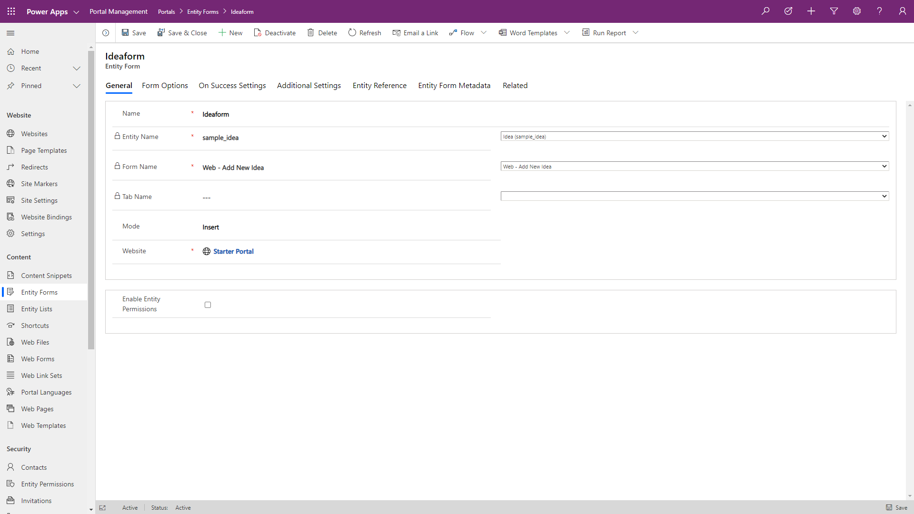
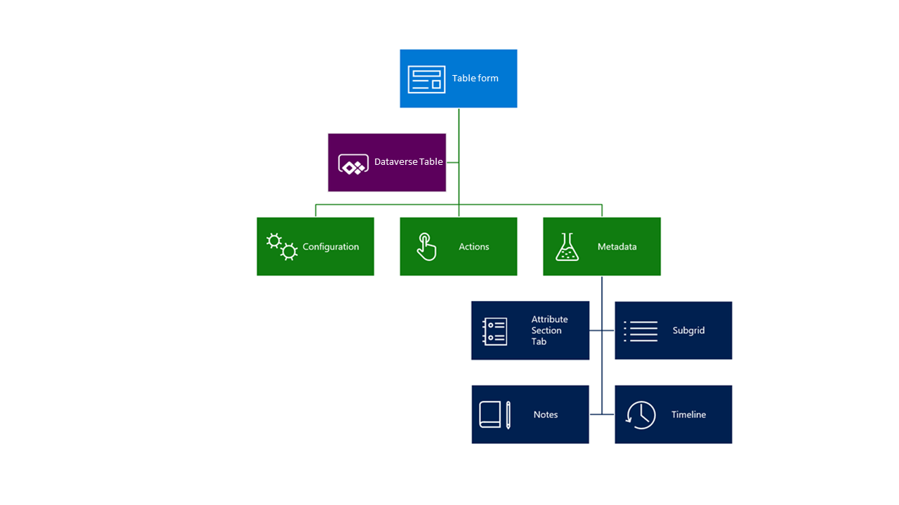
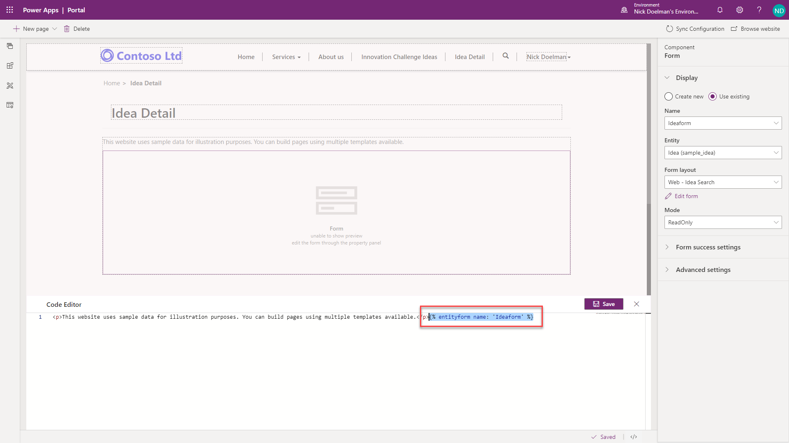

Entity Forms add the ability for the portal pages to interact with the records in a specific entity using model-driven form definition as a layout template. Similar to entity lists, they are a data-driven configuration to allow end users to add a form to collect or display data in the portal without the need for a developer to create a custom form. Entity forms are defined using model-driven forms and can be placed into web pages in the portal.

Entity forms can display most fields types and subgrids but currently cannot display Power Apps Component Framework controls.

> [!div class="mx-imgBorder"]
> [](../media/3-entity-form-ss.png#lightbox)

## Common uses

There are few common scenarios where entity forms can be used.

| Scenario | Description                                                  |
| -------- | ------------------------------------------------------------ |
| **Layout** | Entity Forms can be configured and used in read-only mode as layout mechanism. Think of the informational pages about employees, products, or any other Common Data Service entity. For example, you might have a custom entity in your Common Data Service instance describing open positions available within your organization. Instead of crafting a special template to render the page, you can create a separate model-driven form for the entity, create a new **web page** using the Portal Studio and add an **Entity Form** component to the page.  Any published changes in form layout in model-driven app will automatically apply to the web page. |
| **Information capture** | Forms can be used on the portal for data capture from either anonymous or authenticated users. For example, a simple lead entity form may be used rendered on Contact Us page to record anonymous requests as leads in Dynamics 365 Sales. For authenticated users, a portal might use a survey page to collect product feedback from the customers into a custom Product Feedback entity. |
| **Record management** | Typically used in authenticated scenarios, entity forms allow various combinations of Create, Retrieve, Update, Delete (CRUD) operations on an entity to be defined within a set of related web pages. For example, customers can retrieve and read their own cases, and create new ones. Partners can edit their company profile. Employees can view the list of assets allocated to them by the company. |
| **Web apps** | Entity forms, when used in conjunction with entity lists and subgrids, and with the functionality extended by JavaScript, allow developers to build out complete web applications. |

## Creating an entity form

When creating a new entity form, the first step is to decide the **Entity** and **Form Name** that you will be rendering. 

While reuse of forms that are part of a model-driven app is possible, common practice is to design portal-specific model-driven forms (that may or may not be included in the model-driven apps). 

> [!div class="mx-imgBorder"]
> [](../media/3-create-entity-form-ss.png#lightbox)

- Portal forms are more concise with less information presented, especially when external audiences are involved.
- Portal processes are separate from the internal use of a staff facing model-driven app (including Dynamics 365 apps). Dedicated portal forms are easier to maintain as any changes in the model-driven apps need to be manually applied to the portal forms giving an opportunity to review the requirements and assess usability aspects.
- There are certain limitations on the form and fields rendering, for example, PCF controls are not rendered. For more information about limitations, see [About entity forms](https://docs.microsoft.com/powerapps/maker/portals/configure/entity-forms/?azure-portal=true).
- Client-side business rules and JavaScript, that are essential part of a model-driven form, will **not** run on the portal. It's easy to overlook and may result in unintended consequences. 
- Special considerations need to be given when rendering related records, notes, and timeline as not all functional aspects are supported (or required) in the portals.

### Mode

Form mode can be **Read Only**, **Insert**, or **Edit**. This defines if the form is used to generate a layout, capture the data, or provide full editing capabilities for Common Data Service records. 

> [!NOTE]
> A form in Edit mode will be rendered a Read Only if user does not have write privileges for the record.

If the mode is Insert, no additional information is required. For Read Only and Edit modes, the form will need to "know" the entity record to display and update. **Record Source Type** setting defines how this information is passed to the form:

- **Query String**. This is the default setting when creating an entity form from the Portal Studio.  When the page containing the form is displayed, the record identifier is expected to be part of query string, for example `https://contoso.powerappsportals.com/contacts/edit/?id=<contact guid>`. Usually it is done automatically when the form is linked to an entity list. This is by far the most common setting. 
- **Current Portal User**. This option is configured within the Portal Management app.  When this option is selected, the form will load the information from the current portal user record without using any additional information from the page URL. Commonly it is used to render a user profile form. **Entity Name** field in this case must be set to Contact since portal users are represented by the contact entity.
- **Record Associated to Current Portal User**. This option is configured within the Portal Management app.  Selecting this option allows editing associated records, for example current user's parent account details. **Relationship Name** must be specified to identify the record to edit. The entity type selected must match the selection in the Entity Name field. This option is useful in the partner scenarios where partner organization would have multiple portal users. Some of these users could be authorized to edit the parent account record.

Entity, Form, and Mode are all the information that is required to render the form.

## Configure entity form

Additional configuration options to control form appearance and behavior are available within the Portal Studio.

> [!div class="mx-imgBorder"]
> [](../media/3-entity-form-settings-ssm.png#lightbox)

### Form Success Settings

The form success settings determine the actions taken when a form is successfully submitted to a portal.

- **Show Success Message** Show a message when a form is submitted.
- **Redirect to Web Page** Automatically navigate to a web page on success of the form submission.
- **Redirect to URL** Redirect to a URL (either portal or external).

### Advanced Settings

The advanced settings determine if a captcha is displayed for anonymous or authenticated users.  Also the setting to determine if entity permissions are enabled for the particular entity.

## Additional Entity Form Settings

A number of additional configuration settings are available for entity forms in the Portal Management app. To access entity form in the Portal Management app:

1. Navigate to [Power Apps maker portal](https://make.powerapps.com/?azure-portal=true).
1. Select the target environment using the environment selector in the top right-hand corner.
1. From the list of Apps, locate and open the Portal Management app (app Type will be Model-driven).
1. Select Entity Forms in the left navigation.
1. Open the form created earlier in the Portal Studio.

> [!div class="mx-imgBorder"]
> [](../media/3-entity-form-metadata-ss.png#lightbox)

Forms can include **Actions** for the user to interact with the record. Detailed configurations per form element are available using additional **Entity Form Metadata** records.

> [!div class="mx-imgBorder"]
> [](../media/3-entity-form-overview-c.png#lightbox)

### Configuration

#### Form options

Most of the form options support customization of the CSS elements to change visual appearance. Text elements such as labels, messages, and tooltips,  can be specified in multiple languages. For example, the default message after the form submission is "Saved", but it can be customized for each of the enabled portal languages.

Other options include: Control validation behavior, for example whether to mark all fields as required regardless of the form setting.

#### Additional Settings

Additional settings define additional aspects of the form behavior including styling, translation of the UI elements, etc. 

> [!TIP]
> Some of the settings and configuration options are hidden. Use **Advanced settings** checkbox to display all available options.

**Associate Current Portal User on Insert** - These options can be used to keep track of which portal contacts created or updated the record. This creates a portal equivalent of Created By and Modified By fields in Common Data Service. You can also set parental relationship where applicable. For example, if a new account record is created you might want to set the current contact as a primary contact automatically.

**Add Attach File** - A number of options available to add a file upload control to your form. Configuration is flexible and supports multiple files, storage options, mime type and size restrictions (for example, you can restrict uploads to images up to 2 MB in size). 

**Geolocation** - An entity form can be configured to display a map control to either display an existing location as a pin on a map or to provide the ability for the user to specify a location. See [Add Geolocation](https://docs.microsoft.com/powerapps/maker/portals/configure/add-geolocation/?azure-portal=true).

The form's map control requires additional configuration to tell it what the various location fields are, to assign values to them or retrieve values from them. See [Geolocation configuration for entity forms](https://docs.microsoft.com/powerapps/maker/portals/configure/entity-forms.md?azure-portal=true#geolocation-configuration-for-entity-forms).

> [!div class="mx-imgBorder"]
> [](../media/3-entity-form-geolocation-ss.png#lightbox)

#### Entity Reference

This provides a way to associate the current record being created or updated with another target record. This is useful if you have multiple steps with multiple entity types and would like to relate the resulting records or if the page is passed a query string of a record ID that you would like to associate. 

For example, you might have an event page that displays information about an upcoming webinar. You would like to include a registration button that redirects visitors to the registration page where the registration form is displayed. You can pass event identifier in a query string and, when the registration form is submitted, you'll be able to automatically link the registration information to the event.

### Actions

Because entity form deals with an individual entity record, there are a number of actions that can be run against this record, for example Update, Delete, Deactivate, and so on. These actions, that at runtime are displayed as command buttons, can be configured  using **Addition Settings > Action Button Configuration**. 

All commands include options to rename the buttons and change their placement on the form. 

### Entity form metadata

**Entity Form Metadata** records allow you to control appearance and behavior of individual form elements. That includes:

- Appearance of the fields, sections, and tabs. For individual fields default values, validation behavior, and other aspects can be defined.
- Subgrids configuration allows to define actions for related records, similar to entity list actions.
- Behavior of notes and timeline sections, and if new records can be added. This is commonly used to allow portal users to enter comments about the record, for example, a case in progress.

## Add entity form to your portal

An entity form defines the required behavior but does not contain any information how and where on the site the form should be rendered. There are two methods to render entity form in a portal.

- Entity form can be explicitly specified as a target for an entity list action like Create, Update, or Edit. In this case, the form will be rendered in a modal popup window. There are certain limitations that apply when the form is rendered in a popup window, for example, creating related records from subgrids is not available.
- Similar to an entity list, an entity form component can be added to a webpage from the Portal studio.  This action will place a Liquid tag on the web page copy to render the entity form.

```twig

```

> [!div class="mx-imgBorder"]
> [](../media/3-entity-form-liquid-tag-ssm.png#lightbox)

Because forms can submit information back to the server for processing, there is much less control over the entity forms rendering as compared to the entity lists.

In the following video, we show how to extend entity list functionality with entity forms and display a Common Data Service record either in a popup window or on a separate web page.

> [!VIDEO https://www.microsoft.com/videoplayer/embed/]

