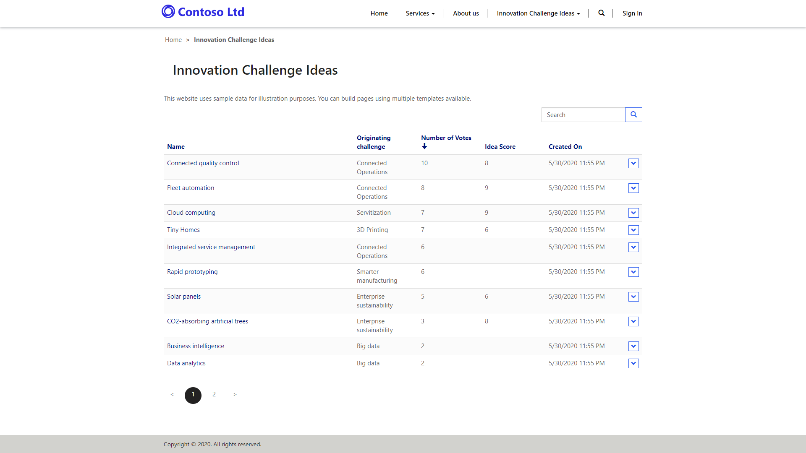

The purpose of this exercise is to provide you with hands-on experience in adding a list and a form to a Power Apps portal.

## Learning objectives

At the end of these exercises, you will be able to:

- Add a list component to a portal page.
- Add a form component to a portal page.
- Configure the list component to drill down and view details of the record.

### Prerequisites

The following prerequisites are necessary for completing these exercises:

- Access to the Power Apps maker portal.
- Ideally, you will have the default sample Microsoft Dataverse apps and data, but you can use other Dataverse entities.
- You will need to have provisioned a Power Apps portal to complete the exercise. If you do not have a provisioned portal, go to [Create Portal](/powerapps/maker/portals/create-portal/?azure-portal=true) to create one.

> [!TIP]
> The exercises work best when you have sample data to work with. When you provision a Dataverse environment, you have the opportunity to add sample apps and data.  Review the [Create Environment](/power-platform/admin/create-environment.md?azure-portal=true#create-an-environment-with-a-database) steps to provision a Dataverse environment with sample apps and data.

## Scenario

Your organization has provisioned a Power Apps portal and wants to display a list of ideas that the research team is considering on a public webpage. The requirement is also to allow visitors to drill down and view additional details.

## High-level steps

To finish the exercise, complete the following tasks:

- Create a webpage and add a list component that is linked to a Dataverse table.
- Create a child webpage with a form component to display details for a Dataverse table.
- Modify the list component to allow visitors to drill down and view the detail record on the form page.

### Create a webpage for the table list

In this exercise, you will create a webpage to contain the **Table Lists** component.

1. Go to the [maker portal](https://make.powerapps.com/?azure-portal=true) and sign in.  
1. Locate your portal app, select the ellipsis (**...**), and then select **Edit** to open portals Studio.
1. From the command bar, select **+ New page**, and from **Fixed Layouts**, select **Page with title**.
1. In the Properties pane, fill in the following information:

	- **Name** - Ideas
	- **Partial URL** - ideasview
	
1. Click in the canvas area to save the webpage.

### Add and configure a list component 

To add and configure a list component, follow these steps:

1. On the canvas, select the **page copy** component, and then from the tool belt, select **Components**.
1. In the **Portal components** section, select the **List** component.
1. In the Properties pane, enter the following values for the **List** component:

	- **Name** - Ideas List
	- **Table** - Idea (sample idea) *or choose another table from your own app*
	- **Views** - Active Ideas

1. Select **Browse** from the command bar and ensure that you can see a list of idea data records from Dataverse.

### Create a webpage for the table form

Your next task is to create a webpage to contain the **Table Forms** component to view record details. This webpage will be a child page of the **Ideas list** page.

1. From the tool belt, select **Pages** and locate the **Ideas** page that you created previously.
1. Select the ellipsis (**...**) and then select **Add a child page**.
1. In the Properties pane, fill in the following information:

	- **Name** - Idea Detail
	- **Partial URL** - ideasdetail
	
1. Click in the canvas area to save the webpage.

### Add and configure a form component

To add and configure a form component, follow these steps:

1. On the canvas, select the **page copy** component, and then from the tool belt, select **Components**.
1. In the **Portal components** section, select the **Form** component.
1. In the Properties pane, enter the following values for the **Form component**:

	- **Name** - Ideas Detail
	- **Table** - Idea (sample idea) *or choose another table from your own app*
	- **Form Layout** - Information (you can select **Edit** to modify your form or create your own form specifically for the portal)
	- **Mode** - ReadOnly

1. Click in the canvas area to save the webpage.

### Modify the list page to navigate to the form component

Your last task is to modify the list page to navigate to the form component:

1. From the tool belt, select **Pages** and locate the **Ideas** page that contains the list component.
1. Select the list component on the canvas.
1. In the Properties pane, activate the **View Details** option.
1. Fill in the following information: 

	- **Target Type** - Form
	- **Form** - Ideas Detail

1. Click in the canvas area to save the webpage.
1. Select **Browse** from the command bar and ensure that you can see a list of idea data records from Dataverse and then select an idea to view details.

    > [!div class="mx-imgBorder"]
    > 

Adding components to a webpage will allow you to quickly view Dataverse records.