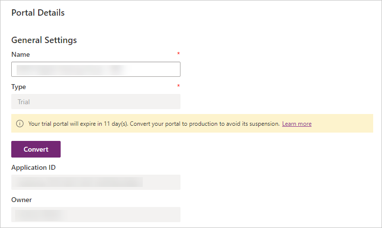
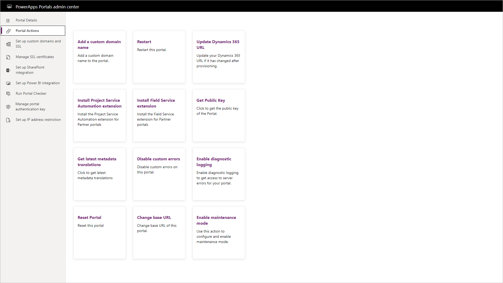
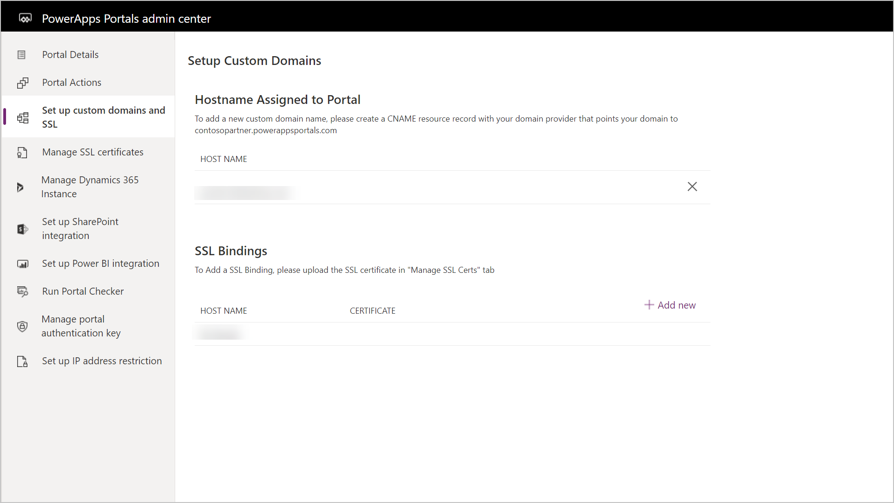

The Microsoft Power Apps portals admin center provides a series of functions for administration of a Power Apps portal.

To access the portals admin center:

1. Sign in to the [Microsoft Power Platform admin center](https://admin.powerplatform.microsoft.com/?azure-portal=true).
1. In the left pane, select **Resources** and then select **Portals**.
1. Select a portal.
1. Select **Manage** at the top of the page.

> [!div class="mx-imgBorder"]
> 

## Portal details

If you need to see more details about the provisioned portal, such as portal type, application ID, owner of the portal, and so on, you can go to the **Portal Details** tab. The user who has created the portal is the owner of the portal.

> [!div class="mx-imgBorder"]
> 

The **Portal Details** area allows makers to alter some key attributes of a Power Apps portal:

- Change or update the portal name. This option is not visible to external portal visitors, but it helps identify the portal in the Portal Management app.

- By default, portals are provisioned in **Trial** mode and a message will be displayed in the admin center. A maker can convert a trial portal to a production portal.  

   > [!div class="mx-imgBorder"]
   > 

   > [!NOTE]
   > Some features, such as custom URLs, are not available for portals in **Trial** mode.

- The portal binding can be changed so that the portal web application will read a different set of metadata records (website record) from Microsoft Dataverse.

- The portal state can be turned off (or on). Portal visitors will receive an error when visiting the portal URL.

- The portal can be configured to allow early upgrades so that it receives updates from Microsoft earlier than regularly scheduled updates.

  > [!WARNING]
  > If a portal has been enabled for early upgrade, it might receive updates that have not gone through the full testing cycle. In rare instances, early upgrade could affect certain functionality of the portal.

## Portal actions

The **Portal Actions** section of the portals admin center allows an administrator to configure specific portal settings or perform actions against a configured portal. For more information, see [Power Apps portals admin center](/powerapps/maker/portals/admin/admin-overview/?azure-portal=true).

> [!div class="mx-imgBorder"]
> 

| Action | Details |
| ------ | ------- |
| Add a custom domain name | This action will go through the process to configure a vanity URL for the Power Apps portal such as `https://www.contoso.com` instead of the subdomain `https://contoso.powerappsportals.com`. This option is only available for production portals. |
| Restart | Restarting the portal will turn off the portal web application and restart the process, clearing the cache or potentially stuck processes. This action is the equivalent of restarting a web server and it might take a few minutes until the portal is available again. |
| Update Dynamics 365 URL | In the event that the Dataverse (or Dynamics 365) environment URL has been modified, this action will realign the portal web application to point to this updated URL. |
| Install Project Service Automation extension | This process will load the solutions and metadata to extend the Partner portal with Project service extensions. This action will only be successful on portals that have been provisioned by using the Partner template and if the connected Dynamics 365 instance has the Project Service Automation solution installed. |
| Install Field Service extension | This process will load the solutions and metadata to extend the Partner portal with Field Service extensions. This action will only be successful on portals that have been provisioned by using the Partner portal template and if the connected Dynamics 365 instance has the Field Service solution installed. |
| Get Public Key | A portal public key is required by the Live Assist by CafeX application to integrate with a Power Apps portal. |
| Get latest metadata translations | For multilingual portals, it's important to have the latest translated labels. This action will prompt an admin to update the portal solutions that will update the various portal template labels in the particular portal languages that are provisioned. |
| Disable custom errors | While you are troubleshooting issues on a portal, disabling the custom errors will show more details about a particular issue instead of a generic error message. |
| Enable diagnostic logging | This action will allow an administrator to specify a Microsoft Azure Blob connection string and retention period where portal logs will be stored.  If issues occur with a portal, these logs can be examined to determine the root cause of a particular issue. |
| Reset Portal | This action will delete all hosted resources that are associated with the portal. When the reset operation has finished, your portal URL will no longer be accessible and you can provision the portal again. The reset will not reinstall the portal solutions or delete the portal metadata. |
| Change base URL | This action will allow an administrator to change the base URL (`something.powerappsportals.com`). The URL will need to be unique, and portal visitors will no longer be able to access the portal by using the old URL. If you have a custom URL, you will also need to update the CNAME records in your DNS settings. |
| Enable maintenance mode | In instances where an administrator needs to change a portal or update Dataverse, the portal can be put into maintenance mode where visitors will instead see a message that the portal is in maintenance mode or they will be redirected to a custom URL. |

## Set up custom domains and SSL

The **Set up custom domains and SSL** feature will show any existing host name and associated SSL Bindings for custom URLs that are configured for the portal.

> [!div class="mx-imgBorder"]
> 

## Manage SSL certificates

The **Manage SSL certificates** section will show a listing of all uploaded SSL certificates and when they will expire.

## Set up SharePoint integration

The **Set up SharePoint integration** section provides you with the ability to activate the SharePoint integration so that SharePoint document libraries that are integrated with Dataverse and Dynamics 365 can be shown through a table form.

## Set up Power BI integration

The **Set up Power BI integration** section allows administrators to enable the Power BI visualization and Power BI Embedded service on portal pages.

## Portal Checker

Portal Checker is a self-service diagnostic tool that can be used by portal administrators to identify common issues in their portals. Portal Checker helps to identify issues with a portal by looking at various configuration parameters and providing suggestions on how to fix them.

> [!div class="mx-imgBorder"]
> 

The Portal Checker feature examines various configuration aspects of the portal and displays warning details and recommended steps to improve portal functionality and performance.

## Manage portal authentication key

Every two years, the portal authentication keys need to be updated so that the portal web application is able to continue communicating with the Dataverse environment. This security aspect of the application is registered with Microsoft Azure Active Directory (Azure AD), such as the portal web application.

## Set up IP address restriction

An administrator might want to restrict access to a portal to only a development/testing team or to specific geographic areas. The administrator can specify a list of specific IP4 or IP6 addresses or ranges from which the portal can be assessed. By default, if no IP addresses are specified, the portal will be accessible from anywhere. For more information, see [Restrict portal access by IP address](/powerapps/maker/portals/admin/ip-address-restrict/?azure-portal=true).
