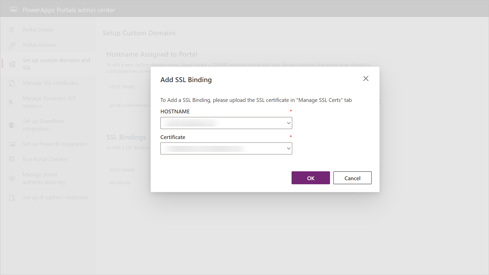

When a portal is provisioned, it will have a portal URL that is a subdomain of `powerappsportals.com`, for example, `contoso.powerappsportals.com`. A common task for a portal administrator is to configure a custom URL for a Power Apps portal to reflect the domain naming conventions of an organization such as `https://www.contoso.com`.  

> [!NOTE]
> You can only have one custom URL per portal.

## Adding a custom URL to a Power Apps portal

### Prerequisites

The organization will need to own the specific domain name as well as have a valid SSL certificate for the domain.  The administrator will also need to have access to configure DNS settings for the custom URL.

The portal must also not be in trial mode to add a custom domain.

### Installing the SSL certificate

In the Power Apps portals admin center, the Manage SSL certificates section will be where an SSL certificate will be uploaded.

The SSL certificate will require a pfx extension and must meet the following requirements:

* Signed by a trusted certificate authority.
* Exported as a password-protected PFX file.
* Contains private key at least 2048 bits long.
* Contains all intermediate certificates in the certificate chain.
* Must be SHA2 enabled; SHA1 support is being removed from popular browsers.
* PFX file must be encrypted with TripleDES encryption. Power Apps portals doesn't support AES-256 encryption.

The specific domain name will need to have a CNAME record setup in DNS to point to the `contoso.powerappsportals.com` domain that was configured during the portal provision process.

The final step is to bind the custom domain and the SSL certificate.  Visitors should now be able to browse to the portal using the custom URL.

> [!div class="mx-imgBorder"]
> 

> [!NOTE]
> If you want to change your existing custom domain name, you must upload a new SSL certificate and follow the steps as mentioned above.

> [!VIDEO https://www.microsoft.com/videoplayer/embed/]

For more information about SSL certificates and custom domains see [Add a custom domain](https://docs.microsoft.com/powerapps/maker/portals/admin/add-custom-domain/?azure-portal=true).
