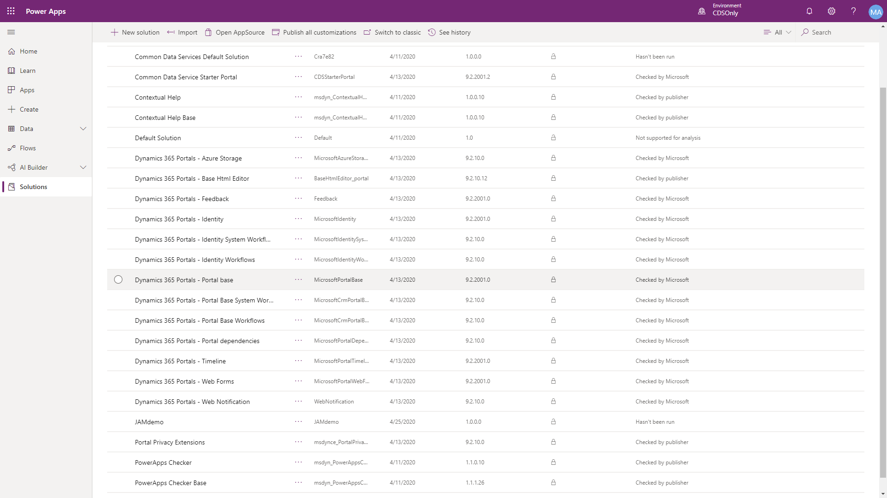
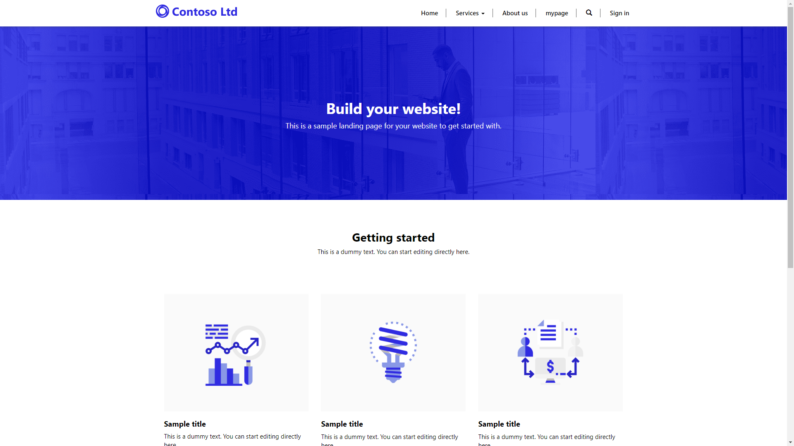

A Power Apps portal provisioned in a Common Data Service environment is composed of three main components:

- Portal solutions
- Portal metadata
- Portal web app

> [!div class="mx-imgBorder"]
> 

A portal requires a Common Data Service (CDS) database to be available in the environment in order to install and configure some of the key components. While a portal from blank can be configured in an environment without any of the Dynamics 365 first-party apps installed, many of the templates (Customer self-service, Employee self-service, Partner, and Community portals) have dependencies on Dynamics 365 Sales or Dynamics 365 Customer Service.

## Portals solutions

A number of Common Data Service solutions are installed in the environment. These solutions contain a model-driven portal management app, entities, forms, views and processes to store and manage the portal metadata. Additional solutions are installed to enable the functionality of specific templates. Solutions contain a number of actions, workflows and plug-ins that are deployed to automate the creation of specific portal records and assist with the management of portal users.

The solutions should not be installed individually by an administrator but installed as part of the portal provisioning process.

> [!div class="mx-imgBorder"]
> 

## Portals metadata

Power Apps portal metadata will describe the portal website, web pages, web templates, content snippets, entity forms, entity lists, site settings and other configuration data. The data is stored in the Common Data Service. A portal maker can add, modify or delete portal metadata to specifically configure a portal application using the portal studio, the portal management app, or the legacy front-side editing tools.

One of the distinctive features of Power Apps portals is using Common Data Service as a centralized storage for the information required to run the portal website. Everything that portals require to run, including metadata and content, is stored in Common Data Service database making it easy to backup and transport portal solutions between the environments.

> [!div class="mx-imgBorder"]
> 

## Portals web app

An Azure web app is configured to run the portal site using the portal solutions and metadata. The web app is automatically configured in the same region as the Common Data Service environment. This web app is accessible via the unique URL specified during the provisioning process. The web app is not customizable however portal administrators have a number of configuration options available to them, for example, configure the portal web app to capture detailed diagnostics logs for troubleshooting purposes.

> [!div class="mx-imgBorder"]
> 

