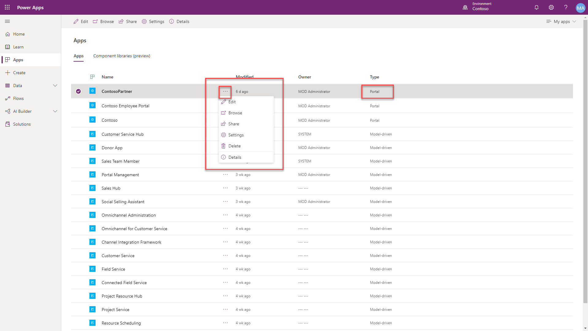
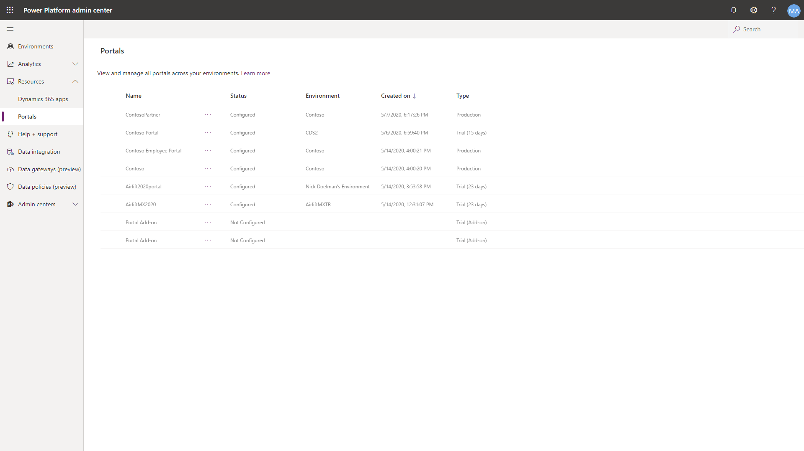

A fully functional portal that is based on a template is provisioned in an environment with Microsoft Dataverse enabled. This portal can be further configured to meet specific business requirements.

A maker will first choose a particular portal template. Currently, only one option (Portal from blank) is available for environments without Dynamics 365, while five different portal templates are available for environments with Dynamics 365 apps enabled.

> [!div class="mx-imgBorder"]
> 

### Portal solutions installation

The provisioning process first begins with the installation of a series of solutions in the environment. All portal implementations will contain base portal solutions with additional functionality added in separate solutions, depending on the portal template chosen. The solutions contain entities, forms, views, processes, and a model-driven Portal Management app that you can use to manage the portal metadata.

### Portal metadata 

After the portal solutions have been installed, the process will upload portal metadata records based on the specific portal template chosen. The portal metadata will define the initial configuration for the portal. Each template can be installed only once for each environment; however, multiple portal templates can be installed in a single environment. 

> [!NOTE]
> Currently, only environments with Dynamics 365 enabled may contain multiple portal types.

### Portal web application

An Azure web app will be configured for each portal that is provisioned in an environment. 

### Portal app

The provisioned portal will appear in the **Apps** list of type Portal. From this portal app, a maker will be able to edit (go to portals Studio), browse, share, go to settings, delete, or view details about the portal. 

> [!div class="mx-imgBorder"]
> 

A list of all portals in a Power Platform tenant can be viewed from the Power Platform admin center.

> [!div class="mx-imgBorder"]
> 

The Portal Management app will also appear in the **Apps** list.

### Trial portal

By default, a portal will be provisioned in Trial mode. A maker will have 30 days to convert the portal to production, or it will be automatically deleted.

### Delete portal

If you delete a portal app, it will be removed from the list of apps and the portal web application will be deleted as well. However, the portal solutions or portal metadata will not be deleted from Dataverse.

> [!VIDEO https://www.microsoft.com/videoplayer/embed/RE4yWm3]