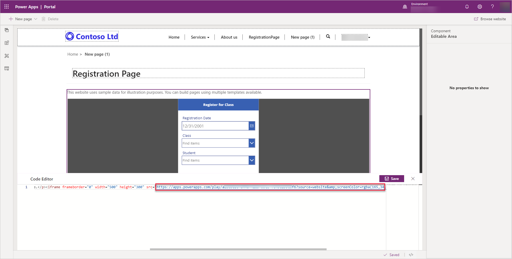

Power Apps portals has a number of features such as entity lists and entity forms, and the ability to use the Liquid markup language that allow an app maker to build powerful web applications. However, there are instances where you would may need to integrate your portal to web based technologies to extend the scope of your application.

**SharePoint document libraries** can be added to entity forms to allow portal users to view and upload files related to a specific Common Data Service record.

**Power BI reports and dashboards** can be added and configured in the Portal studio as components to portal pages to show rich visualizations of data.

Adding components such as entity lists, entity forms, and Power BI will add the corresponding Liquid tags to a portal page.  The Liquid markup language also has a number of Common Data Service specific tags to allow adding of items that don't appear as components such as model-driven charts and web-forms.

**The IFrame component** allows for integration of other Microsoft technologies such as Power Virtual Agents and even Canvas Power Apps to added to a Power Apps portal page.  

> [!div class="mx-imgBorder"]
> 

> [!NOTE]
> Users will still require appropriate licensing for specific technologies, such as licenses for embedded canvas Power Apps or access to Power BI reports.

Adding JavaScript code to a page can provide users with the ability to communicate with other applications with web APIs.

Lets take a look at how we can integrate the Power Apps portal with some of these technologies.
