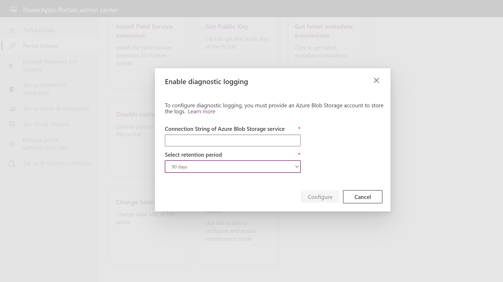

A Microsoft Power Apps portal is an external-facing application that is often open to an external audience. It's critical that the portal is accessible and operational because it reflects the image of an organization.

## Portal site issues

If a portal is completely inaccessible, an administrator can investigate numerous possibilities:

- Whether the portal has been enabled or not
- If other Microsoft Dataverse apps are accessible
- Issues that might have occurred with the infrastructure services that portals depend on such as Microsoft Azure Active Directory (Azure AD) or the Web Apps feature of Azure App Service (Web Apps)
- If advisories exist on the Microsoft 365 admin center

> [!div class="mx-imgBorder"]
> 

An administrator should also investigate whether some of the portal metadata has been recently modified, such as the website or website binding records that also might affect portal functionality.

Running the **Portal Checker** might also identify potential issues with the site.

## Portal page and functionality issues

Occasionally, a portal administrator might be faced with having to resolve errors with specific Power Apps portal pages or functions.

Power Apps portals have several tools that will allow an administrator to quickly identify and resolve issues without needing to contact Microsoft support.

### Disable custom errors

A typical error might begin when a portal visitor reports an issue when visiting a portal page. Often, the error message is brief and doesn't describe the underlying issue.

In the Power Apps Portals admin center, the **Disable custom errors** action will replace the notification with detailed error information on the portal page that could provide additional information for an administrator to troubleshoot the issue.

> [!div class="mx-imgBorder"]
> 

> [!NOTE]
> Disabling custom errors should be a temporary setting because the detailed error message might convey an increased negative experience for portal visitors. We recommend that you only disable custom errors when you are in the development phase and enable custom errors after you go live.

Another option is to personalize the error message by adding a content snippet called **Portal Generic Error** that contains an appropriate message for portal users. For more information, see [Display a custom error message](https://docs.microsoft.com/powerapps/maker/portals/admin/view-portal-error-log#display-a-custom-error-message/?azure-portal=true).

### Diagnostic logging

Along with visual errors on portal pages, potential underlying issues could occur that are not quite as obvious to isolate and troubleshoot. Power Apps portals can be configured to log diagnostic information. The diagnostic logs will be stored in Azure Blob storage in a container named **telemetry-logs**. The administrator can configure the retention period of how long to keep the logs.

> [!div class="mx-imgBorder"]
> 

The logs can provide information of patterns, duration, and frequency of specific portal errors to assist in resolving potential errors and issues.

## Additional troubleshooting steps

Because the portal might extend certain functionality of a model-driven app, one technique to eliminate potential portal errors is to attempt the same operation in the model-driven app. For example, if an error is generated when a record is added through the portal, try adding or updating the same data record that a portal user is attempting to create or update on a portal. After the error has been resolved in the model-driven app, it is quite often resolved on the portal.

Creating the `Site/EnableCustomPluginError` site setting and then setting the value to **True** will display the contents of the plug-in error on a portal page rather than the generic error message.

For more information, see [View portal error logs](https://docs.microsoft.com/powerapps/maker/portals/admin/view-portal-error-log/?azure-portal=true).
