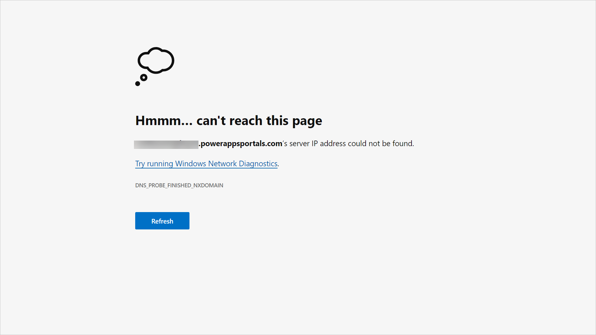
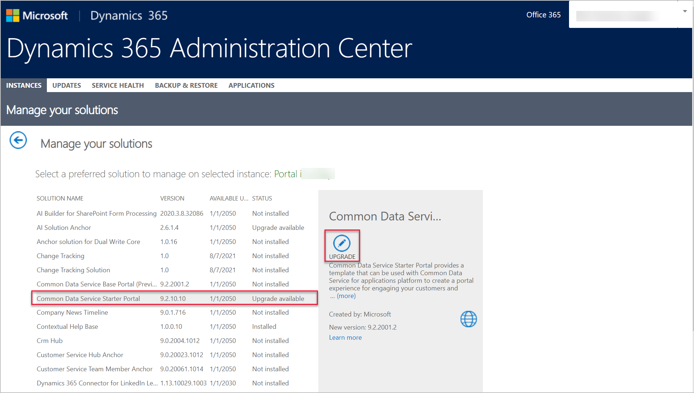

An administrator's role goes beyond ensuring a Power Apps portal is up and running but also configured to run efficiently and quickly.  There are a number of tools to check the settings and status of a Power Apps portal and provide users with clear messaging if the portal is undergoing maintenance.

## Portal checker

The portal checker is available in the Power Apps Portal admin center and will run diagnostic checks against to protect and advise against common issues that may be encountered when operating a portal.

To run the portal checker, follow these steps:

1. From [Power Apps](https://make.powerapps.com/?azure-portal=true), locate your portal app.
1. Click the ellipse (...) and choose **Settings**.
1. Select **Administration**.
1. Select **Run Portal Checker** from the list of options on the left.
1. Press the **Run Portal Checker** button on the screen.
1. After a few minutes, you should see a list of diagnostic results.

> [!div class="mx-imgBorder"]
> 

The result will also provide mitigation steps or links to understand the impact of the issue.

For more information, see [Portal Checker](https://docs.microsoft.com/powerapps/maker/portals/admin/portal-checker/?azure-portal=true).

## Enable maintenance mode

As an administrator, there are times when you do not want to have portal users visit or sign in to the Power Apps portal.  You may be migrating or updating a series of portal web pages and functionality, or uploading a large dataset that you do not want to be available on the portal until the load process is complete.

While there is the option to change the portal state to "off," this would present the portal visitors with a message that the portal cannot be found, leaving the visitors wondering what has happened.

> [!div class="mx-imgBorder"]
> 

Within the Portal admin center actions are the option to enable the Portal Maintenance mode.  This will provide the portal visitors with a more informational page indicating the portal is temporarily unavailable.

> [!div class="mx-imgBorder"]
> 

The maintenance mode page can also be replaced with a custom HTML page hosted elsewhere and publicly accessible. For more details, see [Enable maintenance mode](https://docs.microsoft.com/powerapps/maker/portals/admin/enable-maintenance-mode#enable-maintenance-mode/?azure-portal=true).

## Upgrading the portal

A benefit of Software-As-A-Service applications is that many of the software components are updated automatically.  A number of the Power Apps portals components such as the Azure web application and the various tools are updated automatically.  

An administrator can also opt in to receive early updates in the Portal admin center.

> [!CAUTION]
> You should choose to opt in with early updates in development or testing portals only. This will ensure your production portal remains operational in the unlikely event that an early update may cause issues with your portal application.

While underlying infrastructure is maintained automatically, the portal solutions aren't automatically updated.  These are installed on the Common Data Service and will always be compatible with the current portal web host.  An administrator may be advised of the available solution updates from the Microsoft 365 message center.

An administrator can update the portal solutions during an appropriate maintenance window as the update process may cause some performance degradation and portal instability.

The portal solutions can be updated using the Dynamics 365 Admin center (even for the Common Data Service portals that do not have any Dynamics 365 apps installed).

1. Navigate to the [Power Platform Admin Center](https://aka.ms/ppac/?azure-portal=true).
1. Expand **Admin Centers**.
1. Choose **Dynamics 365**.
1. Select the environment where the portal is provision.
1. In the details section, select the **Manage your solutions** icon.
1. Select the portal solution that has a status of **Upgrade Available**.
1. Press **Upgrade** to start the solution upgrade process.

> [!div class="mx-imgBorder"]
> 

> [!VIDEO https://www.microsoft.com/videoplayer/embed/]
