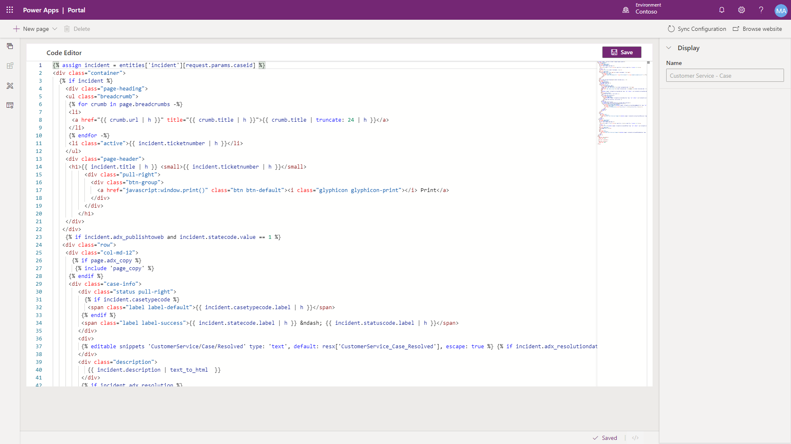

While web pages represent content accessible to portal users, page templates help to maintain a consistent look and feel throughout your entire website. Templates also define how dynamic content based on Common Data Service (CDS) data is delivered to your users, and how users can interact with the portal pages. 

When you create a new webpage either in the Portal Studio or the Portal Management app, you must choose a page template from the list of existing templates. Several page templates are included with each of the portal templates. 

There are two template types which controls how the template determines what to render.

- **Rewrite**: Will use the Rewrite URL field to render a given ASP.NET template.
- **Web Template**: Will use the Web Template field to render a given Web Template.

## Rewrite

Rewrite template type refers to the physical path to the .aspx page that runs on Portals Web App and processes the request. Power Apps portals are hosted and do not provide direct access to the app, code, or resources. It is not possible to create new Rewrite templates or change the behavior of the existing templates.

Rewrite templates are useful for specialized content processing such as Forums, Blogs, and Ideas. There is a number of special Rewrite page templates, such as Access Denied, Error, and Profile. It's not recommended to remove or replace these templates.

## Web templates

To create custom page templates, Web Template can be used. Web template, in general, is a layout template. For example, if a Web template includes static HTML, this HTML will be rendered "as is" in the page output that uses that template. The real power of web templates comes from the ability to contain Liquid code that adds processing capabilities to the static content, including access to CDS data.

Web Templates are very flexible. They can be rendered on their own or can be included as part of another template. They support inheritance where one template is based on and extends functionality of another. Web template can be used to render a standalone fragment of HTML such as page breadcrumbs, the entire custom page, or create custom headers and footers for your portal website.

Since the web template defines the content that gets delivered to the client, often a functional consultant would engage a designer or developer to add CSS or JavaScript to extend a web template and add client-side functionality to the generated page.

> [!div class="mx-imgBorder"]
> 

> [!NOTE] 
> Web Templates can be edited in the Portals Studio if they have a corresponding Page Template.  Web Templates cannot be created on the Portal studio. 

### Web template attributes

Web template is a very simple entity with only the following attributes available.

- **Name**. When template is included in other content, or extended by other templates, it is referred to by this name.
- **Source**. The source content of the template. It can be a static text, HTML fragment, or, most often, a layout using Liquid.
- **MIME Type**. Defines what MIME type the server will send to the client when the template is rendered. If value is not provided, the value will be text/html is assumed, which is a standard type for HTML pages. It's possible to create a web template that will render specialized content. For example, you can create a web template that will return some customer's data in json format. In this case MIME type would be set to application/json. The page using this web template wouldn't be used by users in a browser but, instead, it will be called from JavaScript code, effectively defining an API for your solution.

### Website headers and footers

Web templates can also be used to override the global header and footer used by a Power Apps portal. To do this, set the **Header Template** or **Footer Template** field of your website to the web template of your choice. Note that if you override **Header Template**, your selected template assumes responsibility for rendering the primary navigation, sign-in/sign-out links, search interface, and so on for your site interface elements that are normally handled by the default header template.

> [!TIP]
> If you don't specify a header or a footer template in the Website record, the default content is rendered. To remove, specify a blank template.

> [!VIDEO https://www.microsoft.com/videoplayer/embed/RWs4Bi]
