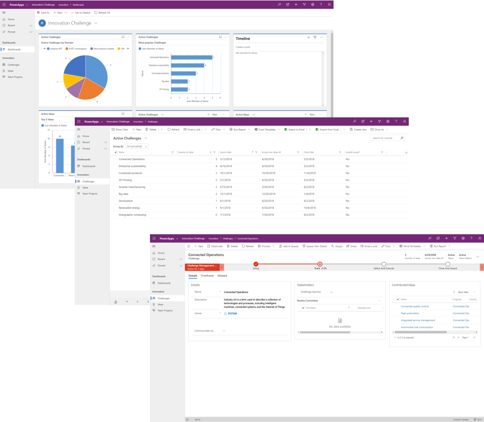
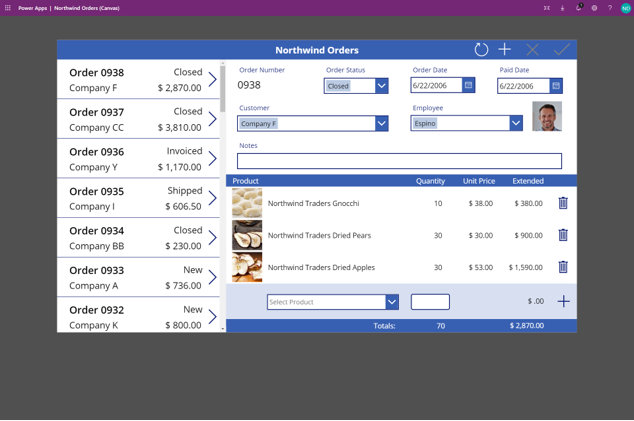
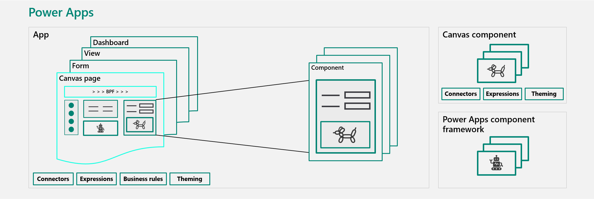

There are common patterns for apps that can help in your project. Let's take a look at some.

## First-party vs third-party apps vs custom apps

A solution architect should also consider using a third-party app from Microsoft AppSource. The rest of this module will be concerned with creating custom apps.

The first decision a solution architect needs to make is where to start:

- First-party Dynamics 365 apps
- A third-party app from AppSource
- Create custom app(s)

There are many apps for Dynamics 365 that you can use individually or together. You need an understanding of these apps and their capabilities so that you can decide whether to use the out-of-the-box (OOTB) functionality of the apps, customize the apps, or even build your own custom apps. You can think of the first-party Dynamics 365 apps as model-driven Power Apps built on top of Microsoft Dataverse.

A solution architect should start with evaluating if Dynamics 365 apps can meet the requirement alone. If not, then look at AppSource next, and then finally look to custom apps.

## App types

A Model-driven app has the following features:

- Dataverse data driven
- Data relationship navigation
- Consistent UI
- Security trimming of UI
- Responsive UI
- Consistent accessibility
- User personalization
- End-user tooling (Excel, import, export, etc.)
- Back/Mid office and process focused

A Canvas app has the following features:

- Not Dataverse data driven
- Visual presentation of info
- Custom UI
- Non-Responsive UI
- Device integration
- Basic offline support
- SharePoint or Teams embedding
- Task focused apps

A Portal app has the following features:

- Dataverse data driven
- Web application
- Uses Model-driven forms and views as framework to surface Dataverse data
- Can be customized with standard web technologies (HTML, JavaScript, CSS, Liquid, etc.)
- External user focused

## Common pattern

When deciding on which app type to use, a solution will typically have multiple apps of different types. A common pattern is:

- Model-driven: Administration of data and process.
- Canvas: End user.
- Portal: Externally facing portal for non-users.

Canvas apps can be used to solve edge cases that would often be ignored.

## Apps in Teams

Both Canvas apps and Model-driven apps can be added to Microsoft Teams and accessed from a tab in a channel. Later in this module, we will look at creating apps in Microsoft Teams.

## Embedding apps

A Canvas app embedded can be embedded in a Model-driven app form. This enables many different scenarios that can be difficult to achieve without code such as:

- Including visuals
- Accessing data not in Dataverse using connectors
- Complex logic and operations on Dataverse data

There are some limitations of using embedded Canvas apps

- Only available during edit; they are not available during creation of new rows.
- Save of form does not save the component data at the same time.

## Roadmap

Currently Canvas and Model-driven apps have separate designers and the integration between Canvas and Model-driven is not seamless. Not all features of each app type are available to the other as shown in the following diagram.

Microsoft plan is to merge and eliminate the difference between Canvas and Model-driven apps. There will simply be Power Apps, with screens made up of canvas and `model components as shown in the following diagram.

