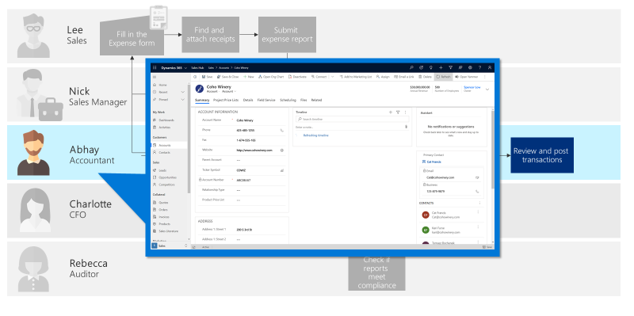
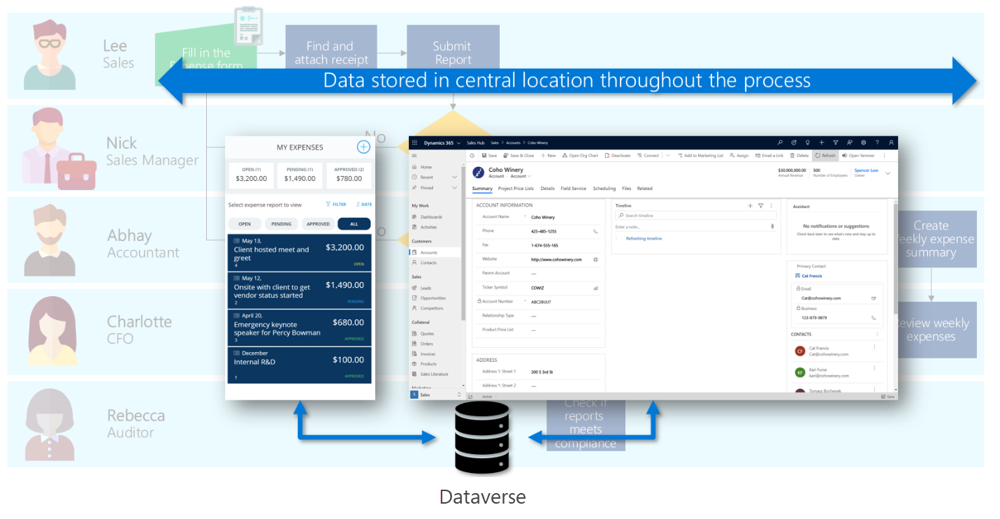

App composition is one of the most important decisions that a solution architect must make. App composition is the process of determining the number and type of apps. Deciding on how many apps and what features to include in an app are important considerations in the process.

## Decide on the number and type of apps

Solution architects should consider the following principles when choosing which apps to build:

- Large monolithic apps should be avoided.
- Too many small apps can be overwhelming for users if they have to frequently context switch.
- Components can be used by multiple apps, allowing composition of apps that target users with specific needs.
- Offer groups of users targeted mobile apps to save time when they are away from their desks.

> [!IMPORTANT]
> A solution architect needs to consider which user communities will use which app, when they will use the app, and on which devices. It might be beneficial to map the apps in such a way that helps you decide the number and type of app.

## Extend existing apps vs. create new apps

Dynamics 365 apps come with apps like Sales hub and Customer Service hub. You can choose to use and extend these apps, or you can create your own apps.

Using and modifying an existing app might:

- Expose new features when updates are released.
- Include features that you do not need.
- Include components that you can't reuse or replicate in custom apps.

Composing a new app will:

- Provide complete control over what is included.
- Require you to manually add new features to app navigation.
- Enable you to use custom forms and views that you can control the structure of.

## Determine which type of app to make

Model-driven apps are built on top of the data model in the Dataverse environment. Views and detail screens for model-driven apps are based on the data structure. Accordingly, they offer users a more consistent appearance and behavior from one screen to the next without requiring much effort from the app creator.

Model-driven apps are useful in scenarios where the business logic is complex, such as:

- Sophisticated data models.
- Business process management.
- Tracking activities that are associated with data.

Canvas apps can be built with or without a Dataverse database. They use connectors to access data and services. Canvas apps start with a blank screen, like an artist's canvas, and then the creator can manually lay out each screen. This feature gives the creator complete control over the placement of each element on the canvas.

You should choose canvas apps if the user expects a customized user experience and because they offer:

- A graphical, intuitive interface.
- The ability to create a tailor-made UI based on user requirements.
- Integration that spans multiple systems by using connectors.

> [!NOTE]
> Consider creating a model-driven app unless your users have a specific need for a canvas app. Model-driven apps enable you to make your app quickly because they don't require you to build the UI yourself.

Your business process might require more than one app. In the following example scenario, a solution is required for creating and viewing expense reports. Many tasks have been identified that need to be completed by different user roles.

The expense report solution has several task sets that are different, so you should consider making several apps. The data that people use is the same, but the user experience will be tailored to the specific scenario and personas.

Canvas apps would be the best fit for employees who are filling in the expense form, which enables people like Lee to submit an expense report by using an attractive mobile app that is intuitive to use and can be used when offline.

Notice in the preceding image that Abhay has the following requirements:

- Must be able to review all expense reports and receipts
- Responsible for ensuring compliance for every expense report
- Large volume of work; needs to be able to process information quickly
- Must be able to report on how expenses are balancing up to the budget

To be able to process a large volume of work and process information quickly, the best fit for Abhay would be a model-driven app. It allows Abhay to quickly view all details of the submitted expense report, assess how it affects the budget, and look for related information such as vendor details.

This example scenario shows a combination of canvas app and model-driven app. Though they are two different types of apps, all data can be centralized in one place: Dataverse.

