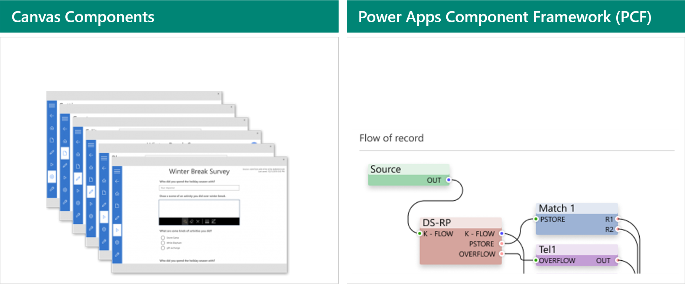

A solution architect needs to consider creating components as part of the app architecture. Components are important because they can promote reuse and enabling multiple makers to collaborate on multiple parts of a canvas app at the build stage.

Components:

- Components allow reuse within and across apps.
- Components can allow multiple makers to work on building a single app.
- Components help promote consistency and reduce redundancy.

A solution architect should look for controls that would benefit from investing in making into a component, headers, common widgets, etc.

There are two types of components in Power Apps:

- Canvas components: Targeted for canvas app makers and work only in canvas apps.
- Power App component framework (PCF) code components: Targeted for professional developers.

## Component libraries

Canvas components are reusable building blocks for Canvas apps so that app makers can create custom controls to use inside an app, or across apps using a Component library. Canvas components are:

- Good for reuse in canvas apps.
- Can be used across multiple apps.
- Allows use of common maker skills, making it easier for multiple makers.
- Limited to capabilities of canvas app formulas and connectors.

Component libraries are containers of component definitions that make it easy to:

- Discover and search components.
- Publish updates.
- Notify app makers of available component updates.

> [!IMPORTANT]
> Canvas components should be added to Component libraries. Component libraries are the recommended way to reuse components across apps. When using a component library, an app maintains dependencies on the components it uses. The app maker will be alerted when the updates to dependent components become available. Hence, all reusable components should be created within the component libraries.

The solution architect should have a strategy for managing components.

## Code components with Power Apps component framework

Power Apps component framework empowers professional developers and app makers to create code components for model-driven and canvas apps (public preview) to provide enhanced user experience for the users to work with data on forms, views, and dashboards.

Code components are:

- Can be used in both model-driven and canvas apps in both web and mobile.
- Can be used in multiple apps to replace fields and grids.
- Can be used by both new record and edit experiences.
- Typically can use multiple components on a form without performance problems.
- Requires code developers with TypeScript and HTML skills.
- Allows using professional developer skills, allowing for all types of developer to contribute to the solution.

Code components can be packaged in solutions. When the solution is updated, each app that consumes the component automatically sees the updated component.

A solution architect should purposefully use code components to create a good user experience.

There is a large community developing code components. You can reuse these components from the [gallery](https://pcf.gallery/) and [sample component gallery](https://powerusers.microsoft.com/t5/Canvas-Apps-Components-Samples/bd-p/ComponentsGallery).

The following screenshot is for a community control that displays a grid of counts based on calculated risk scores.

