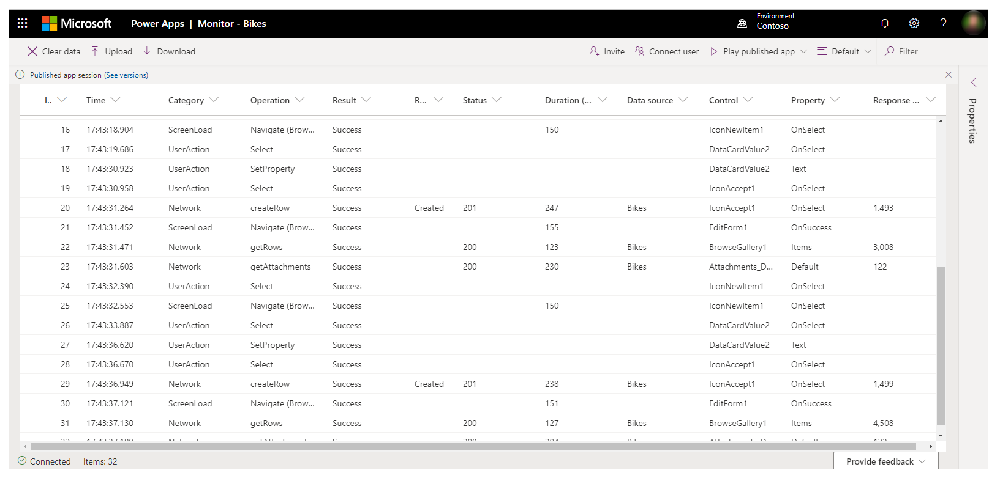
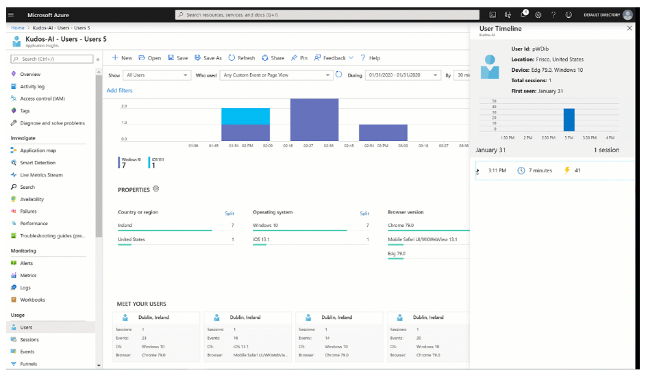

There are two main ways to do development, imperative and declarative. In imperative development, the focus is on how to achieve the goal. With declarative, the focus is on getting the result. Imperative provides more flexibility because you control every step in the process, but that means more code and more complexity. Declarative is much simpler and straightforward to use but can lack the ability to have the complete control that you might want.

Canvas apps takes your declarative "What" and optimizes the "How". There may not be a way to precisely express "What" and Power Apps allow you to use Imperative development. A mistake makers often make is to try and use imperative development when declarative is easier and performs better.

Canvas apps can be made to look pretty apps and while being pretty is important, performant apps get better user adoption.

This section discusses techniques for optimizing Canvas app performance.

## Offloading work from apps

As formulas in apps get larger and more complex consider if work should be done somewhere else. Work can be offloaded to Power Automate cloud flows, business rules, plug-ins, and other server-side logic in Dataverse.

> [!NOTE]
> A common method is to offload logic into a Power Automate cloud flow that uses the Power Apps trigger. The flow can be called from a Power Apps expression passing data to the flow and receiving a result back from the flow.

You can also create custom connectors to Azure Functions or other custom logic. If you find you are using Imperative development inside an app, consider offloading this logic to a more appropriate feature.

## Performance

Common issues with app performance are:

- Data access: The app gets large sets of data into data collections initially, and then uses the data within multiple screens over client-heavy operations like JOIN, Sort, Add Column, and Group By.
- Formulas in OnStart: The app triggers many unnecessary data calls in screens, and these data calls return large data records.
- Repeatedly retrieving data from the source: Use the Set function to cache data from lookup tables locally.

With OnStart you should encourage makers to make the use of the ClearCollect function to cache data locally and the Concurrent function to reduce the time to load thee cached data. The first image shows loading four datasets without Concurrent and the second image with Concurrent.

With so many options, performance needs to be considered often. Analysis and improving optimizations is an ongoing effort. You should validate best practice by referring to [slow performance sources](https://docs.microsoft.com/powerapps/maker/canvas-apps/slow-performance-sources), [common performance issues](https://docs.microsoft.com/powerapps/maker/canvas-apps/common-performance-issue-resolutions), and [performance tips](https://docs.microsoft.com/powerapps/maker/canvas-apps/performance-tips).

The solution architect should implement a canvas app performance tuning strategy.

A tuning strategy should:

- Avoid any work than you can
- Defer work that is less likely to be needed
- Parallelize work wherever possible
- Monitor the app in operation, work may not always be obvious

You should use a progress indicator for the end user on any long running work.

## Test Studio, Monitor, and Application Insights

Canvas apps should be properly tested. Microsoft provides Test Studio for regression testing of canvas apps that can be included in automated builds processes.Test Studio includes:

- Suites: Test suites are used to organize or group test cases together
- Tests: Test cases are made up of a series test steps. Test cases are executed to validate that your app, or specific features in your app, is working as you expect.
- Test steps: Instructions or actions. Test steps are written using the Power Apps expression language.
- Test assertions: The expected result of a test.

Monitor is a tool that offers makers the ability to view a stream of events from a user's session to diagnose and troubleshoot problems. Canvas app makers can use Monitor to view events while building a new app in Power Apps Studio and to monitor published apps during runtime. Model-driven app makers can monitor page navigation, command executions, form-related issues, and other major actions to understand app behavior and make improvements.

You can connect your canvas apps with Application Insights, a feature of Azure Monitor. Application Insights includes powerful analytics tools to help you diagnose issues and to understand what users actually do with your app.

With your app connected to Applications Insights, you can collect telemetry on how users are actually using your app to help you improve the quality of your apps.  Some of the telemetry you can gain from setting this up includes:

- Number of active users using the app.
- Location of where the app is used.
- Which screens are used the most.
- User flow from one screen to another.

The solution architect should decide if Application Insights are to be included in apps you create.

For more information, see [Application Insights](https://docs.microsoft.com/en-us/powerapps/maker/canvas-apps/application-insights).
