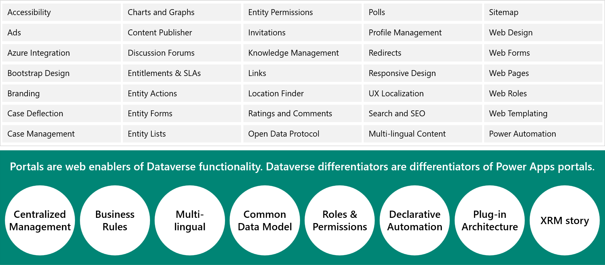

The ability to easily surface and interact with Microsoft Dataverse data on an externally facing web site is the core benefit for implementing a Power Apps portal.

Power Apps portals are designed for interaction with the internal and external audiences. 

## Features of Portal apps

Power Apps portals are built on top of Dataverse. This architecture comes with a major benefit. All the differentiating features of model-driven Power Apps are the features of Power Apps portals as well, including:

- Centralized management
- Common Data Model
- Roles and permissions
- Forms and views
- Business rules
- Declarative workflows and actions
- Plug-in architecture
- Integration with other services
- Dataverse extensibility
- Audit

Power Apps portals deliver a complete content management system out of the box, with all content stored in Dataverse. As a result, content can be edited through the portals studio and also directly by using the Portal Management app. Additionally, the robust Dataverse security model can help secure the content.

> [!NOTE]
> A portal requires a Dataverse database to be available in the environment to install and configure some of the key components. While a portal from blank can be configured in an environment without any of the Microsoft Dynamics 365 apps installed, the templates (Customer self-service, Employee self-service, Partner, and Community portals) have dependencies on Microsoft Dynamics 365 first-party apps.

## Portal architecture

Power Apps portals transact directly with Dataverse data. You can create lists and forms over data. The Power Apps portal provides built in components that use model-driven views and forms. The Portal can be customized and extended as shown in the following diagram.

Power Apps portals securely extend Dataverse solutions to internal and external audiences. Portal visitors can access portals as either anonymous or authenticated users.

## Exposing Dataverse data

There are many ways to expose Dataverse date. Let's take a look.

## Use cases for portals

When to consider using a Portal app:

- Secure interactions with Dataverse for external and internal users.
- Community or self-service sites for customer service.
- CRUD on Dataverse data.
- Limited resources and budget, business-user, and no-code configuration requirements.
- Responsive design, content accessible across all devices and browsers.
- Multi-lingual implementations.
- Single sign-on.

When to exercise caution:

- Most data resides in an external (non-Dataverse) system.
- Heavy requirements around document management, indexing and searching.
- Large volumes of end-users driving heavy traffic to the Portal.
- eCommerce requirements including processing payments and maintaining an online store.
- Use cases that are more appropriate for direct Power Apps licensed user access.

## Authentication

The portal allows both authenticated and unauthenticated users. The solution architect needs to understand:

- Will authenticated access be used?
- How will users be authenticated Azure B2C, Azure AD, or another identity provider?

> [!IMPORTANT]
> You should avoid using local stored accounts to authentication.

## Implementation considerations

When implementing a Portal app, the solution architect needs to consider the following key factors:

- Will you be using a blank template or a Dynamics 365 template?
- What is the gap from template to requirements?
- What portal pages will require advanced Liquid Template skilled resources?
- What data do authenticated users need access to?

## Deployment considerations

Portal assets like views and forms can be packaged in solutions but most portal configuration is stored as data over many tables. The Configuration Migration tool can help mitigate some of the work when moving from development to test to production.

## Further reading

Power Apps portals architecture <https://docs.microsoft.com/learn/modules/portals-architecture/>

Work with Power Apps portals <https://docs.microsoft.com/learn/paths/work-power-apps-portals/>

Extend Power Apps portals <https://docs.microsoft.com/learn/paths/extend-power-apps-portals/>
