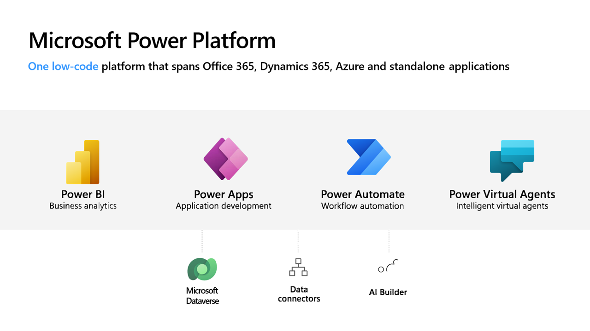

A solution architect for Microsoft Power Platform is responsible for overall design of the solution. Understanding the architecture of Power Platform, how it is designed, and its limits are important when designing solutions based around Power Platform.

As you consider your solution's design, you need to understand the components and capabilities of Power Platform and how they control the design of your solution.

## Power Platform components

Power Platform is a low-code, rapid business application development platform, and it contains several different independent, yet closely related tools:

- **Microsoft Power Apps** - Allows anyone to build custom web and mobile apps by using low-code or no-code techniques.

- **Microsoft Power Automate** - A cloud workflow tool to connect cloud and desktop applications together to automate business processes.

- **Microsoft Power BI** - A self-service analytics service that allows users to gain insights into their data. Power BI allows you to merge data from various sources and to create models, visualizations, reports, and dashboards.

- **Microsoft Power Virtual Agents** - Allows anyone to create chatbots without writing code from within a browser interface.

Power Platform includes many other components that support Power Platform tools that the solution architect can use:

- **Microsoft Dataverse** - Provides a no-code environment to create tables, relationships, and business logic.

- **Data connectors** - Connectors define the services and data sources that Power Platform tools can access.

- **AI Builder** - A set of AI model types that can use data in Dataverse to create, tailor, and train AI models that can be used by other components of Power Platform.

The following diagram illustrates how Power Platform components are related.

> [!NOTE]
> This module describes the architecture of Power Platform. Other modules will examine the details for Power Apps, Power Automate, Power BI, and Power Virtual Agents.

## Cloud

Power Platform is cloud-based software as a service (SaaS) solution that is available from within a Microsoft Azure Active Directory (Azure AD) tenant. Power Platform is licensed through Microsoft 365 and secured by Azure AD. Power Platform runs on Microsoft Azure; therefore, it is highly scalable and available globally.

## Power Platform capabilities

Typically, the solutions that a solution architect designs will use many components that are provided by Power Platform. The individual components provide great capabilities on their own but are more powerful when combined.

- Power Apps allows users to act on data and drive business processes. 
- Power Automate can automate apps and act on behalf of the user in response to metrics and events. 
- Power BI can analyze the data that is captured by apps. 
- Power Virtual Agents can assist users. 
- Power Automate flows can be called from Power Apps, Power Virtual Agent actions, and Power BI alerts. 
- Power BI dashboards and tiles can be displayed in Power Apps screens. 
- Power Apps can be embedded in Power BI dashboards.

## Meaning of platform

Typically, when most people refer to Power Platform, they are thinking of the four components: Power Apps, Power Automate, Power BI, and Power Virtual Agents. These tools allow you to build apps and create solutions.

Data is at the center of everything that a business does today. With Power Platform, you can connect to data where it lives by using connectors or store data in Microsoft Dataverse. Connectors are provided for the following entities:

- Office 365 services such as email and SharePoint
- Azure services such as Azure SQL
- Non-Microsoft sources such as Twitter, SendGrid, Dropbox, and Mailchimp 

Power Apps and Power Automate use the connectors to access the data where it lives. Microsoft Dataverse is more than a database, it is a platform for building business apps and solutions.

Microsoft Dataverse controls security, implements logic, enables integrations, and contains a wealth of capabilities that enable powerful business solutions to be created. These capabilities will be explored further in this module.

Before taking an in-depth look at Dataverse, you first need to learn how Dataverse is accessed through environments.
