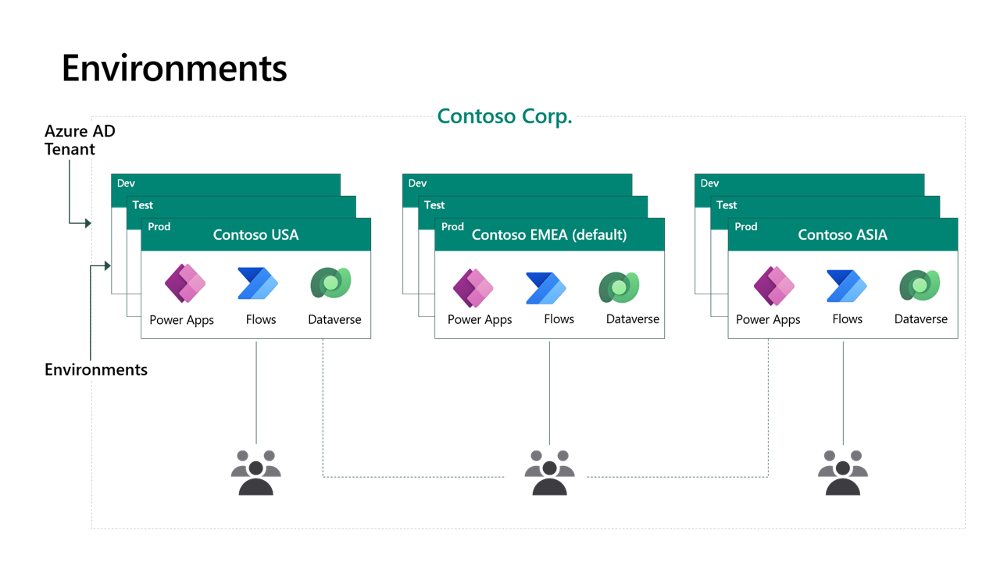
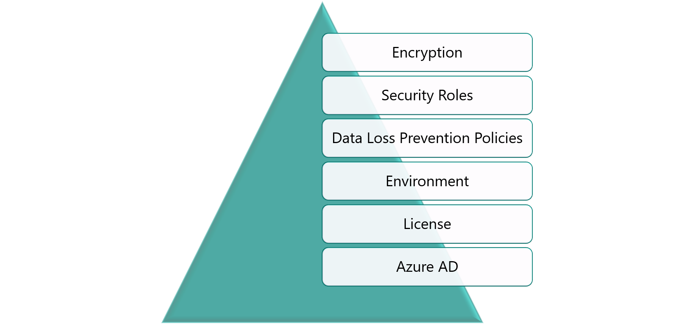

An environment is a space to store, manage, and share an organization's business data, apps, and flows. Administrators can create environments and control access to environments.

An environment has:

- Name: Name of the environment
- Location: Which Azure region the environment, its data, apps, and flows are stored in.
- Admins: Who can manage the environment.
- Security Group: Controls which users can access the environment.
- Apps: The apps created in the in the environment.
- Flows: The flows created in the environment.
- Bots: The chatbots created in the environment.
- Connectors: Custom connectors added to the environment.
- Gateways: On-premises gateways connected to the environment.
- Dataverse (optional): An instance of a Dataverse database.

Environments are containers that administrators can use to manage apps, flows, connections, and other assets; along with permissions to allow organization users to use the resources.

## Tenants

Microsoft 365 uses an Azure Active Directory tenant to control authentication and authorization. You do not need an Azure subscription to access the Azure Active Directory (AAD), the Microsoft 365 subscription permits access to the AAD portal (<https://aad.portal.azure.com>). Adding a user to Microsoft 365, adds the user to AAD. AAD tenants are located in an Azure region, normally the region of the user who created the tenant.

Environment are created within within an Azure Active Directory (AAD) tenant. Access too the environment is authenticated by Azure AD.

## Multiple environments

An environment is a container to separate apps that might have different roles, security requirements, or target audiences. How you choose to use environments depends on your organization and the apps you're trying to build. For example:

- You can choose to only build your apps in a single environment.
- You might create separate environments that group the test and production versions of your apps.
- You might create separate environments that correspond to specific teams or departments in your company, each containing the relevant data and apps for each  audience.
- You might also create separate environments for different global branches of your company.

The following diagram illustrates how an organization may create multiple environments.

Environments are a scope for lifecycle management and a scope for permissions.

## What is not contained in an environment

Environments contain the Power Platform components such as apps, flows, and bots. But not everything you might build for your solution is contained in environments. Dynamics 365 customer engagement apps (Sales, Marketing, Customer Service, Field Service, and Project Operations) are contained in an environment. There are no limitations to the number of apps or flows that can be deployed within an environment.

An environment does not contain:

- Power BI workspaces, datasets, reports, or dashboards.
- Any Azure service deployed.
- Non-customer engagement Dynamics 365 apps (e.g. Finance or Business Central).

A solution architect need to consider how access to these other components is controlled.

The following diagram illustrates how an environment related to other components inside and outside the environment.

## Security layers

The Power Platform uses multiple layers of security.

- Azure AD: User identities are authenticated by Azure Active Directory (AAD). With Azure AD we can restrict users using AAD features such as conditional access policies and enforce security through multi-factor authentication. Azure AD supports Single Sign-On (SSO) so users do not need to login separately to the Power Platform. Guest access is supported for the Power Platform.
- Licensing: Users requires an appropriate license to access the Power Platform.
- Environments: Azure AD Security groups control access to each environment.
- Data Loss Prevention Policies: DLPs restrict the use of connectors for environments and therefore the risk of data leakage. You can create cross-tenant inbound and outbound restrictions where you have a multi-tenant scenario.
- Security Roles: Access to tables and rows in Dataverse is controlled by Security Roles.
- Encryption: All data is encrypted at rest using SQL Server Transparent Data Encryption (TDE). All data is encrypted in transit using SSL.

The following diagram presents how security layers are applied for Power Platform environments.

When creating an environment, the solution architect needs to decide the location of the environment.
