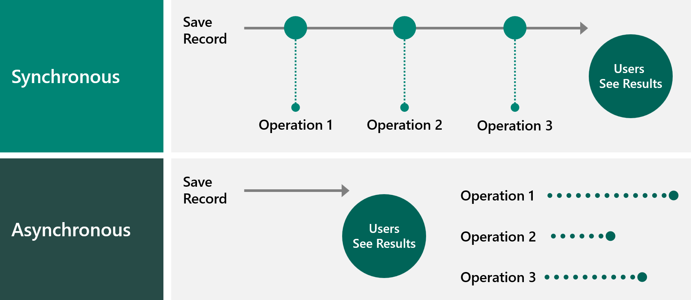

Microsoft Dataverse provides a number of different ways to perform custom logic.

There are several options available for applying custom business logic in Dataverse including:

- Business rules
- Classic workflows
- Power Automate cloud flows
- Business process flow
- Calculated columns
- Rollup columns
- Plug-ins
- Custom Workflow Assemblies
- Custom Actions
- Custom API
- Client-side scripting
- Power Apps Component Framework code components
- Azure Service Bus and Event Hub integration
- Webhooks

## Creating custom logic

The solution architect will need to be able to decide which component of the Power platform is used where in the solution. There are no hard or fast rules for this as each of these options have their own pros and cons.

For instance there are the following limitations/:

- You cannot trigger Power Automate flows from calculated or rollup columns.
- Rollup columns are only recalculated every hour.
- Business rules can only access the columns on the form for its own table.
- Classic workflows cannot access rows in 1-to-many relationships.
- Data changed by a business rule will not trigger an OnChange event created with JavaScript.

^ This list of limitations is not exhaustive.

Having a no/low code or a code-first approach is not the correct tactic, you need to decide each situation on its own merits. Having an understanding of the capabilities of the capabilities for these options is a pre-requisite for an aspiring solution architect.

## Synchronous vs Asynchronous processing

Custom logic can be executed either synchronously or asynchronously. The solution architect needs to consider whether custom logic operations should be performed synchronously or asynchronously.

When the operations are performed synchronously, the user's screen is blocked until all operations are completed. The operations can modify data before or after it is saved to the database. Synchronous calls add minimal overhead to handling the processing but all operations in a synchronous transaction are limited to a total of 2 minutes. This is a hard limit and cannot be changed. Dataverse Plug-ins and Classic workflows can be performed synchronously. Business rules are performed synchronously if the scope is set to table.

When the operations are performed asynchronously, the user's screen is returned after their data is saved to the database. The operation will be added to a queue and will be performed at a later point in time, this could be within a few seconds, or it could be several minutes or even hours depending on the workload. Asynchronous means that users will have to refresh their screen to see the results. There is an additional overhead in running asynchronous jobs. THe platform creates rows in the AsyncOperation and WorkflowLog tables. These rows are updated when the operation starts, as it progresses, and after it completes. The rows can be set to be automatically deleted. Dataverse Plug-ins and Classic workflows can be performed asynchronously. Power Automate cloud flows are performed asynchronously.

## Client vs server processing

The solution architect needs to understand where logic is performed. 

Canvas app formulas, Model-driven form script, Business rules, and Power Apps Component Framework logic happens in the user interface and the user sees the result immediately. However, this logic is only enforced in the app the logic is implemented in.

Plug-ins, Power Automate cloud flows, classic workflows, and Business rules (with scope set to Table) happens only when the data is sent to the server by an app, flow, or an API call. The user only sees results of service custom logic in their app on refresh of data. Server logic is enforced when any app, flow, or API is used.

The Power Platform imposes limits on the number of calls that can be made. The solution architect needs to design the solution with these limits in mind.
