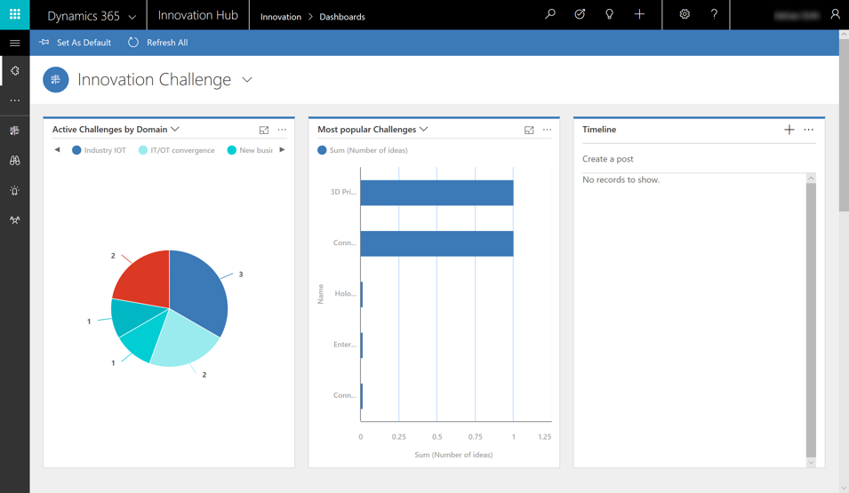
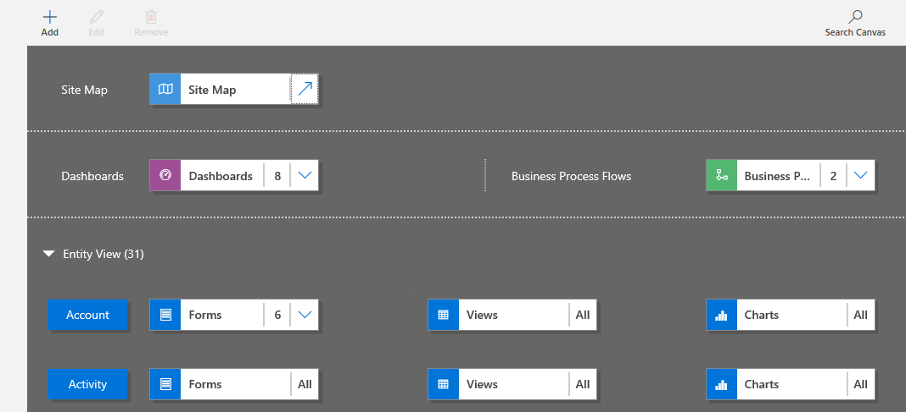

Model-driven app design is an approach that focuses on adding dashboards, forms, views, and charts to your apps. With no code or very little, the apps can be simple or very complex. 

In a canvas app, on the other hand, the designer has complete control over app layout. However, with model-driven apps, much of the layout is determined for you by the components you add. The emphasis is more about viewing your business data quickly and making decisions than on intricate app design.

Here are some of the benefits of model-driven apps:
- Rich component-focused environoments.
- No-code (or very little) needed. 
- Create complex responsive apps that look great on a variety of devices, while developing the app within one environment.
- Design capability similar to what’s  available in the Dynamics 365 customer engagement platform.
- Your app can be distributed as a solution.
 
## The approach to model-driven app making
Model-driven apps have three design areas:

- Model your business data 
- Define your business processes 
- Compose the app

### Model business data
Model-driven design uses a metadata-driven architecture so that designers can customize the application without writing code. To model business data you determine what data the app will need and how that data will relate to other data. Metadata means “data about data”, and it defines the structure of the data stored in the Common Data Service.

### Define business processes
Defining and enforcing consistent business processes is a key aspect of model-driven app design. Consistent processes help make sure your app users focus on their work and not on remembering a set of manual steps. Processes can be simple or complex and often change over time.

### Compose the app
After modeling data and defining processes, you build your app by selecting and configuring the components you need using the App Designer.

