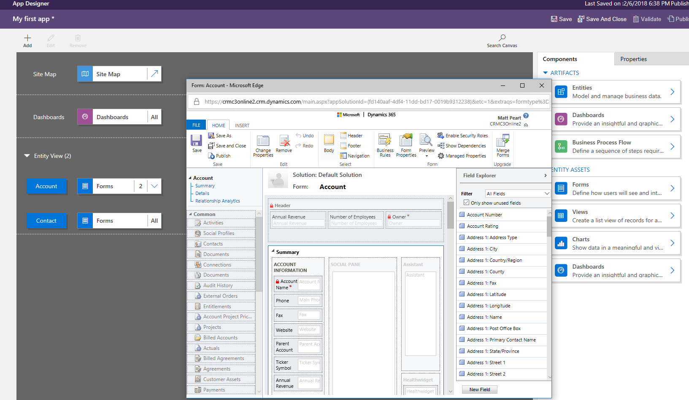
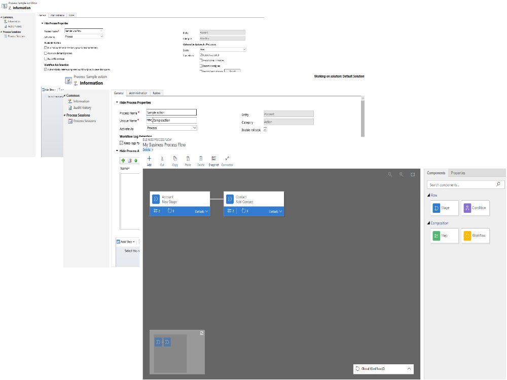

A model-driven app consists of several components you select using the App Designer. The components and component properties become the metadata. Let's look more closely at these components.

## Data
The data components determine what data the app will be based upon.

|Component  |Description  |Designer  |
|---------|---------|---------|
|Entity     |Entities are items with properties that you track, such as a contact or account. Many standard entities are available. You can customize a non-system standard entity (or production entity). You can also create a custom entity from scratch. | Entity designer        |
|Field     | Fields are properties that are associated with an entity and help define the entity. A field is defined by a data type, which determines the type of data that can be entered or selected. Examples include text, number, date and time, currency, and lookup (which creates a relationship with another entity). Fields typically are used with forms, views, and searches.        |Entity designer   |
|Relationship     | Relationships define how entities can be related to each other. There are 1:N (one-to-many), N:1 (many-to-one), and N:N (many-to-many) types of relationships. For example, adding a lookup field to an entity creates a new 1:N relationship between the two entities and lets you add that lookup field to a form.   |Entity designer        |
|Option set field     | This type of field displays a control that allows the user to select an option of predetermined values. Each option has a number value and label.  Options set fields can either require a single for multiple values.  |Entity     |

## User Interface
These components determine how users interact with the app. 

|Component  |Description  |Designer  |
|---------|---------|---------|
|App     | Apps determine the application fundamentals such as components, properties, client type, and URL for your app.      | App designer   |
|Site map     | A site map specifies the navigation for your app.        | Site map designer        |
|Form     | Forms contain a set of data-entry fields for a given entity that matches the items that your organization tracks for the entity. For example, a set of data-entry fields where users input relevant information to track a customer’s previous orders along with specific requested reorder dates.        | Form designer        |
View     | Views define how a list of records for a specific entity is displayed in your application. A view defines the columns to display, width of each column, sort behavior, and the default filters.   |  View designer       |

## Logic
The logic components determine the business processes, rules, and automation the app will have. PowerApps makers use a designer that is specific to the type of process or rule.

|Type of logic  |Description  |Designer  |
|---------|---------|---------|
|Business process flow     | Business process flows walk users through a standard business process. Use a business process flow if you want everyone to handle customer service requests the same way. Or you could use a business process flow to require staff to gain approval for an invoice before submitting an order.        | Business process flow designer        |
|Workflow     |  Workflows automate business processes without a user interface. Designers use workflows to initiate automation that doesn’t require any user interaction.       | Workflow designer        |
|Actions    |  Actions are a type of process that let you manually invoke actions, including custom actions, directly from a workflow.       |  Process designer       |
|Business rule     | Business rules apply rules or recommendation logic to a form, such as to a set field requirements, hide fields, or validate data. App designers use a simple interface to implement and maintain fast-changing and commonly used rules.         |  Business rule designer       |
|Flow     | Flow is a cloud-based service that lets you create automated workflows between apps and services to get notifications, synchronize files, collect data, and more.        | Microsoft Flow        |

## Visualizations
Visualization determines what type of data and reporting the app will have display.

|Component  |Description  |Designer  |
|---------|---------|---------|
|Chart     | Charts are single graphic visualizations that can be displayed within a view, on a form, or be added to a dashboard.        | Chart designer        |
|Dashboard     | Dashboards display one or more graphic visualizations that provide an overview of actionable business data.        | Dashboard designer        |
|Embedded Power BI     | Power Bi adds embedded Power BI tiles and dashboards to your app. Power BI is a cloud-based service that provides business intelligence insight.        |  Combination of chart designer, dashboard designer, and Power BI       |

## Advanced model-driven app making
The Solution Explorer is used for advanced model-driven app building. Within the Solution Explorer you can navigate through a hierarchy that consists of all app components using the navigation pane on the left side of the tool.

