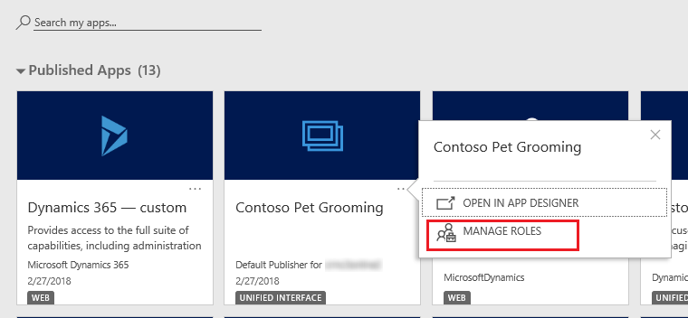
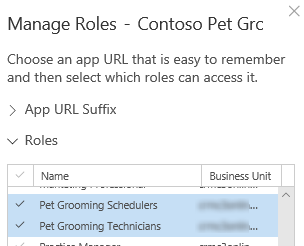

PowerApps use role-based security for sharing. A security role contains privileges that define a set of actions that can be performed within the app. All app users must be assigned to one or more predefined or custom security roles. 

Roles can also be assigned to teams. When a user or team is assigned to one of these roles, the person or team members are granted the set of privileges associated with that role. 

In this unit, you will learn how to share a model-driven app so that others can use it. 
You'll learn how to:
- Create a custom security role
- Assign users to the custom security role
- Assign the security role to an app

To share an app you must have the Environment Admin or System Admin role. 

## Sign in to PowerApps
Sign in to [PowerApps](https://powerapps.microsoft.com/) using your organizational account. If you don’t already have a account, select the **Get started free** link.

## Share an app 
The unit will follow the company, Contoso, which has a pet grooming business that services dogs and cats. An app that contains a custom entity for tracking the pet grooming business has already been created and published. 

The app must be shared so that the pet grooming staff can use it. To share the app, an administrator or app maker assigns one or more security roles to users and to the app.

## Create or configure a security role
The PowerApps environment includes [predefined security roles](https://docs.microsoft.com/en-us/powerapps/maker/model-driven-apps/share-model-driven-app#about-predefined-security-roles). These roles reflect common user tasks with access levels defined to match the security best-practice goal of providing access to the minimum amount of business data required to use the app. 

Remember that the Contoso pet grooming app is based on a custom entity. Because the entity is custom, privileges must be explicitly specified before users can work in it. To do this, you can choose to do one of the following.
- Expand an existing predefined security role so that it includes privileges on records based on the custom entity. 
- Create a custom security role for the purpose of managing privileges for users of the app. 

Because the environment that will maintain the pet grooming records is also used for other apps that the Contoso business runs, a custom security role specific to the pet grooming app will be created. Additionally, two different sets of access privileges are required.
- Pet grooming technicians only need to read, update, and attach other records. Therefore, their security role will have read, write, and append privileges. 
- Pet grooming schedulers need all the privileges that pet grooming technicians have. They will also need the ability to create, append to, delete, and share. Therefore, their security role will have create, read, write, append, delete, assign, append to, and share privileges.

Learn more about [Security roles](https://docs.microsoft.com/dynamics365/customer-engagement/admin/security-roles-privileges#security-roles) for accessing and scope privileges.

## Create a custom security role
1. Sign in to [PowerApps](https://powerapps.microsoft.com/) using your organizational account. If you don’t already have a account, select the **Get started free** link.
1. On the PowerApps home page, select **Model-driven**.
1. For the app you want to share, select **More Commands** (**…**) and then select> **Share link**.
1. From the **Share this app** dialog, under **Create a security role** select **Security Setting**.
1. On the **Settings** page, select **New**.
1. From the Security Role designer, select the actions, such as read, write, or delete.
1. Select the scope for performing that action. Scope determines how deep or high within the environments hierarchy the user can perform a particular action. In the **Role Name** box enter *Pet Grooming Technicians*.
1. Select the **Custom Entities** tab, and then locate the custom entity that you want. For this example, the custom entity named **Pet** is used. 
1. On the **Pet** row, select each of the following privileges four times until organization scope global  has been selected: **Read, Write, Append**

    

1. Because the pet grooming app also has a relationship with the account entity, select the **Core Records** tab, and on the **Account** row select **Read** four times until organization scope global  has been selected. 
1. Select **Save and Close**. 
1. On the Security Role designer, in the **Role Name** box enter *Pet Grooming Schedulers*. 
1. Select the **Custom Entities** tab, and then locate the **Pet** entity. 
1. On the **Pet** row, select each of the following privileges four times until organization scope global  has been selected:
    **Create, Read, Write, Delete, Append, Append To, Assign, Share**
1. Because the pet grooming app also has a relationship with the account entity and schedulers must be able to create and modify account records, select the **Core Records** tab, and on the **Account** row select each of the following privileges four times until organization scope global  has been selected. 
    **Create, Read, Write, Delete, Append, Append To, Assign, Share**
1. Select **Save and Close**.

## Assign security roles to users
Security roles control a user’s access to data through a set of access levels and permissions. The combination of access levels and permissions that are included in a specific security role sets limits on the user’s view of data and on the user’s interactions with that data.

### Assign a security role to Pet Grooming Technicians
1. From the **Share this app** dialog, under **Assign users to the security role** select **Security Users**.
2. In the list that is displayed, select the pet groomers.
3. Select **Manage Roles**.

   

4. In the **Manage User Roles** dialog box, select the **Pet Grooming Technicians** security role that you created earlier, and then select **OK**.

### Assign a security role to Pet Grooming Schedulers
1. From the **Share this app** dialog, under **Assign users to a security role** select **Security Users**.
2. In the list that is displayed, select the pet grooming schedulers.
3. Select **Manage Roles**.
4. In the **Manage User Roles** dialog box, select the **Pet Grooming Schedulers** security role that you created earlier, and then select **OK**.

## Add security roles to the app
Next, one or more security roles need to be assigned to the app. Users will have access to apps based on the security roles they're assigned to.
1. From the **Share this app** dialog box, under **Add the security role to your app** select **My Apps**.
2. In the lower-right corner of the app tile of the Contoso Pet Grooming app, select **More options (...)**, and then select **Manage Roles**.

    

4. In the **Roles** section, you can choose whether to give app access to all security roles or selected roles. Select the **Pet Grooming Schedulers** and **Pet Grooming Technicians** roles you created earlier.

    

5. Select **Save**.
 
## Share the link to your app
1. From the **Share this app** dialog box, under **Share the link to your app directly with users** copy the URL that is displayed.
 
1. Select **Close**.
1. Paste the app URL in a location so that your users can access it. You can post the URL a SharePoint site or send in email.
1. You can also find the app URL on the **Properties** tab in App Designer.  
 

## About predefined security roles
These predefined roles are available with a PowerApps environment. These privileges have global scope unless specified otherwise.

|Security role  |Privileges  |Description |
|---------|---------|---------|
|Environment Maker     |  None       | This role can create new resources associated with an environment including apps, connections, custom APIs, gateways, and flows using Microsoft Flow. However, this role not have any privileges to access data within an environment. Learn more about [Environments](https://powerapps.microsoft.com/blog/powerapps-environments/).        |
|System Administrator     |  Create, Read, Write, Delete, Customize     | This role has full permission to customize or administer the environment, including creating, modifying, and assigning security roles. This role can view all data in the environment. Learn more about [Privileges required for customization](https://docs.microsoft.com/dynamics365/customer-engagement/customize/privileges-required-customization).        |
|System Customizer     | Create (self), Read (self), Write (self), Delete (self), Customizations         | This role full permission to customize the environment. However, This role can only view records for environment entities that they create. Learn more about: [Privileges required for customization](https://docs.microsoft.com/dynamics365/customer-engagement/customize/privileges-required-customization).      |
|Common Data Service User     |  Read, Create (self), write (self), delete (self)       | This role can run an app within the environment and perform common tasks for the records that they own.        |
|Delegate     | Act on behalf of another user        | This role allows code to run as another user or impersonate.  This role is typically used with another security role to allow access to records. Learn more about how to [Impersonate another user](https://docs.microsoft.com/dynamics365/customer-engagement/developer/org-service/impersonate-another-user).       |

