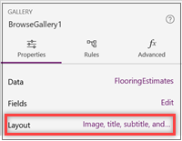
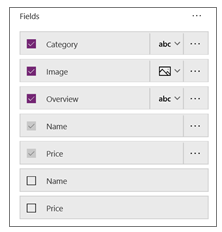

# Customize an app
In the previous topic, you looked more closely at the Flooring Estimates app and explored it to get a better understanding of how three-screen apps are composed. The app that PowerApps generated is useful, but you will often customize an app after it's generated.

In this topic, we'll walk through some basic changes for each screen in the app. There is a lot more you can do to customize an app, but for now the best way to learn is to take any app you generate from a list, such as from an Excel file, and see how you can customize it.

## Browse screen
We'll start with the browse screen. The app contains an image for each product but the layout could be improved. Let's work on that.
1. On the **Screens** pane on the left, select the control for the main gallery , **BrowseGallery1**. 
1. On the right pane, select the **Layout** control.

    

3. Select a different layout for the browse screen, such as a horizontal layout. You'll see the change immediately.

Now let's change your app some more.

1. On the **Screens** pane on the left, select the **Body1** control, which contains a description for the item. The control will now be highlighted on the app.

    

1. Press the Delete key to remove the description text. Don't worry. You're not deleting this information from your data source. You're just note making it viewable in the app.

Continue selecting controls on the left pane and changing the information for them on the right pane. Or select the control directly in the app first, and the change its details on the right pane. 

You might start finding out how easy and fun this is to do!

## Details screen
On the details screen, we want to change the order of the fields. There are different controls on this screen, so the process is a little different from the browse screen. 

1. On the **Screens** pane on the left, select the control for the Detail screen, **DetailScreen1**.
1. On the right pane, select the control for the number of fields indicated.

   

3. Select and drag the **Name** field to the top. Then select and drag the **Image** field underneath the **Price** field.

   

## Edit/create screen
Finally, on the screen where your app user edits and creates entries (**EditScreen1**), we want to change a text field so that it's easier to enter text. 

1. On the **Screens** pane on the left, select the control for the Edit/Create screen, **EditScreen1**.
1. On the right pane, select the control for the number of fields indicated.
1. Select the down arrow for the **Overview** field list, and then select **Edit multi-line text** control. A multi-line edit control will make it easier to add information to the app.

   

You can see how a few basic steps can do a lot to improve the appearance and experience of using an app. In this topic, we focused on the PowerApps Studio UI, which provides a lot of options for customizing your apps. In the next topic, we'll get into formulas, which play an important role in driving app behavior.  