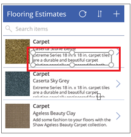
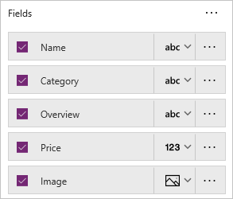
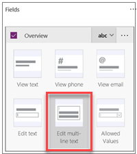

In a previous unit, you looked more closely at the Flooring Estimates app and explored it to get a better understanding of how three-screen apps are built. Apps that Microsoft PowerApps generates are useful, but you'll often want to customize an app after it's generated.

In this unit, we'll walk you through some basic changes for each screen in the app. You can do a lot more to customize an app, but the best way to start learning is to take any app that you've generated from a list (for example, a Microsoft Excel file) and see how you can customize it.

## Browse screen
We'll start on the browse screen. The app currently contains an image for each product, but the layout could be better. Let's work on that.

1. In the **Screens** pane on the left, select the control for the main gallery, **BrowseGallery1**. 
1. In the right pane, select the **Layout** control.

    

1. Select a different layout for the browse screen, such as a horizontal layout. You'll see the change immediately.

Now let's change your app some more.

1. In the **Screens** pane on the left, select the **Body1** control, which contains a description for the item. The control will now be highlighted in the app.

    

1. Press the Delete key to remove the description text. Don't worry. You aren't deleting this information from your data source. You're just making it so that the information no longer shows up in the app.
1. Continue selecting controls in the left pane and changing the information for them in the right pane. You can also select controls directly in the app and then change their details in the right pane. 

It's that easy. And you might find that it's fun too!

## Details screen

On the details screen, we want to change the order of the fields. The controls on this screen are different from the controls on the browse screen, so the process for changing them is also a little different. 

1. On the **Screens** pane on the left, select the control for the details screen, **DetailScreen1**.
1. In the right pane, select the control that shows the number of selected fields.

    

1. Select and drag the **Name** field to the top. Then select and drag the **Image** field underneath the **Price** field.

    

## Edit/create screen

Finally, on the screen where your app user edits and creates entries, we want to change a text field so that it's easier to enter text. 

1. On the **Screens** pane on the left, select the control for the edit/create screen, **EditScreen1**.
1. In the right pane, select the control that shows the number of selected fields.
1. Select the drop-down arrow for the **Overview** list, and then select the **Edit multi-line text** control. A multi-line edit control will make it easier to add information to the app.

    

You've seen how a few basic steps can do a lot to improve the appearance and experience of using an app. In this unit, we focused on the PowerApps Studio UI, which provides lots of options for customizing apps. In the next unit, we'll explore the app in greater detail.