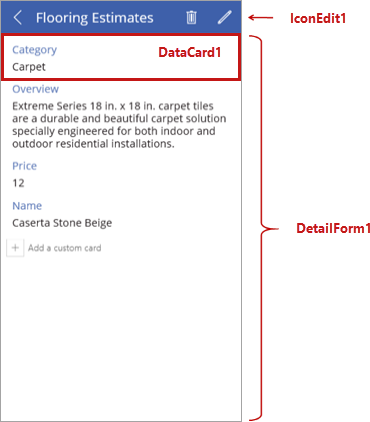

## Explore your app

We're now going to look more closely at Microsoft PowerApps Studio, and the screens and controls that define your app's behavior. We won't go through all the details, but knowing more about how this app works will help you build your own apps. 

### Understand controls in PowerApps
A control is just a UI element that produces an action or shows information. Many of the controls in PowerApps are just like controls that you've used in other apps: labels, text input boxes, drop-down lists, navigation elements, and so on.

In addition to these typical controls, PowerApps has more specialized controls. These can be found on the top toolbar.

Here are just a few of the controls that can add interest and impact to your apps:

- **Galleries**: These controls are layout containers that hold a set of controls that represent data from a data source.
- **Forms**: These controls show detail data, and let you create and edit items. 
- **Media**: These controls let you add background images, a camera button so that users can take pictures from the app, and a barcode reader for quick capture of identification information. 
- **Charts**: These controls let you to add charts so that users can do instant analysis while they're on the road.

To see what's available, select **Insert** on the ribbon, and then select each option in turn.

### Explore the browse screen

Each of the three main app screens has a main control and some additional controls. The first screen in the app is the browse screen, named **BrowseScreen1** by default. 

Here are some of the main controls that you'll want to become familiar with for the browse screen:

- **BrowseGallery1**: This is the main control on this screen. It shows data from your data source.
- **NextArrow1**: When this control is selected, it opens the details screen. 
- **IconNewItem1**: When this control is selected, it opens the edit/create screen.

PowerApps has a variety of gallery types beyond the default vertical orientation. 

- Try the horizontal orientation to see how it changes the look of your app. You'll see more ways to control layout later in this section.

### Explore the details screen
Next is the details screen. Here are its main controls:

- **DetailScreen1** This is the main control on this screen.
- **DetailForm1**: This control is a container for other controls.
- **DataCard1**: This is a card control. In this case, it shows a flooring category from the Flooring Estimates app, as seen in the previous unit. 
- **IconEdit1**: When this control is selected, it opens the edit/create screen so that the user can edit the current item.

### Explore the edit/create screen
The third screen in the app is the edit/create screen. Here are its main controls:

- **EditScreen1**: This is the main control on this screen.
- **EditForm1**: This control is a container for other controls.
- **DataCard8**: This is another a card control that shows a flooring category from the Flooring Estimates app, as seen in the previous unit.
- **IconAccept1**: When this control is selected, it saves the changes that the user made on the screen.

You now have a sense of the screens and controls that the app consists of. In the next unit, we'll look at how you can customize the app.