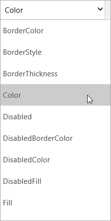

## Add formulas to PowerApps
One of the major benefits of Microsoft PowerApps is that you don't have to write complicated application code as a developer does. But you still need a way to express logic in an app, and to control an app's navigation, filtering, sorting, and other functionality. This is where formulas come in.

If you've used Microsoft Excel functions, the approach that PowerApps takes should feel familiar. In this unit, we'll show a couple of basic formulas for text formatting and then walk through three of the formulas that PowerApps includes in the generated app. You'll get a taste of what formulas can do and will also start writing your own.

### Understand formulas and properties
In the previous unit, we worked with the browse screen gallery. Now we're going to work with the details screen, which is the screen the user opens to look more closely at a carpet item. 

By default, the price appears as a plain number without a currency symbol. But suppose we want to add a dollar sign, and that we also want the text color to change, depending on the item's cost (for example, red if it's more than $5 but green otherwise). The following illustration gives an idea of what we want.

Let's start with the currency formatting. By default, PowerApps just pulls in a price value for each item. This value is set as the **Text** *property* of the label that shows the price.

1. In the **Screens** pane on the left, select the control for the details screen, **DetailsScreen1**, because that's the main screen we want to change.
1. Select the **Price** control in the app.

    

1. On the function bar, select the properties for this control, and then select the **Text** property in the drop-down list. This list includes all properties that are relevant to the control that's currently selected in your app. You'll see that the **Price** control is currently set to show only a numeric value and hasn't yet been formatted to be more helpful. 

    

1. To add the currency symbol for US dollars, replace "Price" with this formula: 

    `Text(Price, "[$-en-US]$ ##.00")`

The formula `Text(Price, "[$-en-US]$ ##.00")` uses the **Text** *function* to specify how the number should be formatted. The formula is like an Excel function, but PowerApps formulas refer to controls and other elements in an app instead of cells in a workbook.

If you select a control and then select the property drop-down list, you'll see a list of properties that are relevant to the control. For example, here is a partial list of the properties for a label. Some properties are relevant across a wide range of controls, whereas others are relevant only for a specific control.

To format the color conditionally, based on the price, use a formula like the following for the **Color** property of the label:

`If(Price > 5, Color.Red, Color.Green)`

### Formulas included in the generated app
Now that you understand how to use formulas in conjunction with properties, we'll look at three examples of formulas that PowerApps uses in the generated app. All the examples are from the browse screen and work with the **OnSelect** property, which defines what happens when a user selects an app control.

* The first formula is associated with the **IconNewItem1** control . You select this control to go from the browse screen to the edit/create screen to create an item. 

    * The formula is `NewForm(EditForm1);Navigate(EditScreen1, ScreenTransition.None)`.
    * The formula *instantiates* a new edit form and then opens the edit/create screen so that you can create a new item. A value of `ScreenTransition.None` means there's no transition between screens (such as a fade).

* The second formula is associated with the **IconSortUpDown1** control . You select this control to sort the list of items in the browse screen gallery.

    * The formula is `UpdateContext({SortDescending1: !SortDescending1})`.
    * The formula uses `UpdateContext` to update a *variable* called `SortDescending1`. The value of the variable switches back and forth as you select the control. This tells the gallery on this screen how to sort the items (watch the video for more details).

* The third formula is associated with the **NextArrow1** control . You select this control to go from the browse screen to the details screen.

    * The formula is `Navigate(DetailScreen1, ScreenTransition.None)`.
    * The formula opens the details screen. Once again, there's no transition.

There are many other formulas in the app, so take some time to select controls and see what formulas are set for various properties.

For more information about these and other functions, see the [formula reference](https://docs.microsoft.com/en-us/powerapps/maker/canvas-apps/formula-reference).

### Wrapping it all up
This brings us to the end of our exploration of the generated app, and our behind-the-scenes look at the screens, controls, properties, and formulas that give the app its capabilities—and even its personality. If you've followed along, you should have a better understanding of how a generated app works. You can now take this understanding and use it to create your own app.